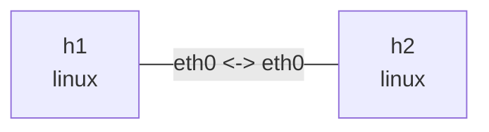

# nslab

[](https://nslab.readthedocs.io/en/latest/)
[](https://github.com/calcky/nslab/actions/workflows/ci-release.yml)

[中文文档](https://nslab.readthedocs.io/en/latest/zh/) |
[English documentation](https://nslab.readthedocs.io/en/latest/) |
[Releases](https://github.com/calcky/nslab/releases)

`nslab` 是一个面向 Linux network namespace 实验的声明式 CLI。使用严格校验的
`nslab.yaml` 描述拓扑，然后通过统一的命令重复部署、检查、执行和销毁实验。

支持 Linux namespace、veth、bridge、STP、VLAN、IPv4/IPv6、静态路由、netem，
以及基于 FRRouting 的 OSPFv2/eBGP 和 XDP 实验。网络资源通过 pyroute2 管理，不依赖
生命周期 shell hook。

## 安装

运行环境为 x86_64 Linux，推荐 Ubuntu 22.04 或更高版本。网络拓扑操作需要 root；
OSPF/BGP 示例还需要 `frr` 与 `frr-pythontools`；XDP 示例需要 Clang、libbpf 和
bpftool。

从源码运行：

```bash
git clone https://github.com/calcky/nslab.git
cd nslab
uv sync --python 3.12
```

完整依赖和安装说明见[快速开始](https://nslab.readthedocs.io/en/latest/zh/getting-started/)。

## 最小 Demo

创建 `nslab.yaml`：

```yaml
version: 1
name: minimal

topology:
  nodes:
    h1:
      kind: linux
      interfaces:
        eth0:
          addresses: [10.0.0.1/24]
    h2:
      kind: linux
      interfaces:
        eth0:
          addresses: [10.0.0.2/24]
  links:
    - endpoints: [h1:eth0, h2:eth0]
```

生成 Mermaid 拓扑图：

```bash
nslab graph --format mermaid
```



部署、测试并销毁：

```bash
sudo nslab deploy
sudo nslab inspect
sudo nslab exec --node h1 -- ping -c 3 10.0.0.2
sudo nslab destroy
```

不传 `-t/--topo` 时，nslab 使用当前目录的 `nslab.yaml`。`deploy` 和 `destroy` 都可
重复执行；流量、抓包和观察命令通过 `nslab exec` 显式运行。

## 命令

| 命令 | 用途 |
| --- | --- |
| `nslab --version` | 显示版本和 commit hash |
| `nslab deploy` | 创建拓扑 |
| `nslab destroy` | 销毁拓扑 |
| `nslab redeploy` | 校验后重建拓扑 |
| `nslab inspect` | 比较 manifest、state 和内核状态 |
| `nslab exec --node NODE -- COMMAND` | 在节点 namespace 中执行命令 |
| `nslab graph` | 输出终端、Mermaid、DOT 或 JSON 拓扑图 |
| `nslab completion bash\|zsh` | 生成 shell 补全脚本 |

参数和行为详见 [CLI 参考](https://nslab.readthedocs.io/en/latest/zh/cli/)。

## Examples

| 示例 | 学习内容 |
| --- | --- |
| [bridge-fdb](examples/bridge-fdb/README.md) | Linux bridge 转发与 FDB 学习 |
| [bridge-vlan](examples/bridge-vlan/README.md) | Access VLAN 与 tagged trunk |
| [bridge-stp](examples/bridge-stp/README.md) | STP 选举、路径选择与重收敛 |
| [ipv4-forward](examples/ipv4-forward/README.md) | Linux IPv4 转发 |
| [ipv6-forward](examples/ipv6-forward/README.md) | Linux IPv6 转发 |
| [netem](examples/netem/README.md) | 延迟、抖动与丢包 |
| [xdp](examples/xdp/README.md) | `XDP_PASS`、`XDP_DROP`、`XDP_TX` 与 `XDP_REDIRECT` |
| [ospf](examples/ospf/README.md) | OSPFv2 邻居与故障收敛 |
| [bgp](examples/bgp/README.md) | eBGP 与 AS_PATH 传播 |

每个目录的 README 包含该实验的完整运行、观察和清理步骤。

## 开发验证

```bash
uv run pytest -q
uv run ruff check src tests
uv run mypy src
uv build
```

项目采用 [MIT License](LICENSE)。
