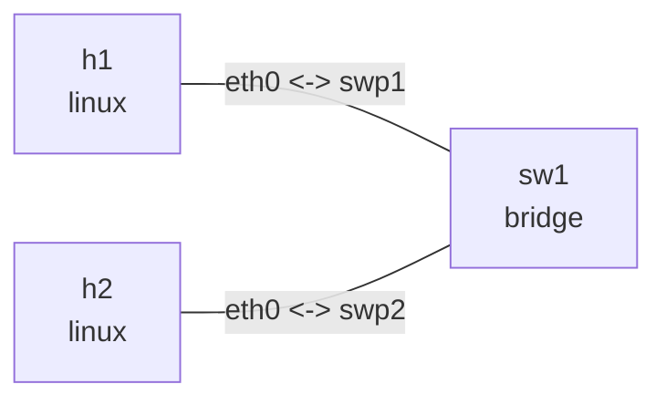
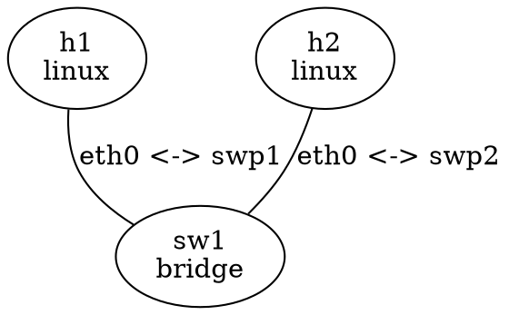

# CLI reference

```text
nslab deploy    [-t PATH] [-n NAME]
nslab destroy   [-t PATH] [-n NAME]
nslab redeploy  [-t PATH] [-n NAME]
nslab inspect   [-t PATH] [-n NAME] [--format table|json]
nslab exec      [-t PATH] [-n NAME] (-N NODE | --node NODE)
                -- COMMAND [ARG ...]
nslab graph     [-t PATH] [-n NAME] [--detail]
                [--format tree|box|mermaid|dot|json]
nslab completion bash|zsh
```

All lifecycle subcommands accept `-t`/`--topo` and `-n`/`--name`. Use `--debug` to include a
Python traceback when a command fails.

## Topology selection

Selection depends on the supplied arguments:

| Arguments | Behavior |
| --- | --- |
| No `--topo` | Read `nslab.yaml` from the current directory without searching parents |
| `--topo PATH` | Use the selected YAML file |
| No `--name` | Use the manifest's `name` |
| `--name NAME` | Override the name on deploy; select that deployment for other commands |
| Only `--name` | Restore the topology from `/var/lib/nslab/NAME.json` |

To perform an exact destroy after state has already disappeared, pass the original `--topo`
and `--name` so that nslab can deterministically recalculate owned resource names.

## Lifecycle

### deploy

Creates namespaces, veth pairs, bridges, addresses, routes, sysctls, qdiscs, and dynamic routing
daemons. Repeating a complete and unchanged deployment prints `topology already deployed` and
returns success.

```bash
sudo nslab deploy --topo examples/bridge-fdb/nslab.yaml
```

### destroy

Removes only the resources precisely owned by the deployment and deletes its saved state.
Repeating the command is a successful no-op:

```bash
sudo nslab destroy --topo examples/bridge-fdb/nslab.yaml
```

### redeploy

Validates the replacement manifest first, then destroys and deploys under the same lock:

```bash
sudo nslab redeploy --topo examples/bridge-fdb/nslab.yaml
```

### inspect

The default output is a terminal table. JSON output is suitable for scripts and diagnostics:

```bash
sudo nslab inspect --name bridge-fdb
sudo nslab inspect --name bridge-fdb --format json
```

Summary status is `absent`, `deployed`, `degraded`, or `stale`. Dynamic STP roles and learned
FDB entries are live behavior rather than manifest drift and can be examined through `exec`.

## exec

`-N` is shorthand for `--node`; lowercase `-n` selects the deployment `--name`. `exec` runs the
argv after `--` directly in the selected node namespace without starting an implicit shell.
Standard input, output, and error are inherited from the terminal, so long-running commands stream
their output:

```bash
sudo nslab exec -N h1 -- ping -c 3 10.10.0.2
sudo nslab exec --node sw1 -- bridge fdb show br br0
sudo nslab exec --node r1 -- vtysh -N nslab-ospf-r1 -c "show ip ospf neighbor"
```

The child command's status is returned by nslab. Pressing `Ctrl-C` terminates the foreground
command and exits nslab with status `130` without a pyroute2 helper-process traceback.

## graph

`graph` does not read live state and can run before deployment. Its default output is a compact
Unicode tree. `--detail` adds STP state, bridge priority, port cost/priority, and VLAN filtering.
Every format below uses `examples/bridge-fdb/nslab.yaml`.

### tree (default)

```bash
nslab graph --topo examples/bridge-fdb/nslab.yaml
```

```text
Topology: bridge-fdb

sw1 [bridge · br0]
├─ swp1 ↔ eth0  h1 [linux]
│               eth0: 10.10.0.1/24
└─ swp2 ↔ eth0  h2 [linux]
                eth0: 10.10.0.2/24
```

### box

```bash
nslab graph --topo examples/bridge-fdb/nslab.yaml --format box
```

```text
Topology: bridge-fdb

                ┌──────────────┐
                │ sw1          │
                │ bridge · br0 │
                └───────┬──────┘
                        │
           ┌────────────┴─────────────┐
           │                          │
      swp1 ↔ eth0                swp2 ↔ eth0
           │                          │
┌──────────┴─────────┐     ┌──────────┴─────────┐
│ h1                 │     │ h2                 │
│ linux              │     │ linux              │
│ eth0: 10.10.0.1/24 │     │ eth0: 10.10.0.2/24 │
└────────────────────┘     └────────────────────┘
```

### mermaid

```bash
nslab graph --topo examples/bridge-fdb/nslab.yaml --format mermaid
```



### dot

```bash
nslab graph --topo examples/bridge-fdb/nslab.yaml --format dot
```



### json

```bash
nslab graph --topo examples/bridge-fdb/nslab.yaml --format json
```

```json
{
  "links": [
    {
      "endpoints": [
        {
          "interface": "eth0",
          "node": "h1"
        },
        {
          "interface": "swp1",
          "node": "sw1"
        }
      ],
      "index": 0,
      "kind": "veth",
      "mtu": 1500
    },
    {
      "endpoints": [
        {
          "interface": "eth0",
          "node": "h2"
        },
        {
          "interface": "swp2",
          "node": "sw1"
        }
      ],
      "index": 1,
      "kind": "veth",
      "mtu": 1500
    }
  ],
  "name": "bridge-fdb",
  "nodes": [
    {
      "kind": "linux",
      "name": "h1",
      "namespace": "nslab-bridge-fdb-h1-31a8127feeb4ce2e"
    },
    {
      "kind": "bridge",
      "name": "sw1",
      "namespace": "nslab-bridge-fdb-sw1-33858844c78991ec"
    },
    {
      "kind": "linux",
      "name": "h2",
      "namespace": "nslab-bridge-fdb-h2-9265b596d1fcc5ba"
    }
  ]
}
```

`tree` and `box` are intended for terminals. `mermaid` and `dot` feed diagram renderers, while
`json` is intended for automation.
`--detail` is available only for `tree` and `box`, for example
`nslab graph --format box --detail`.

## completion

Generate Bash or Zsh completion without changing shell configuration files:

```bash
# Bash
source <(nslab completion bash)

# Zsh
source <(nslab completion zsh)
```

Completion covers subcommands, options, output formats, topology paths, saved deployment names,
and node names from the selected manifest.
