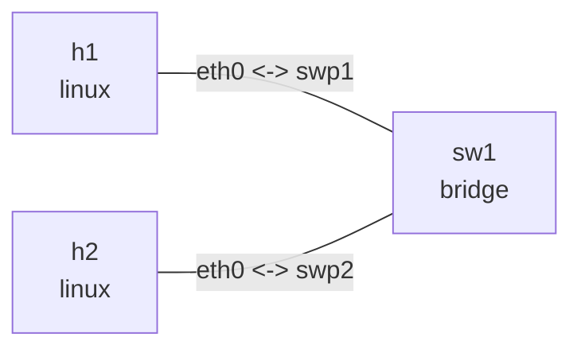
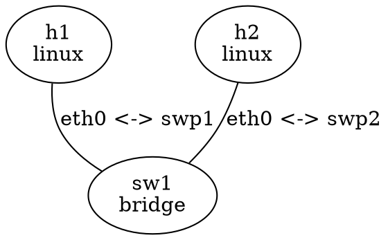

# CLI 参考

```text
nslab --version
nslab deploy    [-t PATH] [-n NAME]
nslab destroy   [-t PATH] [-n NAME]
nslab redeploy  [-t PATH] [-n NAME]
nslab inspect   [-t PATH] [-n NAME] [--format table|json]
nslab exec      [-t PATH] [-n NAME] (-N NODE | --node NODE)
                -- COMMAND [ARG ...]
nslab graph     [-t PATH] [-n NAME] [--detail]
                [--format tree|box|mermaid|dot|json]
nslab completion bash|zsh
```

`nslab --version` 输出当前安装包或独立可执行程序的版本和源码提交，例如
`nslab 0.2.0 (commit 685d41187de5)`。

所有生命周期子命令也接受 `-t`/`--topo` 和 `-n`/`--name`。`--debug` 可在命令失败时
显示 Python 异常 traceback。

## 选择拓扑

选择顺序由命令决定：

| 参数 | 行为 |
| --- | --- |
| 不传 `--topo` | 读取当前目录的 `nslab.yaml`，不搜索父目录 |
| `--topo PATH` | 使用指定 YAML 文件 |
| 不传 `--name` | 使用 manifest 的 `name` |
| `--name NAME` | deploy 时覆盖 manifest 名称；其他命令选择该 deployment |
| 只传 `--name` | 从 `/var/lib/nslab/NAME.json` 恢复保存的拓扑 |

需要在 state 已经不存在时执行精确 destroy，传入原始 `--topo` 和 `--name`，让 nslab
根据计划重新计算资源名称。

## 生命周期

### deploy

创建 namespace、veth、bridge、地址、路由、sysctl、qdisc 和动态路由 daemon。重复
执行完整相同的 deployment 会输出 `topology already deployed` 并成功返回。

```bash
sudo nslab deploy --topo examples/bridge-fdb/nslab.yaml
```

### destroy

只删除该 deployment 计划精确拥有的资源，并清理保存的 state。重复执行是成功的
no-op：

```bash
sudo nslab destroy --topo examples/bridge-fdb/nslab.yaml
```

### redeploy

先完整验证新 manifest，再在同一 lock 下销毁旧拓扑并部署新拓扑：

```bash
sudo nslab redeploy --topo examples/bridge-fdb/nslab.yaml
```

### inspect

默认输出适合终端的表格；`--format json` 适合脚本和诊断工具：

```bash
sudo nslab inspect --name bridge-fdb
sudo nslab inspect --name bridge-fdb --format json
```

概要状态为 `absent`、`deployed`、`degraded` 或 `stale`。动态 STP 端口角色和 FDB
学习属于 live 行为，不会被当作 manifest 漂移；可通过 `exec` 查看。

## exec

`-N` 是 `--node` 的简写；小写 `-n` 表示 deployment 的 `--name`。`exec` 在目标节点
namespace 中直接运行 `--` 后的 argv，不隐式启动 shell。标准输入、输出和错误流继承
当前终端，长时间运行的程序会实时显示输出：

```bash
sudo nslab exec -N h1 -- ping -c 3 10.10.0.2
sudo nslab exec --node sw1 -- bridge fdb show br br0
sudo nslab exec --node r1 -- vtysh -N nslab-ospf-r1 -c "show ip ospf neighbor"
```

命令返回值会传给 nslab。按 `Ctrl-C` 取消前台命令时，nslab 以状态码 `130` 退出，
不会打印 pyroute2 辅助进程 traceback。

## graph

`graph` 不读取 live state，可在 deploy 前运行。默认是紧凑的 Unicode 树；`--detail`
才会追加 STP、bridge priority、端口 cost/priority 和 VLAN filtering。下面所有样式都使用
`examples/bridge-fdb/nslab.yaml`。

### tree（默认）

```bash
nslab graph --topo examples/bridge-fdb/nslab.yaml
```

```text
Topology: bridge-fdb

sw1 [bridge · br0]
├─ swp1 ↔ eth0  h1 [linux]
│               eth0: 10.10.0.1/24
└─ swp2 ↔ eth0  h2 [linux]
                eth0: 10.10.0.2/24
```

### box

```bash
nslab graph --topo examples/bridge-fdb/nslab.yaml --format box
```

```text
Topology: bridge-fdb

                ┌──────────────┐
                │ sw1          │
                │ bridge · br0 │
                └───────┬──────┘
                        │
           ┌────────────┴─────────────┐
           │                          │
      swp1 ↔ eth0                swp2 ↔ eth0
           │                          │
┌──────────┴─────────┐     ┌──────────┴─────────┐
│ h1                 │     │ h2                 │
│ linux              │     │ linux              │
│ eth0: 10.10.0.1/24 │     │ eth0: 10.10.0.2/24 │
└────────────────────┘     └────────────────────┘
```

### mermaid

```bash
nslab graph --topo examples/bridge-fdb/nslab.yaml --format mermaid
```



### dot

```bash
nslab graph --topo examples/bridge-fdb/nslab.yaml --format dot
```



### json

```bash
nslab graph --topo examples/bridge-fdb/nslab.yaml --format json
```

```json
{
  "links": [
    {
      "endpoints": [
        {
          "interface": "eth0",
          "node": "h1"
        },
        {
          "interface": "swp1",
          "node": "sw1"
        }
      ],
      "index": 0,
      "kind": "veth",
      "mtu": 1500
    },
    {
      "endpoints": [
        {
          "interface": "eth0",
          "node": "h2"
        },
        {
          "interface": "swp2",
          "node": "sw1"
        }
      ],
      "index": 1,
      "kind": "veth",
      "mtu": 1500
    }
  ],
  "name": "bridge-fdb",
  "nodes": [
    {
      "kind": "linux",
      "name": "h1",
      "namespace": "nslab-bridge-fdb-h1-31a8127feeb4ce2e"
    },
    {
      "kind": "bridge",
      "name": "sw1",
      "namespace": "nslab-bridge-fdb-sw1-33858844c78991ec"
    },
    {
      "kind": "linux",
      "name": "h2",
      "namespace": "nslab-bridge-fdb-h2-9265b596d1fcc5ba"
    }
  ]
}
```

`tree` 和 `box` 适合终端，`mermaid` 和 `dot` 可粘贴到渲染器，`json` 适合自动化。
`--detail` 只适用于 `tree` 和 `box`，例如 `nslab graph --format box --detail`。

## completion

生成 Bash 或 Zsh 补全脚本；命令不会修改 shell 配置：

```bash
# Bash
source <(nslab completion bash)

# Zsh
source <(nslab completion zsh)
```

补全包括子命令、选项、格式、文件路径，以及 state 中的 deployment 和 manifest 中的
节点名称。
