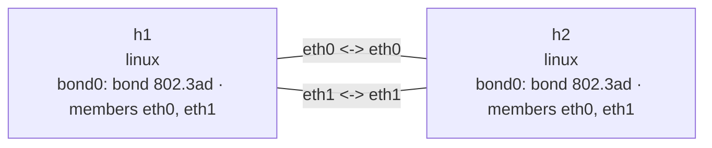

# Bond 802.3ad

This lab directly connects two Linux network namespaces with two veth pairs. Both `bond0`
interfaces run IEEE 802.3ad/LACP, negotiate a two-member aggregator, and use a `layer3+4` hash to
select a member for each network flow.
See the [Bond overview](bond.md) for a comparison with the `active-backup` lab.

## Topology

```console
$ nslab graph --format mermaid
flowchart LR
    n0["h1\nlinux\nbond0: bond 802.3ad · members eth0, eth1"]
    n1["h2\nlinux\nbond0: bond 802.3ad · members eth0, eth1"]
    n0 -- "eth0 <-> eth0" --- n1
    n0 -- "eth1 <-> eth1" --- n1
```



The following is representative output. Interface indexes, MAC addresses, throughput, and ICMP
timing vary.

## Deploy

```console
$ sudo nslab deploy
deployed topology: bond-8023ad

$ sudo nslab inspect
status: deployed

NAME  KIND   STATUS    NAMESPACE
----  -----  --------  ----------------------------
h1    linux  matching  nslab-bond-8023ad-h1-...
h2    linux  matching  nslab-bond-8023ad-h2-...
```

## Inspect the LACP aggregator

```console
$ sudo nslab exec --node h1 -- /usr/bin/grep -E 'Bonding Mode|Transmit Hash Policy|MII Status|LACP rate|Number of ports|Slave Interface|Aggregator ID' /proc/net/bonding/bond0
Bonding Mode: IEEE 802.3ad Dynamic link aggregation
Transmit Hash Policy: layer3+4 (1)
MII Status: up
LACP rate: fast
        Aggregator ID: 1
        Number of ports: 2
Slave Interface: eth0
MII Status: up
Aggregator ID: 1
Slave Interface: eth1
MII Status: up
Aggregator ID: 1

$ sudo nslab exec --node h1 -- /usr/bin/ping -c 2 10.61.0.2
PING 10.61.0.2 (10.61.0.2) 56(84) bytes of data.
64 bytes from 10.61.0.2: icmp_seq=1 ttl=64 time=<time> ms
64 bytes from 10.61.0.2: icmp_seq=2 ttl=64 time=<time> ms
2 packets transmitted, 2 received, 0% packet loss
```

Both slaves have the same `Aggregator ID`, and the active aggregator reports two ports. This
confirms that LACP admitted both links into one aggregation group.

## Observe per-flow distribution

A single TCP connection hashes to one member and cannot combine both links' bandwidth. After
installing `iperf3`, run the following commands in two terminals. The server uses `-1` and exits
after one test.

Terminal 1:

```console
$ sudo nslab exec --node h2 -- /usr/bin/iperf3 -s -1
-----------------------------------------------------------
Server listening on 5201
-----------------------------------------------------------
Accepted connection from 10.61.0.1, port <port>
[SUM]   0.00-3.00 sec  <size> GBytes  <rate> Gbits/sec  receiver
```

Terminal 2:

```console
$ sudo nslab exec --node h1 -- /usr/bin/iperf3 -c 10.61.0.2 -P 4 -t 3
Connecting to host 10.61.0.2, port 5201
[SUM]   0.00-3.00 sec  <size> GBytes  <rate> Gbits/sec  sender
[SUM]   0.00-3.00 sec  <size> GBytes  <rate> Gbits/sec  receiver
iperf Done.

$ sudo nslab exec --node h1 -- /usr/sbin/ip -s link show master bond0
<index>: eth0: <BROADCAST,MULTICAST,SLAVE,UP,LOWER_UP> ... master bond0 ...
    RX:  bytes  packets  errors  dropped  missed  mcast
    TX:  bytes  packets  errors  dropped  carrier  collsns
<index>: eth1: <BROADCAST,MULTICAST,SLAVE,UP,LOWER_UP> ... master bond0 ...
    RX:  bytes  packets  errors  dropped  missed  mcast
    TX:  bytes  packets  errors  dropped  carrier  collsns
```

The four TCP flows use different ports, allowing the `layer3+4` policy to select different
members. Hashing does not guarantee equal counters on the two links.

## Destroy

```console
$ sudo nslab destroy
destroyed topology: bond-8023ad
```
