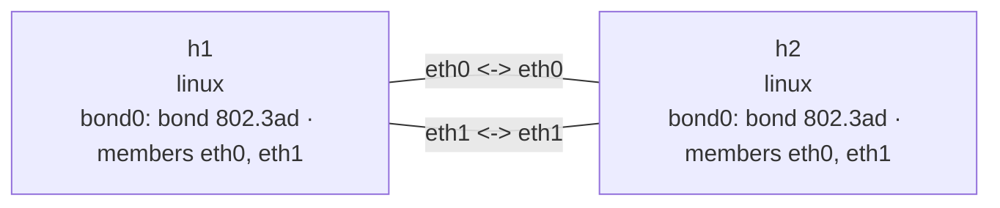

# Bond 802.3ad 实验

这个实验用两对 veth 直连两个 Linux network namespace。两端的 `bond0` 都运行
IEEE 802.3ad/LACP，协商出一个包含两个成员的聚合器，并使用 `layer3+4` 哈希为不同
网络流选择成员链路。

## 拓扑图

```console
$ nslab graph --format mermaid
flowchart LR
    n0["h1\nlinux\nbond0: bond 802.3ad · members eth0, eth1"]
    n1["h2\nlinux\nbond0: bond 802.3ad · members eth0, eth1"]
    n0 -- "eth0 <-> eth0" --- n1
    n0 -- "eth1 <-> eth1" --- n1
```



以下为典型输出；接口索引、MAC 地址、吞吐率和 ICMP 时延会随运行变化。

## 部署

```console
$ sudo nslab deploy
deployed topology: bond-8023ad

$ sudo nslab inspect
status: deployed

NAME  KIND   STATUS    NAMESPACE
----  -----  --------  ----------------------------
h1    linux  matching  nslab-bond-8023ad-h1-...
h2    linux  matching  nslab-bond-8023ad-h2-...
```

## 查看 LACP 聚合器

```console
$ sudo nslab exec --node h1 -- /usr/bin/grep -E 'Bonding Mode|Transmit Hash Policy|MII Status|LACP rate|Number of ports|Slave Interface|Aggregator ID' /proc/net/bonding/bond0
Bonding Mode: IEEE 802.3ad Dynamic link aggregation
Transmit Hash Policy: layer3+4 (1)
MII Status: up
LACP rate: fast
        Aggregator ID: 1
        Number of ports: 2
Slave Interface: eth0
MII Status: up
Aggregator ID: 1
Slave Interface: eth1
MII Status: up
Aggregator ID: 1

$ sudo nslab exec --node h1 -- /usr/bin/ping -c 2 10.61.0.2
PING 10.61.0.2 (10.61.0.2) 56(84) bytes of data.
64 bytes from 10.61.0.2: icmp_seq=1 ttl=64 time=<time> ms
64 bytes from 10.61.0.2: icmp_seq=2 ttl=64 time=<time> ms
2 packets transmitted, 2 received, 0% packet loss
```

两个成员的 `Aggregator ID` 相同，且活动聚合器报告两个端口，说明 LACP 已把两条链路
加入同一个聚合组。

## 观察多流分担

单条 TCP 连接只会被哈希到一个成员，不能把两条链路的带宽直接相加。安装 `iperf3`
后，在两个终端中运行以下命令；服务端使用 `-1`，完成一次测试后自动退出。

终端 1：

```console
$ sudo nslab exec --node h2 -- /usr/bin/iperf3 -s -1
-----------------------------------------------------------
Server listening on 5201
-----------------------------------------------------------
Accepted connection from 10.61.0.1, port <port>
[SUM]   0.00-3.00 sec  <size> GBytes  <rate> Gbits/sec  receiver
```

终端 2：

```console
$ sudo nslab exec --node h1 -- /usr/bin/iperf3 -c 10.61.0.2 -P 4 -t 3
Connecting to host 10.61.0.2, port 5201
[SUM]   0.00-3.00 sec  <size> GBytes  <rate> Gbits/sec  sender
[SUM]   0.00-3.00 sec  <size> GBytes  <rate> Gbits/sec  receiver
iperf Done.

$ sudo nslab exec --node h1 -- /usr/sbin/ip -s link show master bond0
<index>: eth0: <BROADCAST,MULTICAST,SLAVE,UP,LOWER_UP> ... master bond0 ...
    RX:  bytes  packets  errors  dropped  missed  mcast
    TX:  bytes  packets  errors  dropped  carrier  collsns
<index>: eth1: <BROADCAST,MULTICAST,SLAVE,UP,LOWER_UP> ... master bond0 ...
    RX:  bytes  packets  errors  dropped  missed  mcast
    TX:  bytes  packets  errors  dropped  carrier  collsns
```

四条 TCP 流具有不同端口号，`layer3+4` 哈希可以把它们分配到不同成员。具体分布由
哈希决定，不保证两条链路的计数完全相等。

## 清理

```console
$ sudo nslab destroy
destroyed topology: bond-8023ad
```
