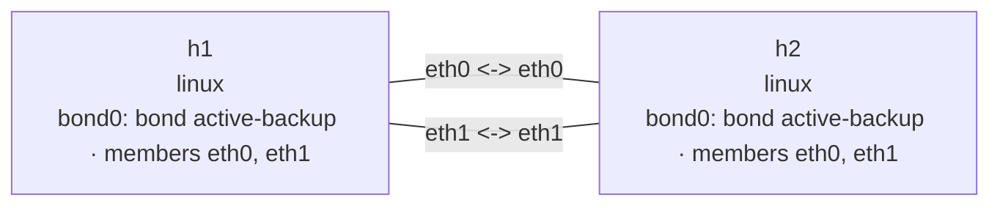

# Bond active-backup

This lab creates two links between two Linux network namespaces and builds a `bond0` at each end.
`eth0` is the preferred active member and `eth1` is its standby. MII carrier monitoring moves both
ends to `eth1` when the primary link fails and selects `eth0` again after it recovers.
See the [Bond overview](bond.md) for a comparison with the `802.3ad` lab.

## Topology

```console
$ nslab graph --format mermaid
flowchart LR
    n0["h1\nlinux\nbond0: bond active-backup · members eth0, eth1"]
    n1["h2\nlinux\nbond0: bond active-backup · members eth0, eth1"]
    n0 -- "eth0 <-> eth0" --- n1
    n0 -- "eth1 <-> eth1" --- n1
```



The following is representative output. Interface indexes, MAC addresses, and ICMP timing vary.

## Deploy

```console
$ sudo nslab deploy
deployed topology: bond-active-backup

$ sudo nslab inspect
status: deployed

NAME  KIND   STATUS    NAMESPACE
----  -----  --------  ----------------------------------
h1    linux  matching  nslab-bond-active-backup-h1-...
h2    linux  matching  nslab-bond-active-backup-h2-...
```

## Inspect the initial state

```console
$ sudo nslab exec --node h1 -- /usr/bin/grep -E 'Bonding Mode|Primary Slave|Currently Active Slave|Slave Interface|MII Status' /proc/net/bonding/bond0
Bonding Mode: fault-tolerance (active-backup)
Primary Slave: eth0 (primary_reselect always)
Currently Active Slave: eth0
MII Status: up
Slave Interface: eth0
MII Status: up
Slave Interface: eth1
MII Status: up

$ sudo nslab exec --node h1 -- /usr/bin/ping -c 2 10.60.0.2
PING 10.60.0.2 (10.60.0.2) 56(84) bytes of data.
64 bytes from 10.60.0.2: icmp_seq=1 ttl=64 time=<time> ms
64 bytes from 10.60.0.2: icmp_seq=2 ttl=64 time=<time> ms
2 packets transmitted, 2 received, 0% packet loss
```

Only `bond0` owns an IP address. The member interfaces remain unnumbered; `eth0` transmits while
both links remain under carrier monitoring.

## Fail the primary link

```console
$ sudo nslab exec --node h1 -- /bin/sh -c 'ip link set eth0 down; sleep 1; grep "Currently Active Slave" /proc/net/bonding/bond0'
Currently Active Slave: eth1

$ sudo nslab exec --node h2 -- /usr/bin/grep 'Currently Active Slave' /proc/net/bonding/bond0
Currently Active Slave: eth1

$ sudo nslab exec --node h1 -- /usr/bin/ping -c 2 10.60.0.2
PING 10.60.0.2 (10.60.0.2) 56(84) bytes of data.
64 bytes from 10.60.0.2: icmp_seq=1 ttl=64 time=<time> ms
64 bytes from 10.60.0.2: icmp_seq=2 ttl=64 time=<time> ms
2 packets transmitted, 2 received, 0% packet loss
```

The two ends of a veth share carrier state. Taking down `h1:eth0` also removes carrier from
`h2:eth0`, so both bonds move to the second link.

## Restore the preferred link

```console
$ sudo nslab exec --node h1 -- /bin/sh -c 'ip link set eth0 up; sleep 1; grep "Currently Active Slave" /proc/net/bonding/bond0'
Currently Active Slave: eth0

$ sudo nslab exec --node h2 -- /usr/bin/grep 'Currently Active Slave' /proc/net/bonding/bond0
Currently Active Slave: eth0
```

`primary: eth0` uses the kernel's default `primary_reselect=always`, so the preferred member takes
over again after recovery.

## Destroy

```console
$ sudo nslab destroy
destroyed topology: bond-active-backup
```
