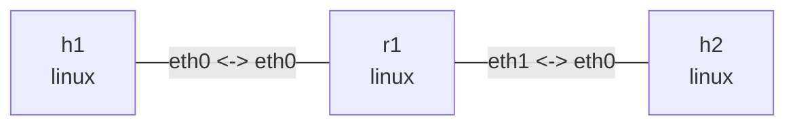

# BPF data path

Run in this directory. Ubuntu dependencies: `clang llvm libbpf-dev make iproute2 tcpdump iputils-ping`; kernel BPF and clsact support are required. Generic XDP avoids native-driver dependencies. The program only recognizes unfragmented Ethernet/IPv4 ICMP Echo Requests. ARP, IPv6, VLAN, and other traffic pass; this is not a security firewall.

```console
$ make
clang ... -target bpf ... -c path_lab.c -o path_lab.o
```

## Topology and deployment

```bash
nslab graph --format mermaid
```



```console
$ sudo nslab deploy
deployed topology: bpf-path
$ sudo nslab inspect
status: deployed
...
```

## Baseline and capture points

Capture on r1 ingress and h2 in separate terminals while executing the following commands from a third. Start a new capture for each stage to avoid mixing observations. First verify ordinary Linux forwarding.

```console
$ sudo nslab exec --node r1 -- tcpdump -ni eth0 'icmp and icmp[0] = 8'
... 10.72.1.1 > 10.72.2.2: ICMP echo request ...
$ sudo nslab exec --node h2 -- tcpdump -ni eth0 'icmp and icmp[0] = 8'
... 10.72.1.1 > 10.72.2.2: ICMP echo request ...
$ sudo nslab exec --node h1 -- ping -c 2 -W 1 10.72.2.2
...
2 packets transmitted, 2 received, 0% packet loss
```

## XDP_DROP

Install XDP_DROP on r1:eth0. Echo Requests are dropped before the normal AF_PACKET capture point, so neither r1 nor h2 sees them in these captures. The sender can still capture its transmitted requests. These observations refer to this Linux generic-XDP path.

```console
$ sudo nslab exec --node r1 -- ip link set dev eth0 xdpgeneric obj "$PWD/path_lab.o" sec xdp/drop
(no output)
$ sudo nslab exec --node r1 -- ip -details link show dev eth0
... prog/xdp id <id> ...
$ sudo nslab exec --node h1 -- ping -c 2 -W 1 10.72.2.2
...
2 packets transmitted, 0 received, 100% packet loss
$ sudo nslab exec --node r1 -- ip link set dev eth0 xdpgeneric off
(no output)
```

## TC ingress

clsact provides ingress/egress attachment points without shaping. The direct-action program returns TC_ACT_SHOT. r1:eth0 capture sees the request, but it is dropped before normal IP routing and h2 does not receive it.

```console
$ sudo nslab exec --node r1 -- tc qdisc add dev eth0 clsact
(no output)
$ sudo nslab exec --node r1 -- tc filter add dev eth0 ingress pref 10 bpf da obj "$PWD/path_lab.o" sec classifier/drop
(no output)
$ sudo nslab exec --node r1 -- tc filter show dev eth0 ingress
filter ... pref 10 bpf ... direct-action ... id <id> ...
$ sudo nslab exec --node h1 -- ping -c 2 -W 1 10.72.2.2
...
2 packets transmitted, 0 received, 100% packet loss
$ sudo nslab exec --node r1 -- tc qdisc del dev eth0 clsact
(no output)
```

## TC egress

Attach the same program to r1:eth1 egress. Traffic has already passed route selection on r1 but is dropped before transmission to h2. Pinging r1’s own eth0 address still succeeds because that reply does not traverse eth1 egress.

```console
$ sudo nslab exec --node r1 -- tc qdisc add dev eth1 clsact
(no output)
$ sudo nslab exec --node r1 -- tc filter add dev eth1 egress pref 10 bpf da obj "$PWD/path_lab.o" sec classifier/drop
(no output)
$ sudo nslab exec --node h1 -- ping -c 2 -W 1 10.72.2.2
...
2 packets transmitted, 0 received, 100% packet loss
$ sudo nslab exec --node h1 -- ping -c 2 -W 1 10.72.1.254
...
2 packets transmitted, 2 received, 0% packet loss
$ sudo nslab exec --node r1 -- tc qdisc del dev eth1 clsact
(no output)
```

## TC_ACT_OK and comparison

Load the pass section to confirm that TC attachment itself does not block forwarding. Nonzero ping exits are expected in all three drop stages; do not run the entire sequence under set -e. Return codes are program-type specific: XDP_PASS and TC_ACT_OK are not interchangeable.

```console
$ sudo nslab exec --node r1 -- tc qdisc add dev eth0 clsact
(no output)
$ sudo nslab exec --node r1 -- tc filter add dev eth0 ingress pref 10 bpf da obj "$PWD/path_lab.o" sec classifier/pass
(no output)
$ sudo nslab exec --node h1 -- ping -c 2 -W 1 10.72.2.2
...
2 packets transmitted, 2 received, 0% packet loss
$ sudo nslab exec --node r1 -- tc qdisc del dev eth0 clsact
(no output)
```

| Stage | r1 eth0 capture | h2 capture | Ping |
| --- | --- | --- | --- |
| Baseline / TC_ACT_OK | Request | Request | OK |
| XDP_DROP on r1 eth0 | No request | No request | Timeout |
| TC ingress DROP on r1 eth0 | Request | No request | Timeout |
| TC egress DROP on r1 eth1 | Request | No request | Timeout |

## Cleanup

Stop captures before destroy. Even if an attachment remains, removing namespaces/interfaces releases these unpinned BPF programs. Redeploy before repeating to avoid stacked hooks. Continue with the existing xdp example for redirect and FIB/MAC/TTL rewriting.


```console
$ sudo nslab destroy
destroyed topology: bpf-path
$ sudo nslab inspect
status: absent
...
```
