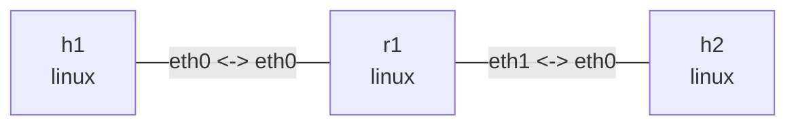

# BPF data path

Run in this directory. Basic Ubuntu dependencies: `clang llvm libbpf-dev make iproute2 tcpdump iputils-ping`; kernel BPF and clsact support are required. Basic actions and DEVMAP use generic XDP; CPUMAP explicitly uses native XDP and AF_XDP uses generic/copy. See those sections for additional dependencies. Programs only recognize unfragmented Ethernet/IPv4 ICMP Echo Requests. ARP, IPv6, VLAN, and other traffic pass; this is not a security firewall.

```console
$ make
clang ... -target bpf ... -c path_lab.c -o path_lab.o
```

## Topology and deployment

```bash
nslab graph --format mermaid
```



```console
$ sudo nslab deploy
deployed topology: bpf-path
$ sudo nslab inspect
status: deployed
...
```

## Baseline and capture points

Capture on r1 ingress and h2 in separate terminals while executing the following commands from a third. Start a new capture for each stage to avoid mixing observations. First verify ordinary Linux forwarding.

```console
$ sudo nslab exec --node r1 -- tcpdump -ni eth0 'icmp and icmp[0] = 8'
... 10.72.1.1 > 10.72.2.2: ICMP echo request ...
$ sudo nslab exec --node h2 -- tcpdump -ni eth0 'icmp and icmp[0] = 8'
... 10.72.1.1 > 10.72.2.2: ICMP echo request ...
$ sudo nslab exec --node h1 -- ping -c 2 -W 1 10.72.2.2
...
2 packets transmitted, 2 received, 0% packet loss
```

## XDP_DROP

Install XDP_DROP on r1:eth0. Echo Requests are dropped before the normal AF_PACKET capture point, so neither r1 nor h2 sees them in these captures. The sender can still capture its transmitted requests. These observations refer to this Linux generic-XDP path.

```console
$ sudo nslab exec --node r1 -- ip link set dev eth0 xdpgeneric obj "$PWD/path_lab.o" sec xdp/drop
(no output)
$ sudo nslab exec --node r1 -- ip -details link show dev eth0
... prog/xdp id <id> ...
$ sudo nslab exec --node h1 -- ping -c 2 -W 1 10.72.2.2
...
2 packets transmitted, 0 received, 100% packet loss
$ sudo nslab exec --node r1 -- ip link set dev eth0 xdpgeneric off
(no output)
```

## TC ingress

clsact provides ingress/egress attachment points without shaping. The direct-action program returns TC_ACT_SHOT. r1:eth0 capture sees the request, but it is dropped before normal IP routing and h2 does not receive it.

```console
$ sudo nslab exec --node r1 -- tc qdisc add dev eth0 clsact
(no output)
$ sudo nslab exec --node r1 -- tc filter add dev eth0 ingress pref 10 bpf da obj "$PWD/path_lab.o" sec classifier/drop
(no output)
$ sudo nslab exec --node r1 -- tc filter show dev eth0 ingress
filter ... pref 10 bpf ... direct-action ... id <id> ...
$ sudo nslab exec --node h1 -- ping -c 2 -W 1 10.72.2.2
...
2 packets transmitted, 0 received, 100% packet loss
$ sudo nslab exec --node r1 -- tc qdisc del dev eth0 clsact
(no output)
```

## TC egress

Attach the same program to r1:eth1 egress. Traffic has already passed route selection on r1 but is dropped before transmission to h2. Pinging r1’s own eth0 address still succeeds because that reply does not traverse eth1 egress.

```console
$ sudo nslab exec --node r1 -- tc qdisc add dev eth1 clsact
(no output)
$ sudo nslab exec --node r1 -- tc filter add dev eth1 egress pref 10 bpf da obj "$PWD/path_lab.o" sec classifier/drop
(no output)
$ sudo nslab exec --node h1 -- ping -c 2 -W 1 10.72.2.2
...
2 packets transmitted, 0 received, 100% packet loss
$ sudo nslab exec --node h1 -- ping -c 2 -W 1 10.72.1.254
...
2 packets transmitted, 2 received, 0% packet loss
$ sudo nslab exec --node r1 -- tc qdisc del dev eth1 clsact
(no output)
```

## TC_ACT_OK and comparison

Load the pass section to confirm that TC attachment itself does not block forwarding. Nonzero ping exits are expected in all three drop stages; do not run the entire sequence under set -e. Return codes are program-type specific: XDP_PASS and TC_ACT_OK are not interchangeable.

```console
$ sudo nslab exec --node r1 -- tc qdisc add dev eth0 clsact
(no output)
$ sudo nslab exec --node r1 -- tc filter add dev eth0 ingress pref 10 bpf da obj "$PWD/path_lab.o" sec classifier/pass
(no output)
$ sudo nslab exec --node h1 -- ping -c 2 -W 1 10.72.2.2
...
2 packets transmitted, 2 received, 0% packet loss
$ sudo nslab exec --node r1 -- tc qdisc del dev eth0 clsact
(no output)
```

| Stage | r1 eth0 capture | h2 capture | Ping |
| --- | --- | --- | --- |
| Baseline / TC_ACT_OK | Request | Request | OK |
| XDP_DROP on r1 eth0 | No request | No request | Timeout |
| TC ingress DROP on r1 eth0 | Request | No request | Timeout |
| TC egress DROP on r1 eth1 | Request | No request | Timeout |

## Advanced: DEVMAP versus TC redirect

Reuse the same topology to compare map-driven XDP redirection with TC ingress redirection on the skb path. This is not a benchmark. These comparisons use generic XDP and do not represent native XDP batching, CPU scheduling, or throughput. Later sections explore the CPU and userspace paths with CPUMAP and AF_XDP.

Additional dependencies: a C compiler, `libbpf >= 0.7`, and `libelf-dev zlib1g-dev`; Ubuntu 24.04's `gcc libbpf-dev` packages are recommended. The original `make` still builds only the drop/pass experiment. Build the advanced programs separately:

```console
$ make redirect
clang ... -target bpf ... -c redirect_lab.bpf.c -o redirect_lab.bpf.o
cc ... redirect_lab.c -o redirect_lab -lbpf -lelf -lz
```

Stop previous captures/programs, redeploy, and warm the next-hop neighbor. The FIB helper does not replace ARP: unresolved neighbors, low TTL, or failed FIB lookups fall back to Linux.

```console
$ sudo nslab redeploy
redeployed topology: bpf-path
$ sudo nslab exec --node r1 -- ping -c 1 -W 2 10.72.2.2
...
1 packets transmitted, 1 received, 0% packet loss
```

### DEVMAP redirect

Run the foreground loader in terminal A. It puts eth1's actual ifindex into DEVMAP_HASH as both key and value rather than assuming a fixed interface number.

```console
$ sudo nslab exec --node r1 -- env -u LD_LIBRARY_PATH "$PWD/redirect_lab" devmap eth0 eth1 "$PWD/redirect_lab.bpf.o"
attached devmap on eth0; output eth1; Ctrl+C detaches
seen=0 redirected=0 map_miss=0 fib_fallback=0 passed=0
...
seen=<N> redirected=3 map_miss=0 fib_fallback=0 passed=<N-3>
```

In other terminals start captures at r1 ingress and h2, then ping. The counters above change after traffic is sent; N may include ARP or other background traffic. Outputs are illustrative.

```console
$ sudo nslab exec --node r1 -- env -u LD_LIBRARY_PATH tcpdump -nni eth0 'icmp and icmp[0] = 8'
listening on eth0 ...
(no Echo Requests in devmap mode)
$ sudo nslab exec --node h2 -- env -u LD_LIBRARY_PATH tcpdump -nnvi eth0 'icmp and icmp[0] = 8'
... IP (... ttl 63, ... proto ICMP ...)
    10.72.1.1 > 10.72.2.2: ICMP echo request ...
$ sudo nslab exec --node h1 -- ping -c 3 -W 2 10.72.2.2
...
3 packets transmitted, 3 received, 0% packet loss
```

The program resolves the FIB and DEVMAP before rewriting next-hop MACs, decrementing TTL, updating the IPv4 header checksum, and returning XDP_REDIRECT. Echo Replies still follow Linux routing. Requests bypass subsequent normal IPv4 forwarding, not the routing and neighbor information itself.

### Empty-map fallback

Press Ctrl+C in terminal A and wait for detachment, then switch to empty mode. Restart captures and ping from other terminals. This mode creates the same DEVMAP without populating an output entry:

```console
$ sudo nslab exec --node r1 -- env -u LD_LIBRARY_PATH "$PWD/redirect_lab" empty eth0 eth1 "$PWD/redirect_lab.bpf.o"
attached empty on eth0; output eth1; Ctrl+C detaches
...
seen=<N> redirected=0 map_miss=3 fib_fallback=0 passed=<N>
$ sudo nslab exec --node h1 -- ping -c 3 -W 2 10.72.2.2
...
3 packets transmitted, 3 received, 0% packet loss
```

An unmatched `bpf_redirect_map(..., XDP_PASS)` returns XDP_PASS. MACs, TTL, and checksum must remain unchanged so Linux processes the original packet once. r1 ingress now captures requests and h2 still sees TTL=63. Decrementing TTL before falling back could incorrectly produce 62.

### TC ingress redirect

Stop the empty-mode loader before starting tc mode. The loader exclusively creates clsact on r1:eth0 and installs a direct-action program. It refuses an existing clsact rather than overwriting earlier configuration.

```console
$ sudo nslab exec --node r1 -- env -u LD_LIBRARY_PATH "$PWD/redirect_lab" tc eth0 eth1 "$PWD/redirect_lab.bpf.o"
attached tc on eth0; output eth1; Ctrl+C detaches
...
seen=<N> redirected=3 map_miss=0 fib_fallback=0 passed=<N-3>
$ sudo nslab exec --node h1 -- ping -c 3 -W 2 10.72.2.2
...
3 packets transmitted, 3 received, 0% packet loss
$ sudo nslab exec --node h1 -- ping -t 1 -c 1 -W 1 10.72.2.2
From 10.72.1.254 icmp_seq=1 Time to live exceeded
...
1 packets transmitted, 0 received, +1 errors, 100% packet loss
```

TC operates on an skb: it looks up the FIB, rewrites MAC/TTL/checksum, and uses `bpf_redirect(ifindex, 0)` to send to the output's egress, not its ingress. AF_PACKET capture precedes TC ingress, so r1 captures these requests.

The final TTL=1 ping intentionally exits nonzero. All three modes return it to Linux for ICMP Time Exceeded rather than decrementing it to zero in BPF.

| Mode | r1 eth0 Echo Request | h2 request TTL | Counter after 3 requests |
| --- | --- | --- | --- |
| devmap | Not visible | 63 | redirected +3 |
| empty | Visible | 63 | map_miss +3, redirected +0 |
| tc | Visible | 63 | redirected +3 |

### Counters and lifecycle

Counters use PERCPU_ARRAY; the loader sums all possible CPUs every second. seen counts packets at the hook; passed counts packets returned to Linux; fib_fallback counts unsuccessful FIB helper results for candidate requests; map_miss indicates an output absent from DEVMAP. redirected counts a selected redirect, not confirmed transmission. Always corroborate it with receiver capture and ping.

Both programs only handle unfragmented IPv4 Echo Requests. They omit IPv6, VLAN, exhaustive checksum validation, and full router error handling; they are not general routers or security policies. TC only redirects requests whose FIB-selected output matches the command argument.

Nothing is pinned and bpffs is not required. Ctrl+C / SIGTERM detaches the installed XDP program or removes the loader-created clsact. Closing descriptors releases maps. Do not modify these hooks concurrently. XDP attachment refuses replacement and detachment checks the expected program fd. SIGKILL cannot run cleanup; stop other experiment processes and redeploy to reclaim namespaces/interfaces. Stop the loader before destroy.

The `env -u LD_LIBRARY_PATH` prefix prevents standalone nslab builds from passing bundled library paths to system libbpf/tcpdump.

### One-shot check

After stopping loaders and captures, optionally run this script. It creates an independently named temporary topology without changing your current deployment, tests counters, capture points, TTL, duplicate-attachment refusal, and detachment in all three modes, then destroys it. Failures print raw logs and return nonzero. This root experiment is not added to CI. NSLAB_BIN can select an absolute nslab path.

```console
$ sudo python3 ./check_redirect.py
deployed topology: bpf-check-<random>
devmap: PASS (redirect/fallback, TTL, capture, duplicate refusal, detach)
empty: PASS (redirect/fallback, TTL, capture, duplicate refusal, detach)
tc: PASS (redirect/fallback, TTL, capture, duplicate refusal, detach)
destroyed topology: bpf-check-<random>
```

## CPUMAP: select a CPU and resume the stack

Reuse the deployed topology after stopping previous loaders and captures. Do not stack modes. Remote CPUMAP XDP programs require Linux 5.9+; this lab requires native XDP on veth and never silently downgrades to generic. Build only this section with `make cpumap`, using the earlier libbpf development dependencies; libxdp is not needed.

```console
$ make cpumap
clang ... -target bpf ... -c cpu_lab.bpf.c -o cpu_lab.bpf.o
cc ... cpu_lab.c -o cpu_lab -lbpf -lelf -lz
```

Keep the loader running in terminal A and ping from another terminal. auto chooses the second CPU allowed by the current affinity, or the only CPU if just one is available. An explicit allowed CPU number is also accepted. CPU IDs below are illustrative; ingress CPU reflects actual receive execution.

```console
$ sudo nslab exec --node r1 -- env -u LD_LIBRARY_PATH "$PWD/cpu_lab" eth0 auto "$PWD/cpu_lab.bpf.o"
attached cpumap native on eth0 target_cpu=1 qsize=2048
...
stage=ingress cpu=0 packets=3
stage=remote cpu=1 packets=3
$ sudo nslab exec --node h1 -- ping -c 3 -W 2 10.72.2.2
...
3 packets transmitted, 3 received, 0% packet loss
```

The ingress program queues IPv4 Echo Requests through CPUMAP to the selected CPU. A remote `xdp/cpumap` program counts them and returns XDP_PASS, resuming normal Linux stack processing and forwarding. It does not modify MACs or TTL: h2 should see TTL=63. CPU redirection is not DEVMAP output-device forwarding.

stage=ingress / remote count matching requests on each CPU, not all Ethernet frames. The remote CPU should equal target_cpu. To establish that a CPU handoff occurred, also check that ingress and remote differ; a single-CPU environment only demonstrates queuing and stack resumption. qsize=2048 is queue capacity, not a rate limit. Queues may overflow under load, so ingress counts do not prove delivery.

After stopping traffic, Ctrl+C detaches native XDP and releases the map/remote program. No objects are pinned, no global CPU configuration changes are made, and no persistent service is started.

## AF_XDP: userspace ICMP RX/TX

Additionally install `libxdp-dev` in your environment (Ubuntu 24.04 recommended). The program uses libxdp's XSK API for the socket and UMEM rings. `make af-xdp` builds this section; `make advanced` builds all advanced programs on this page.

```console
$ make af-xdp
clang ... -target bpf ... -c xsk_lab.bpf.c -o xsk_lab.bpf.o
cc ... xsk_lab.c -o xsk_lab -lxdp -lbpf -lelf -lz
```

Stop the CPUMAP loader first. This section uses generic XDP, explicitly requests XDP_COPY, binds RX queue 0 on r1:eth0, and queries the kernel to confirm zero_copy=no. This is not zero-copy or DPDK and creates no TAP/TUN device.

LOCAL_IPV4 must already be assigned to the selected interface. Ordinary IPv4 Echo Requests to that address reach userspace through XSKMAP. Userspace validates IP/ICMP checksums, swaps MAC/IP addresses, preserves ICMP identifier/sequence/payload, and sends Echo Replies through the AF_XDP TX ring on the same interface. IP options, fragments, and other protocols bypass this userspace responder.

Keep the loader in terminal A and send traffic in another terminal. Sending 300 requests exceeds the 256 UMEM frames and exercises recycling; subsequent payload sizes check odd-length checksums and the MTU boundary. The final request to h2 does not match LOCAL_IPV4 and still follows Linux forwarding without incrementing AF_XDP rx/tx counters.

```console
$ sudo nslab exec --node r1 -- env -u LD_LIBRARY_PATH "$PWD/xsk_lab" eth0 10.72.1.254 "$PWD/xsk_lab.bpf.o"
attached af_xdp generic on eth0 queue=0 mode=copy zero_copy=no address=10.72.1.254
rx=0 tx=0 completed=0 rejected=0
...
rx=300 tx=300 completed=300 rejected=0
$ sudo nslab exec --node h1 -- ping -c 300 -i 0.01 -W 2 10.72.1.254
...
300 packets transmitted, 300 received, 0% packet loss
$ sudo nslab exec --node h1 -- ping -s 57 -c 3 -W 2 10.72.1.254
...
3 packets transmitted, 3 received, 0% packet loss
$ sudo nslab exec --node h1 -- ping -s 1472 -c 3 -W 2 10.72.1.254
...
3 packets transmitted, 3 received, 0% packet loss
$ sudo nslab exec --node h1 -- ping -c 3 -W 2 10.72.2.2
...
3 packets transmitted, 3 received, 0% packet loss
```

| Ring | Role |
| --- | --- |
| FILL | Userspace supplies empty UMEM frame addresses to the kernel |
| RX | Kernel supplies received descriptors to userspace |
| TX | Userspace submits transmit descriptors to the kernel |
| COMPLETION | Kernel returns reusable transmit frames; not a peer ACK |

The UMEM is 256 × 4096 bytes and needs no hugepages. Each frame belongs to exactly one ring or the userspace free list at a time. A frame submitted to TX must not be returned to FILL until COMPLETION returns ownership.

rx counts userspace-received packets; tx counts TX submissions; completed counts returned frames. rejected includes failed packet validation and a full TX ring. Neither tx nor completed alone proves peer reception; corroborate with ping and receiver capture.

### AF_XDP capture and cleanup

Start captures in other terminals, then ping as above. Requests redirected into XSK bypass r1's normal stack capture point; h1 sees requests and userspace-generated replies.

```console
$ sudo nslab exec --node r1 -- env -u LD_LIBRARY_PATH tcpdump -nni eth0 'dst host 10.72.1.254 and icmp and icmp[0] = 8'
listening on eth0 ...
(no Echo Requests while AF_XDP handles them)
$ sudo nslab exec --node h1 -- env -u LD_LIBRARY_PATH tcpdump -nni eth0 icmp
... 10.72.1.1 > 10.72.1.254: ICMP echo request ...
... 10.72.1.254 > 10.72.1.1: ICMP echo reply ...
```

Ctrl+C / SIGTERM detaches XDP before closing the socket and releasing UMEM/maps. SIGKILL cannot run cleanup; stop other experiment processes and redeploy to remove residual hooks. Do not reconfigure the interface/queue or replace the program while the loader runs. Stop the loader before destroy.

### Full advanced check

After `make advanced`, run the optional checker below to exercise all advanced modes in an independently named temporary topology. It also pauses AF_XDP userspace, requires ping to time out, then resumes RX/TX, excluding false success from kernel-generated replies. The original checker invocation still works without requiring libxdp.

```console
$ sudo python3 ./check_redirect.py --advanced
deployed topology: bpf-check-<random>
devmap: PASS (redirect/fallback, TTL, capture, duplicate refusal, detach)
empty: PASS (redirect/fallback, TTL, capture, duplicate refusal, detach)
tc: PASS (redirect/fallback, TTL, capture, duplicate refusal, detach)
cpumap: PASS (native XDP, target CPU 1, stack resume, TTL, detach)
af_xdp: PASS (copy mode, userspace RX/TX, UMEM recycling, checksums, detach)
destroyed topology: bpf-check-<random>
```

Unsupported native XDP, CPUMAP, or AF_XDP results in a nonzero exit and cleanup, not a false pass or automatic host configuration changes. This check is not added to privileged CI.

## Cleanup

Stop captures before destroy. Even if an attachment remains, removing namespaces/interfaces releases these unpinned BPF programs. Redeploy before repeating to avoid stacked hooks. Continue with the existing xdp example for redirect and FIB/MAC/TTL rewriting.


```console
$ sudo nslab destroy
destroyed topology: bpf-path
$ sudo nslab inspect
status: absent
...
```
