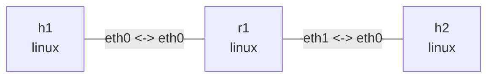

# BPF 数据路径

在此目录执行。Ubuntu 依赖 `clang llvm libbpf-dev make iproute2 tcpdump iputils-ping`，内核需要 BPF 和 clsact 支持。使用 generic XDP，避免依赖网卡 native XDP。该程序只识别未分片的 Ethernet/IPv4 ICMP Echo Request，ARP、IPv6、VLAN 和其它协议透传，不是安全防火墙。

```console
$ make
clang ... -target bpf ... -c path_lab.c -o path_lab.o
```

## 拓扑与部署

```bash
nslab graph --format mermaid
```



```console
$ sudo nslab deploy
deployed topology: bpf-path
$ sudo nslab inspect
status: deployed
...
```

## 基线与抓包点

在两个终端分别抓 r1 的入接口和 h2 接口，第三个终端执行后面的命令。每个阶段单独开始抓包以免混淆旧数据。先验证普通 Linux 路由转发。

```console
$ sudo nslab exec --node r1 -- tcpdump -ni eth0 'icmp and icmp[0] = 8'
... 10.72.1.1 > 10.72.2.2: ICMP echo request ...
$ sudo nslab exec --node h2 -- tcpdump -ni eth0 'icmp and icmp[0] = 8'
... 10.72.1.1 > 10.72.2.2: ICMP echo request ...
$ sudo nslab exec --node h1 -- ping -c 2 -W 1 10.72.2.2
...
2 packets transmitted, 2 received, 0% packet loss
```

## XDP_DROP

在 r1:eth0 上安装 XDP_DROP。Echo Request 在常规 AF_PACKET 抓包点之前丢弃，r1 和 h2 的抓包都看不到它。发送端仍能抓到自己发出的请求。此处只讨论本示例的 Linux generic XDP 路径。

```console
$ sudo nslab exec --node r1 -- ip link set dev eth0 xdpgeneric obj "$PWD/path_lab.o" sec xdp/drop
(no output)
$ sudo nslab exec --node r1 -- ip -details link show dev eth0
... prog/xdp id <id> ...
$ sudo nslab exec --node h1 -- ping -c 2 -W 1 10.72.2.2
...
2 packets transmitted, 0 received, 100% packet loss
$ sudo nslab exec --node r1 -- ip link set dev eth0 xdpgeneric off
(no output)
```

## TC ingress

clsact 提供 ingress/egress 挂载点，不进行限速。direct-action 程序返回 TC_ACT_SHOT。r1:eth0 的抓包能看到请求，但报文在进入正常 IP 路由处理前丢弃，h2 收不到。

```console
$ sudo nslab exec --node r1 -- tc qdisc add dev eth0 clsact
(no output)
$ sudo nslab exec --node r1 -- tc filter add dev eth0 ingress pref 10 bpf da obj "$PWD/path_lab.o" sec classifier/drop
(no output)
$ sudo nslab exec --node r1 -- tc filter show dev eth0 ingress
filter ... pref 10 bpf ... direct-action ... id <id> ...
$ sudo nslab exec --node h1 -- ping -c 2 -W 1 10.72.2.2
...
2 packets transmitted, 0 received, 100% packet loss
$ sudo nslab exec --node r1 -- tc qdisc del dev eth0 clsact
(no output)
```

## TC egress

将同一个程序挂到 r1:eth1 egress。报文已经经过 r1 的选路，但在发送到 h2 前丢弃。访问 r1 自己的 eth0 地址仍然成功，因为该响应不经过 eth1 egress。

```console
$ sudo nslab exec --node r1 -- tc qdisc add dev eth1 clsact
(no output)
$ sudo nslab exec --node r1 -- tc filter add dev eth1 egress pref 10 bpf da obj "$PWD/path_lab.o" sec classifier/drop
(no output)
$ sudo nslab exec --node h1 -- ping -c 2 -W 1 10.72.2.2
...
2 packets transmitted, 0 received, 100% packet loss
$ sudo nslab exec --node h1 -- ping -c 2 -W 1 10.72.1.254
...
2 packets transmitted, 2 received, 0% packet loss
$ sudo nslab exec --node r1 -- tc qdisc del dev eth1 clsact
(no output)
```

## TC_ACT_OK 与对比

最后加载 pass section，确认 TC 挂载本身不会阻断转发。ping 非零在三个 drop 阶段是预期结果，不要用 set -e 连续执行全部实验。不同 hook 不能互换返回码：XDP_PASS 和 TC_ACT_OK 属于不同程序类型。

```console
$ sudo nslab exec --node r1 -- tc qdisc add dev eth0 clsact
(no output)
$ sudo nslab exec --node r1 -- tc filter add dev eth0 ingress pref 10 bpf da obj "$PWD/path_lab.o" sec classifier/pass
(no output)
$ sudo nslab exec --node h1 -- ping -c 2 -W 1 10.72.2.2
...
2 packets transmitted, 2 received, 0% packet loss
$ sudo nslab exec --node r1 -- tc qdisc del dev eth0 clsact
(no output)
```

| Stage | r1 eth0 capture | h2 capture | Ping |
| --- | --- | --- | --- |
| Baseline / TC_ACT_OK | Request | Request | OK |
| XDP_DROP on r1 eth0 | No request | No request | Timeout |
| TC ingress DROP on r1 eth0 | Request | No request | Timeout |
| TC egress DROP on r1 eth1 | Request | No request | Timeout |

## 清理

停止所有抓包，然后 destroy。即使中途未卸载程序，namespace/接口销毁也会释放本例没有 pin 的 BPF 程序。重新实验使用 redeploy，避免残留 hook 叠加。重定向和 FIB/MAC/TTL 改写可接着做现有 xdp 示例。


```console
$ sudo nslab destroy
destroyed topology: bpf-path
$ sudo nslab inspect
status: absent
...
```
