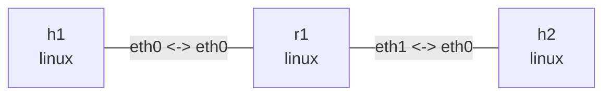

# BPF 数据路径

在此目录执行。基础 Ubuntu 依赖 `clang llvm libbpf-dev make iproute2 tcpdump iputils-ping`，内核需要 BPF 和 clsact 支持。基础动作与 DEVMAP 使用 generic XDP；CPUMAP 显式使用 native XDP，AF_XDP 使用 generic/copy，额外依赖见对应小节。程序只识别未分片的 Ethernet/IPv4 ICMP Echo Request，ARP、IPv6、VLAN 和其它协议透传，不是安全防火墙。

```console
$ make
clang ... -target bpf ... -c path_lab.c -o path_lab.o
```

## 拓扑与部署

```bash
nslab graph --format mermaid
```



```console
$ sudo nslab deploy
deployed topology: bpf-path
$ sudo nslab inspect
status: deployed
...
```

## 基线与抓包点

在两个终端分别抓 r1 的入接口和 h2 接口，第三个终端执行后面的命令。每个阶段单独开始抓包以免混淆旧数据。先验证普通 Linux 路由转发。

```console
$ sudo nslab exec --node r1 -- tcpdump -ni eth0 'icmp and icmp[0] = 8'
... 10.72.1.1 > 10.72.2.2: ICMP echo request ...
$ sudo nslab exec --node h2 -- tcpdump -ni eth0 'icmp and icmp[0] = 8'
... 10.72.1.1 > 10.72.2.2: ICMP echo request ...
$ sudo nslab exec --node h1 -- ping -c 2 -W 1 10.72.2.2
...
2 packets transmitted, 2 received, 0% packet loss
```

## XDP_DROP

在 r1:eth0 上安装 XDP_DROP。Echo Request 在常规 AF_PACKET 抓包点之前丢弃，r1 和 h2 的抓包都看不到它。发送端仍能抓到自己发出的请求。此处只讨论本示例的 Linux generic XDP 路径。

```console
$ sudo nslab exec --node r1 -- ip link set dev eth0 xdpgeneric obj "$PWD/path_lab.o" sec xdp/drop
(no output)
$ sudo nslab exec --node r1 -- ip -details link show dev eth0
... prog/xdp id <id> ...
$ sudo nslab exec --node h1 -- ping -c 2 -W 1 10.72.2.2
...
2 packets transmitted, 0 received, 100% packet loss
$ sudo nslab exec --node r1 -- ip link set dev eth0 xdpgeneric off
(no output)
```

## TC ingress

clsact 提供 ingress/egress 挂载点，不进行限速。direct-action 程序返回 TC_ACT_SHOT。r1:eth0 的抓包能看到请求，但报文在进入正常 IP 路由处理前丢弃，h2 收不到。

```console
$ sudo nslab exec --node r1 -- tc qdisc add dev eth0 clsact
(no output)
$ sudo nslab exec --node r1 -- tc filter add dev eth0 ingress pref 10 bpf da obj "$PWD/path_lab.o" sec classifier/drop
(no output)
$ sudo nslab exec --node r1 -- tc filter show dev eth0 ingress
filter ... pref 10 bpf ... direct-action ... id <id> ...
$ sudo nslab exec --node h1 -- ping -c 2 -W 1 10.72.2.2
...
2 packets transmitted, 0 received, 100% packet loss
$ sudo nslab exec --node r1 -- tc qdisc del dev eth0 clsact
(no output)
```

## TC egress

将同一个程序挂到 r1:eth1 egress。报文已经经过 r1 的选路，但在发送到 h2 前丢弃。访问 r1 自己的 eth0 地址仍然成功，因为该响应不经过 eth1 egress。

```console
$ sudo nslab exec --node r1 -- tc qdisc add dev eth1 clsact
(no output)
$ sudo nslab exec --node r1 -- tc filter add dev eth1 egress pref 10 bpf da obj "$PWD/path_lab.o" sec classifier/drop
(no output)
$ sudo nslab exec --node h1 -- ping -c 2 -W 1 10.72.2.2
...
2 packets transmitted, 0 received, 100% packet loss
$ sudo nslab exec --node h1 -- ping -c 2 -W 1 10.72.1.254
...
2 packets transmitted, 2 received, 0% packet loss
$ sudo nslab exec --node r1 -- tc qdisc del dev eth1 clsact
(no output)
```

## TC_ACT_OK 与对比

最后加载 pass section，确认 TC 挂载本身不会阻断转发。ping 非零在三个 drop 阶段是预期结果，不要用 set -e 连续执行全部实验。不同 hook 不能互换返回码：XDP_PASS 和 TC_ACT_OK 属于不同程序类型。

```console
$ sudo nslab exec --node r1 -- tc qdisc add dev eth0 clsact
(no output)
$ sudo nslab exec --node r1 -- tc filter add dev eth0 ingress pref 10 bpf da obj "$PWD/path_lab.o" sec classifier/pass
(no output)
$ sudo nslab exec --node h1 -- ping -c 2 -W 1 10.72.2.2
...
2 packets transmitted, 2 received, 0% packet loss
$ sudo nslab exec --node r1 -- tc qdisc del dev eth0 clsact
(no output)
```

| Stage | r1 eth0 capture | h2 capture | Ping |
| --- | --- | --- | --- |
| Baseline / TC_ACT_OK | Request | Request | OK |
| XDP_DROP on r1 eth0 | No request | No request | Timeout |
| TC ingress DROP on r1 eth0 | Request | No request | Timeout |
| TC egress DROP on r1 eth1 | Request | No request | Timeout |

## 进阶：DEVMAP 与 TC redirect

这部分沿用同一拓扑，对比 map 驱动的 XDP 重定向与 skb 路径的 TC ingress 重定向。不是性能基准；其中 XDP 一侧使用 generic 模式，不代表 native XDP 的批量发送、CPU 调度或吞吐表现。后面的 CPUMAP 与 AF_XDP 小节分别观察目标 CPU 和用户态路径。

额外依赖 C 编译器、`libbpf >= 0.7`、`libelf-dev zlib1g-dev`，推荐 Ubuntu 24.04 的 `gcc libbpf-dev`。原来的 `make` 只编译 drop/pass 实验；进阶部分单独构建：

```console
$ make redirect
clang ... -target bpf ... -c redirect_lab.bpf.c -o redirect_lab.bpf.o
cc ... redirect_lab.c -o redirect_lab -lbpf -lelf -lz
```

停止前面的抓包和程序，重新部署后预热下一跳邻居。FIB helper 不能替代 ARP：未解析邻居、TTL 过低或 FIB 查询失败都会回退 Linux。

```console
$ sudo nslab redeploy
redeployed topology: bpf-path
$ sudo nslab exec --node r1 -- ping -c 1 -W 2 10.72.2.2
...
1 packets transmitted, 1 received, 0% packet loss
```

### DEVMAP 重定向

在终端 A 运行加载器并保持前台。加载器将 eth1 的真实 ifindex 写入 DEVMAP_HASH，以 ifindex 同时作为 key 和 value，不假定接口编号固定。

```console
$ sudo nslab exec --node r1 -- env -u LD_LIBRARY_PATH "$PWD/redirect_lab" devmap eth0 eth1 "$PWD/redirect_lab.bpf.o"
attached devmap on eth0; output eth1; Ctrl+C detaches
seen=0 redirected=0 map_miss=0 fib_fallback=0 passed=0
...
seen=<N> redirected=3 map_miss=0 fib_fallback=0 passed=<N-3>
```

在其它终端分别启动 r1 入接口、h2 接口抓包，然后 ping。上面的计数变化出现在发包之后；示意输出中的 N 可能包含 ARP 等背景流量。

```console
$ sudo nslab exec --node r1 -- env -u LD_LIBRARY_PATH tcpdump -nni eth0 'icmp and icmp[0] = 8'
listening on eth0 ...
(no Echo Requests in devmap mode)
$ sudo nslab exec --node h2 -- env -u LD_LIBRARY_PATH tcpdump -nnvi eth0 'icmp and icmp[0] = 8'
... IP (... ttl 63, ... proto ICMP ...)
    10.72.1.1 > 10.72.2.2: ICMP echo request ...
$ sudo nslab exec --node h1 -- ping -c 3 -W 2 10.72.2.2
...
3 packets transmitted, 3 received, 0% packet loss
```

程序先查询 FIB、确认 DEVMAP 命中，再改写下一跳 MAC、递减 TTL 并修正 IPv4 header checksum，最后返回 XDP_REDIRECT。Echo Reply 仍走 Linux 路由。这里绕过的是请求包后续的常规 IPv4 转发路径，不是绕过路由和邻居信息。

### 空 map 回退

在终端 A 按 Ctrl+C 等待卸载，保持其它终端用于重新抓包和 ping，再切换 empty 模式。此模式创建同样的 DEVMAP，但不填入出口：

```console
$ sudo nslab exec --node r1 -- env -u LD_LIBRARY_PATH "$PWD/redirect_lab" empty eth0 eth1 "$PWD/redirect_lab.bpf.o"
attached empty on eth0; output eth1; Ctrl+C detaches
...
seen=<N> redirected=0 map_miss=3 fib_fallback=0 passed=<N>
$ sudo nslab exec --node h1 -- ping -c 3 -W 2 10.72.2.2
...
3 packets transmitted, 3 received, 0% packet loss
```

`bpf_redirect_map(..., XDP_PASS)` 未命中时返回 XDP_PASS。此时必须保持 MAC、TTL 和 checksum 原样，让 Linux 只做一次转发处理。r1 入接口现在能抓到请求，h2 仍看到 TTL=63；若提前递减 TTL 再回退，就可能错误地变成 62。

### TC ingress 重定向

先停止 empty 加载器，再运行 tc 模式。加载器独占创建 r1:eth0 的 clsact，并安装 direct-action 程序；已有 clsact 时拒绝运行，不覆盖此前的实验配置。

```console
$ sudo nslab exec --node r1 -- env -u LD_LIBRARY_PATH "$PWD/redirect_lab" tc eth0 eth1 "$PWD/redirect_lab.bpf.o"
attached tc on eth0; output eth1; Ctrl+C detaches
...
seen=<N> redirected=3 map_miss=0 fib_fallback=0 passed=<N-3>
$ sudo nslab exec --node h1 -- ping -c 3 -W 2 10.72.2.2
...
3 packets transmitted, 3 received, 0% packet loss
$ sudo nslab exec --node h1 -- ping -t 1 -c 1 -W 1 10.72.2.2
From 10.72.1.254 icmp_seq=1 Time to live exceeded
...
1 packets transmitted, 0 received, +1 errors, 100% packet loss
```

TC 程序处理的是 skb，在 ingress 执行 FIB 查询、MAC/TTL/checksum 改写，再用 `bpf_redirect(ifindex, 0)` 送往出口 egress。flags=0 不是送往目标 ingress。抓包点在 TC ingress 之前，所以 r1 能看到这些请求。

最后一条 TTL=1 的 ping 返回非零是预期行为。三种模式都把它交回 Linux，生成 ICMP Time Exceeded，不在 BPF 中直接减成 0。

| Mode | r1 eth0 Echo Request | h2 request TTL | Counter after 3 requests |
| --- | --- | --- | --- |
| devmap | 不可见 | 63 | redirected +3 |
| empty | 可见 | 63 | map_miss +3，redirected +0 |
| tc | 可见 | 63 | redirected +3 |

### 计数与生命周期

计数使用 PERCPU_ARRAY，加载器每秒汇总所有 possible CPU。seen 是该 hook 收到的包数；passed 是交回 Linux 的包数；fib_fallback 表示候选请求的 FIB helper 未成功；map_miss 表示出口不在 DEVMAP。redirected 只证明程序选择了重定向，不能单独证明后续实际发送成功，必须结合接收端抓包和 ping。

两类 BPF 程序都只处理未分片的 IPv4 Echo Request，未覆盖 IPv6、VLAN、所有 checksum 验证和完整路由器错误处理，不是通用路由器或安全策略。TC 模式只重定向 FIB 选出的出口与命令参数一致的请求。

加载器不 pin 对象、不要求挂载 bpffs。Ctrl+C / SIGTERM 会卸载自己安装的 XDP 或删除自己创建的 clsact，关闭 fd 后释放 maps。运行期间不要另行修改这些 hook；XDP 挂载拒绝覆盖已有程序，卸载时检查预期程序 fd。SIGKILL 无法运行清理，停止其它实验进程后用 redeploy 回收 namespace/interface。必须先停止加载器，再 destroy。

命令中的 `env -u LD_LIBRARY_PATH` 避免独立打包的 nslab 将自带动态库路径传给系统 libbpf/tcpdump。

### 一次性检查

停止上述加载器和抓包后，也可以运行下面的可选脚本。它创建独立随机名称的拓扑，不修改当前部署，验证三种模式的计数、抓包点、TTL、重复挂载拒绝和卸载，最后自动 destroy。失败会打印原始日志并返回非零；该 root 实验不加入 CI。NSLAB_BIN 可指定 nslab 的绝对路径。

```console
$ sudo python3 ./check_redirect.py
deployed topology: bpf-check-<random>
devmap: PASS (redirect/fallback, TTL, capture, duplicate refusal, detach)
empty: PASS (redirect/fallback, TTL, capture, duplicate refusal, detach)
tc: PASS (redirect/fallback, TTL, capture, duplicate refusal, detach)
destroyed topology: bpf-check-<random>
```

## CPUMAP：指定 CPU 后回到协议栈

沿用已部署的拓扑，先停止之前的加载器和抓包，不要叠加多个模式。CPUMAP 的 remote XDP 程序要求 Linux 5.9+；本例要求 veth 支持 native XDP，不会静默降级为 generic。只需编译此部分时运行 `make cpumap`；使用前述 libbpf 开发依赖，不需要 libxdp。

```console
$ make cpumap
clang ... -target bpf ... -c cpu_lab.bpf.c -o cpu_lab.bpf.o
cc ... cpu_lab.c -o cpu_lab -lbpf -lelf -lz
```

终端 A 保持加载器运行，在另一终端 ping。auto 选择当前 CPU affinity 允许的第二个 CPU，只有一个可用 CPU 时选择它；也可以替换成允许的 CPU 编号。输出中的 CPU 编号为示意，入口 CPU 由实际接收执行位置决定。

```console
$ sudo nslab exec --node r1 -- env -u LD_LIBRARY_PATH "$PWD/cpu_lab" eth0 auto "$PWD/cpu_lab.bpf.o"
attached cpumap native on eth0 target_cpu=1 qsize=2048
...
stage=ingress cpu=0 packets=3
stage=remote cpu=1 packets=3
$ sudo nslab exec --node h1 -- ping -c 3 -W 2 10.72.2.2
...
3 packets transmitted, 3 received, 0% packet loss
```

入口程序只将 IPv4 Echo Request 经 CPUMAP 排队到目标 CPU。目标 CPU 上的 `xdp/cpumap` 程序计数并返回 XDP_PASS，随后 Linux 协议栈正常处理和转发。这里不改 MAC/TTL，h2 应看到 TTL=63，不能把这一步误认为 DEVMAP 式的出口转发。

stage=ingress / remote 是各 CPU 上匹配请求的累计计数，不是所有以太帧计数；remote 的 cpu 应等于 target_cpu。想证明跨 CPU，还要确认 ingress 与 remote 不同；单 CPU 环境只能验证排队和协议栈恢复。qsize=2048 是 CPUMAP 队列容量，不是限速参数，高负载下仍可能队列溢出，入口计数不等于交付成功。

停止发包后，在加载器终端按 Ctrl+C，卸载 native XDP 并释放 map/远端程序。不 pin 对象，不修改 CPU 全局配置，不运行常驻系统服务。

## AF_XDP：用户态 ICMP 收发

额外安装环境依赖 `libxdp-dev`（推荐 Ubuntu 24.04），使用 libxdp 的 XSK API 管理 AF_XDP socket 和 UMEM ring。可用 `make af-xdp` 单独编译；`make advanced` 构建本页全部进阶程序。

```console
$ make af-xdp
clang ... -target bpf ... -c xsk_lab.bpf.c -o xsk_lab.bpf.o
cc ... xsk_lab.c -o xsk_lab -lxdp -lbpf -lelf -lz
```

先停止 CPUMAP 加载器。这里挂 generic XDP，明确请求 XDP_COPY，绑定 r1:eth0 的 RX queue 0，并查询内核确认 zero_copy=no。不是零拷贝、不是 DPDK，也不创建 TAP/TUN。

加载器只接受已经配置在此接口上的 LOCAL_IPV4。发往这个地址的普通 IPv4 Echo Request 进入 XSKMAP 和用户态；用户态校验 IP/ICMP checksum，交换 MAC/IP 地址，保留 ICMP identifier、sequence 和 payload，生成 Echo Reply，再通过 AF_XDP TX ring 从原接口发出。有 IP options、分片或其它协议的包不进入本例的用户态响应路径。

终端 A 保持运行，另一个终端发送测试流量。300 个请求超过本例 256 个 UMEM frame，可验证 frame 回收循环；后两种 payload 长度验证奇数长度 checksum 与 MTU 边界。最后发往 h2 的请求不匹配 LOCAL_IPV4，仍由 Linux 转发，不增加 AF_XDP 的 rx/tx 计数。

```console
$ sudo nslab exec --node r1 -- env -u LD_LIBRARY_PATH "$PWD/xsk_lab" eth0 10.72.1.254 "$PWD/xsk_lab.bpf.o"
attached af_xdp generic on eth0 queue=0 mode=copy zero_copy=no address=10.72.1.254
rx=0 tx=0 completed=0 rejected=0
...
rx=300 tx=300 completed=300 rejected=0
$ sudo nslab exec --node h1 -- ping -c 300 -i 0.01 -W 2 10.72.1.254
...
300 packets transmitted, 300 received, 0% packet loss
$ sudo nslab exec --node h1 -- ping -s 57 -c 3 -W 2 10.72.1.254
...
3 packets transmitted, 3 received, 0% packet loss
$ sudo nslab exec --node h1 -- ping -s 1472 -c 3 -W 2 10.72.1.254
...
3 packets transmitted, 3 received, 0% packet loss
$ sudo nslab exec --node h1 -- ping -c 3 -W 2 10.72.2.2
...
3 packets transmitted, 3 received, 0% packet loss
```

| 队列 | 作用 |
| --- | --- |
| FILL | 用户态交给内核的空闲 UMEM frame 地址 |
| RX | 内核交给用户态的接收描述符 |
| TX | 用户态提交给内核的发送描述符 |
| COMPLETION | 内核归还可复用的发送 frame，不是对端 ACK |

本例使用 256 × 4096 字节的 UMEM，不需要 hugepages。每个 frame 在任一时刻只归一个队列或用户态空闲列表所有；不能提交 TX 后立即把同一个 frame 塞回 FILL，必须等 COMPLETION。

rx 是用户态取出的包数，tx 是提交 TX 的数量，completed 是归还的 frame 数，rejected 包含报文校验失败或 TX ring 无空间导致的丢弃。tx/completed 不能单独证明对端收到报文，应同时看 ping 和接收端抓包。

### AF_XDP 抓包与清理

在其它终端抓包，再发送上面的 ping。进入 XSK 的请求不走 r1 常规协议栈抓包点；h1 可以看到请求和用户态生成的响应。

```console
$ sudo nslab exec --node r1 -- env -u LD_LIBRARY_PATH tcpdump -nni eth0 'dst host 10.72.1.254 and icmp and icmp[0] = 8'
listening on eth0 ...
(no Echo Requests while AF_XDP handles them)
$ sudo nslab exec --node h1 -- env -u LD_LIBRARY_PATH tcpdump -nni eth0 icmp
... 10.72.1.1 > 10.72.1.254: ICMP echo request ...
... 10.72.1.254 > 10.72.1.1: ICMP echo reply ...
```

Ctrl+C / SIGTERM 先卸载 XDP，再关闭 socket、释放 UMEM 和 maps。SIGKILL 无法执行此流程，需在停止其它实验进程后 redeploy 清理残留 hook。运行期间不要重配接口、queue 或替换程序。不要在加载器仍运行时 destroy。

### 完整进阶检查

编译 `make advanced` 后，以下可选脚本在独立临时拓扑中检查本页全部进阶模式。它还会暂停 AF_XDP 用户态进程，确认 ping 超时，恢复后再测收发，从而排除“实际仍由内核回复”的假象。普通模式的检查命令仍然有效，不额外要求 libxdp。

```console
$ sudo python3 ./check_redirect.py --advanced
deployed topology: bpf-check-<random>
devmap: PASS (redirect/fallback, TTL, capture, duplicate refusal, detach)
empty: PASS (redirect/fallback, TTL, capture, duplicate refusal, detach)
tc: PASS (redirect/fallback, TTL, capture, duplicate refusal, detach)
cpumap: PASS (native XDP, target CPU 1, stack resume, TTL, detach)
af_xdp: PASS (copy mode, userspace RX/TX, UMEM recycling, checksums, detach)
destroyed topology: bpf-check-<random>
```

不支持 native XDP、CPUMAP 或 AF_XDP 时，该可选检查返回非零并清理，不会伪装为通过，也不会自动修改宿主机配置。它不加入特权 CI 测试。

## 清理

停止所有抓包，然后 destroy。即使中途未卸载程序，namespace/接口销毁也会释放本例没有 pin 的 BPF 程序。重新实验使用 redeploy，避免残留 hook 叠加。重定向和 FIB/MAC/TTL 改写可接着做现有 xdp 示例。


```console
$ sudo nslab destroy
destroyed topology: bpf-path
$ sudo nslab inspect
status: absent
...
```
