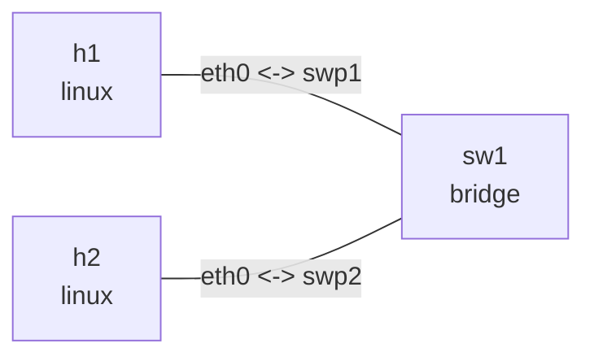

# Linux bridge FDB

## 实验目标

用两台主机和一台 Linux bridge 观察二层转发、动态 MAC 学习以及端口计数器变化。

## 拓扑图

```bash
nslab graph --format mermaid
```



以下为典型输出；接口索引、MAC 地址和计数器会随运行变化。

## 运行

```bash
cd examples/bridge-fdb
```

```console
$ sudo nslab deploy
deployed topology: bridge-fdb

$ sudo nslab inspect
status: deployed

NAME  KIND    STATUS    NAMESPACE
----  ------  --------  ----------------------------
h1    linux   matching  nslab-bridge-fdb-h1-...
sw1   bridge  matching  nslab-bridge-fdb-sw1-...
h2    linux   matching  nslab-bridge-fdb-h2-...

$ sudo nslab deploy
topology already deployed: bridge-fdb
```

## 观察 FDB

先读取初始 FDB，再发送 ICMP 流量：

```console
$ sudo nslab exec --node sw1 -- bridge fdb show br br0
... dev swp1 self permanent
... dev swp2 self permanent

$ sudo nslab exec --node h1 -- ping -c 3 10.10.0.2
PING 10.10.0.2 (10.10.0.2) 56(84) bytes of data.
64 bytes from 10.10.0.2: icmp_seq=1 ttl=64 time=<time> ms
...
3 packets transmitted, 3 received, 0% packet loss

$ sudo nslab exec --node sw1 -- bridge fdb show br br0
<h1-mac> dev swp1 master br0
<h2-mac> dev swp2 master br0
...
```

端口计数器会随流量增加：

```console
$ sudo nslab exec --node sw1 -- ip -s link show swp1
... swp1 ... state UP ...
    RX:  bytes  packets  errors  dropped  missed  mcast
         ...    ...      0       0        0       ...
    TX:  bytes  packets  errors  dropped  carrier  collsns
         ...    ...      0       0        0        0

$ sudo nslab exec --node sw1 -- ip -s link show swp2
... swp2 ... state UP ...
    RX:  bytes  packets  errors  dropped  missed  mcast
         ...    ...      0       0        0       ...
    TX:  bytes  packets  errors  dropped  carrier  collsns
         ...    ...      0       0        0        0
```

## 清理

```console
$ sudo nslab destroy
destroyed topology: bridge-fdb

$ sudo nslab destroy
topology already absent: bridge-fdb
```

[查看 nslab.yaml](https://github.com/calcky/nslab/blob/main/examples/bridge-fdb/nslab.yaml) ·
[查看示例 README](https://github.com/calcky/nslab/blob/main/examples/bridge-fdb/README.md)
