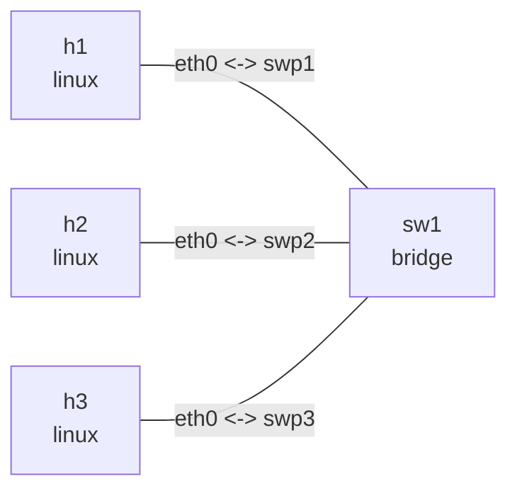

# Bridge port controls

## Goal

Use one Linux bridge and three hosts to observe `hairpin`, `isolated`, `learning`, `flood`, and
`multicast_flood`. `h1` and `h2` use isolated ports, while `h3` uses a normal port. The port toward
`h2` also disables MAC learning, unknown-unicast flooding, and unregistered-multicast flooding.

## Graph

```bash
nslab graph --format mermaid
```



The outputs below are representative. Interface indexes, veth peer indexes, port MAC addresses,
and ICMP timings vary.

## Deploy

```console
$ sudo nslab deploy
deployed topology: bridge-port-controls

$ sudo nslab inspect
status: deployed

NAME  KIND    STATUS    NAMESPACE
----  ------  --------  ----------------------------------
h1    linux   matching  nslab-bridge-port-controls-h1-...
sw1   bridge  matching  nslab-bridge-port-controls-sw1-...
h2    linux   matching  nslab-bridge-port-controls-h2-...
h3    linux   matching  nslab-bridge-port-controls-h3-...
```

## Inspect port flags

```console
$ sudo nslab exec -N sw1 -- bridge -details link show dev swp1
... swp1@... master br0 state forwarding priority 32 cost 2
    hairpin on ... learning on flood on mcast_flood on ... isolated on ...

$ sudo nslab exec -N sw1 -- bridge -details link show dev swp2
... swp2@... master br0 state forwarding priority 32 cost 2
    hairpin off ... learning off flood off mcast_flood off ... isolated on ...
```

`hairpin on` permits a frame to leave through its ingress port, commonly for multiple VEPA
endpoints behind one port. `isolated on` prevents direct forwarding between isolated ports while
still allowing access to normal ports.

## Verify port isolation

`h1` cannot reach `h2` behind another isolated port:

```console
$ sudo nslab exec -N h1 -- ping -c 1 -W 1 10.20.0.2
PING 10.20.0.2 (10.20.0.2) 56(84) bytes of data.
1 packets transmitted, 0 received, 100% packet loss
```

It can reach `h3` behind a normal port:

```console
$ sudo nslab exec -N h1 -- ping -c 1 -W 2 10.20.0.3
64 bytes from 10.20.0.3: icmp_seq=1 ttl=64 time=<time> ms
1 packets transmitted, 1 received, 0% packet loss
```

## Verify learning and unknown-unicast flooding

`h3` resolves the fixed MAC of `h2` through broadcast ARP, but the following ICMP unicast fails:

```console
$ sudo nslab exec -N h3 -- ping -c 1 -W 1 10.20.0.2
PING 10.20.0.2 (10.20.0.2) 56(84) bytes of data.
1 packets transmitted, 0 received, 100% packet loss

$ sudo nslab exec -N h3 -- ip neigh show 10.20.0.2
10.20.0.2 dev eth0 lladdr 02:00:00:00:20:02 REACHABLE

$ sudo nslab exec -N sw1 -- bridge fdb show br br0 dev swp2
<swp2-mac> vlan 1 master br0 permanent
<swp2-mac> master br0 permanent
...
```

With `learning: false`, the FDB does not contain `02:00:00:00:20:02`. That destination is unknown,
and `flood: false` prevents it from being flooded toward `swp2`. Temporarily enable flooding to
restore connectivity. `inspect` reports the explicit configuration drift:

```console
$ sudo nslab exec -N sw1 -- bridge link set dev swp2 flood on && echo "swp2 flood enabled"
swp2 flood enabled

$ sudo nslab inspect
status: degraded

$ sudo nslab exec -N h3 -- ping -c 1 -W 2 10.20.0.2
64 bytes from 10.20.0.2: icmp_seq=1 ttl=64 time=<time> ms
1 packets transmitted, 1 received, 0% packet loss

$ sudo nslab exec -N sw1 -- bridge link set dev swp2 flood off && echo "swp2 flood restored"
swp2 flood restored

$ sudo nslab inspect
status: deployed
```

`multicast_flood: false` independently prevents unregistered multicast from being flooded toward
`swp2`; it does not suppress broadcast ARP.

## Clean up

```console
$ sudo nslab destroy
destroyed topology: bridge-port-controls
```

[View nslab.yaml](https://github.com/calcky/nslab/blob/main/examples/bridge-port-controls/nslab.yaml) ·
[View example README](https://github.com/calcky/nslab/blob/main/examples/bridge-port-controls/README.md)
