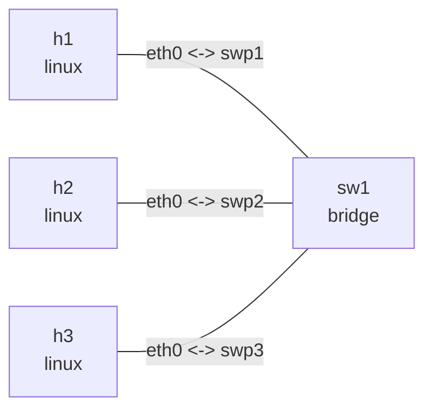

# Bridge 端口控制

## 实验目标

用一台 Linux bridge 和三台主机观察 `hairpin`、`isolated`、`learning`、`flood` 与
`multicast_flood`。`h1`、`h2` 位于隔离端口，`h3` 位于普通端口；`h2` 端口还关闭了
MAC 学习以及未知单播和未注册组播泛洪。

## 拓扑图

```bash
nslab graph --format mermaid
```



以下为典型输出；接口索引、veth 对端索引、端口自身 MAC 和 ICMP 时延会随运行变化。

## 部署

```console
$ sudo nslab deploy
deployed topology: bridge-port-controls

$ sudo nslab inspect
status: deployed

NAME  KIND    STATUS    NAMESPACE
----  ------  --------  ----------------------------------
h1    linux   matching  nslab-bridge-port-controls-h1-...
sw1   bridge  matching  nslab-bridge-port-controls-sw1-...
h2    linux   matching  nslab-bridge-port-controls-h2-...
h3    linux   matching  nslab-bridge-port-controls-h3-...
```

## 查看端口标志

```console
$ sudo nslab exec -N sw1 -- bridge -details link show dev swp1
... swp1@... master br0 state forwarding priority 32 cost 2
    hairpin on ... learning on flood on mcast_flood on ... isolated on ...

$ sudo nslab exec -N sw1 -- bridge -details link show dev swp2
... swp2@... master br0 state forwarding priority 32 cost 2
    hairpin off ... learning off flood off mcast_flood off ... isolated on ...
```

`hairpin on` 允许报文从入端口原路发回，常用于端口后方存在多个 VEPA endpoint 的场景。
`isolated on` 禁止两个隔离端口直接互通，但仍允许它们访问普通端口。

## 验证端口隔离

`h1` 无法访问另一个隔离端口后的 `h2`：

```console
$ sudo nslab exec -N h1 -- ping -c 1 -W 1 10.20.0.2
PING 10.20.0.2 (10.20.0.2) 56(84) bytes of data.
1 packets transmitted, 0 received, 100% packet loss
```

但可以访问普通端口后的 `h3`：

```console
$ sudo nslab exec -N h1 -- ping -c 1 -W 2 10.20.0.3
64 bytes from 10.20.0.3: icmp_seq=1 ttl=64 time=<time> ms
1 packets transmitted, 1 received, 0% packet loss
```

## 验证学习与未知单播泛洪

`h3` 能通过广播 ARP 得到 `h2` 的固定 MAC，但后续 ICMP 单播仍失败：

```console
$ sudo nslab exec -N h3 -- ping -c 1 -W 1 10.20.0.2
PING 10.20.0.2 (10.20.0.2) 56(84) bytes of data.
1 packets transmitted, 0 received, 100% packet loss

$ sudo nslab exec -N h3 -- ip neigh show 10.20.0.2
10.20.0.2 dev eth0 lladdr 02:00:00:00:20:02 REACHABLE

$ sudo nslab exec -N sw1 -- bridge fdb show br br0 dev swp2
<swp2-mac> vlan 1 master br0 permanent
<swp2-mac> master br0 permanent
...
```

因为 `learning: false`，FDB 中没有 `02:00:00:00:20:02`。目的 MAC 因而属于未知单播，
而 `flood: false` 又禁止向 `swp2` 泛洪它。临时打开泛洪后，连通性恢复，同时 `inspect`
会报告这一显式配置漂移：

```console
$ sudo nslab exec -N sw1 -- bridge link set dev swp2 flood on && echo "swp2 flood enabled"
swp2 flood enabled

$ sudo nslab inspect
status: degraded

$ sudo nslab exec -N h3 -- ping -c 1 -W 2 10.20.0.2
64 bytes from 10.20.0.2: icmp_seq=1 ttl=64 time=<time> ms
1 packets transmitted, 1 received, 0% packet loss

$ sudo nslab exec -N sw1 -- bridge link set dev swp2 flood off && echo "swp2 flood restored"
swp2 flood restored

$ sudo nslab inspect
status: deployed
```

`multicast_flood: false` 独立控制未注册组播是否向 `swp2` 泛洪，不影响广播 ARP。

## 清理

```console
$ sudo nslab destroy
destroyed topology: bridge-port-controls
```

[查看 nslab.yaml](https://github.com/calcky/nslab/blob/main/examples/bridge-port-controls/nslab.yaml) ·
[查看示例 README](https://github.com/calcky/nslab/blob/main/examples/bridge-port-controls/README.md)
