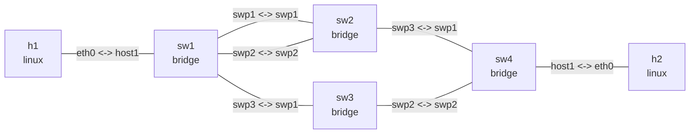

# Linux bridge STP

## 实验目标

四台 Linux bridge 构成冗余二层拓扑，用于观察根桥选举、等 cost 链路的端口优先级、
path cost 以及链路故障后的 STP 重收敛。

## 拓扑图

```bash
nslab graph --format mermaid
```



`nslab graph --detail` 还可在终端中显示 bridge priority、端口 priority 和 path cost。
以下输出中的接口索引、MAC 地址、计数器和 timer 会随运行变化。

## 运行并等待收敛

```bash
cd examples/bridge-stp
```

```console
$ sudo nslab deploy
deployed topology: bridge-stp

$ sudo nslab inspect
status: deployed

NAME  KIND    STATUS    NAMESPACE
----  ------  --------  ----------------------------
h1    linux   matching  nslab-bridge-stp-h1-...
sw1   bridge  matching  nslab-bridge-stp-sw1-...
sw2   bridge  matching  nslab-bridge-stp-sw2-...
sw3   bridge  matching  nslab-bridge-stp-sw3-...
sw4   bridge  matching  nslab-bridge-stp-sw4-...
h2    linux   matching  nslab-bridge-stp-h2-...
```

```bash
sleep 35
```

## 观察端口角色

```console
$ sudo nslab exec --node sw1 -- ip -d link show br0
... br0 ... state UP ...
    bridge forward_delay 1500 hello_time 200 max_age 2000 ... stp_state 1 priority 4096 ...

$ sudo nslab exec --node sw2 -- bridge -d link show
swp1 ... state blocking   priority 32 cost 10
swp2 ... state forwarding priority 32 cost 10
swp3 ... state forwarding priority 32 cost 10

$ sudo nslab exec --node sw4 -- bridge -d link show
swp1 ... state forwarding priority 32 cost 10
swp2 ... state blocking   priority 32 cost 100
host1 ... state forwarding priority 32 cost <auto>

$ sudo nslab exec --node h1 -- ping -c 3 10.20.0.2
64 bytes from 10.20.0.2: icmp_seq=1 ttl=64 time=<time> ms
...
3 packets transmitted, 3 received, 0% packet loss
```

## 验证故障切换

```bash
sudo nslab exec --node sw4 -- ip link set swp1 down
sleep 35
```

```console
$ sudo nslab exec --node sw4 -- bridge -d link show
swp1 ... state disabled   priority 32 cost 10
swp2 ... state forwarding priority 32 cost 100
host1 ... state forwarding priority 32 cost <auto>

$ sudo nslab inspect
status: degraded
...

$ sudo nslab exec --node h2 -- ping -c 1 10.20.0.1
64 bytes from 10.20.0.1: icmp_seq=1 ttl=64 time=<time> ms
1 packets transmitted, 1 received, 0% packet loss

$ sudo nslab exec --node h1 -- ping -c 3 10.20.0.2
64 bytes from 10.20.0.2: icmp_seq=1 ttl=64 time=<time> ms
...
3 packets transmitted, 3 received, 0% packet loss
```

## 恢复与清理

```bash
sudo nslab exec --node sw4 -- ip link set swp1 up
```

```console
$ sudo nslab destroy
destroyed topology: bridge-stp
```

[查看 nslab.yaml](https://github.com/calcky/nslab/blob/main/examples/bridge-stp/nslab.yaml) ·
[查看示例 README](https://github.com/calcky/nslab/blob/main/examples/bridge-stp/README.md)
