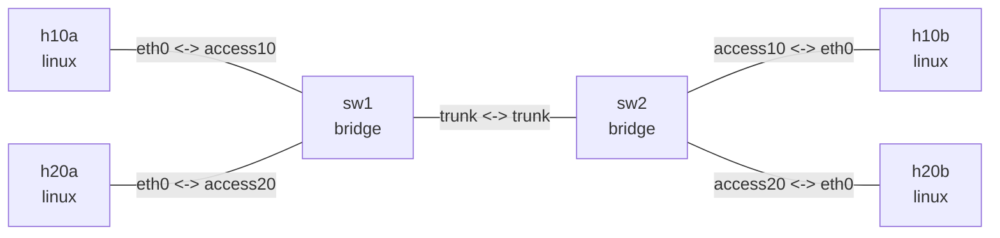

# Linux bridge VLAN

## 实验目标

两台 VLAN-aware bridge 通过 tagged trunk 承载 VLAN 10 和 VLAN 20。四台主机配置在
同一个 IPv4 子网，用于直接观察二层 VLAN 隔离。

## 拓扑图

```bash
nslab graph --format mermaid
```



以下为典型输出；接口索引、MAC 地址和计数器会随运行变化。

## 运行

```bash
cd examples/bridge-vlan
```

```console
$ sudo nslab deploy
deployed topology: bridge-vlan

$ sudo nslab inspect
status: deployed

NAME  KIND    STATUS    NAMESPACE
----  ------  --------  -----------------------------
h10a  linux   matching  nslab-bridge-vlan-h10a-...
sw1   bridge  matching  nslab-bridge-vlan-sw1-...
h20a  linux   matching  nslab-bridge-vlan-h20a-...
sw2   bridge  matching  nslab-bridge-vlan-sw2-...
h10b  linux   matching  nslab-bridge-vlan-h10b-...
h20b  linux   matching  nslab-bridge-vlan-h20b-...
```

## 观察和验证

```console
$ sudo nslab exec --node sw1 -- bridge vlan show
port      vlan-id
access10  10 PVID Egress Untagged
access20  20 PVID Egress Untagged
trunk     10
          20

$ sudo nslab exec --node sw2 -- bridge vlan show
port      vlan-id
trunk     10
          20
access10  10 PVID Egress Untagged
access20  20 PVID Egress Untagged

$ sudo nslab exec --node h10a -- ping -c 3 10.0.0.2
64 bytes from 10.0.0.2: icmp_seq=1 ttl=64 time=<time> ms
...
3 packets transmitted, 3 received, 0% packet loss

$ sudo nslab exec --node h20a -- ping -c 3 10.0.0.4
64 bytes from 10.0.0.4: icmp_seq=1 ttl=64 time=<time> ms
...
3 packets transmitted, 3 received, 0% packet loss
```

跨 VLAN ping 会按预期失败：

```console
$ sudo nslab exec --node h10a -- ping -c 2 -W 1 10.0.0.3
From 10.0.0.1 icmp_seq=1 Destination Host Unreachable
From 10.0.0.1 icmp_seq=2 Destination Host Unreachable
2 packets transmitted, 0 received, +2 errors, 100% packet loss

$ sudo nslab exec --node sw1 -- bridge fdb show br br0
<h10a-mac> dev access10 vlan 10 master br0
<h10b-mac> dev trunk vlan 10 master br0
<h20a-mac> dev access20 vlan 20 master br0
<h20b-mac> dev trunk vlan 20 master br0
...

$ sudo nslab exec --node sw2 -- bridge fdb show br br0
<h10a-mac> dev trunk vlan 10 master br0
<h10b-mac> dev access10 vlan 10 master br0
<h20a-mac> dev trunk vlan 20 master br0
<h20b-mac> dev access20 vlan 20 master br0
...
```

## 清理

```console
$ sudo nslab destroy
destroyed topology: bridge-vlan
```

[查看 nslab.yaml](https://github.com/calcky/nslab/blob/main/examples/bridge-vlan/nslab.yaml) ·
[查看示例 README](https://github.com/calcky/nslab/blob/main/examples/bridge-vlan/README.md)
