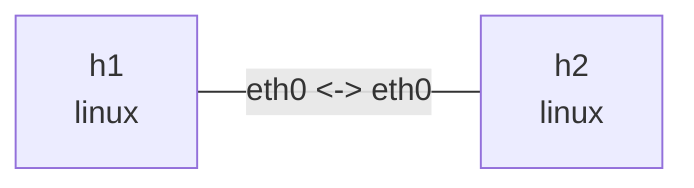

# CAKE lab

This lab installs CAKE at both ends of one point-to-point link. It shapes aggregate traffic to
20mbit and applies per-flow fairness. CAKE combines shaping, fair queueing, and AQM in one qdisc.
The kernel must provide `sch_cake`, and the throughput exercise also requires `iperf3`.

## Graph

```bash
nslab graph --format mermaid
```



## Run

```console
$ sudo nslab deploy
deployed topology: cake

$ sudo nslab inspect
status: deployed

NAME  KIND   STATUS    NAMESPACE
----  -----  --------  -----------------------
h1    linux  matching  nslab-cake-h1-...
h2    linux  matching  nslab-cake-h2-...
```

If deployment reports that the kernel does not support the qdisc, check the module first:

```console
$ sudo modprobe sch_cake && echo sch_cake-ready
sch_cake-ready
```

If the distribution does not ship `sch_cake`, use a kernel that includes it. This is not a
manifest validation error.

## Observe shaping and fair queueing

```console
$ sudo nslab exec --node h2 -- sh -c 'iperf3 -s -D && echo server-ready'
server-ready

$ sudo nslab exec --node h1 -- iperf3 -c 10.61.0.2 -P 2 -t 10
[  5]   0.00-10.01 sec  11.8 MBytes  9.90 Mbits/sec  receiver
[  7]   0.00-10.01 sec  11.8 MBytes  9.89 Mbits/sec  receiver
[SUM]   0.00-10.01 sec  23.6 MBytes  19.8 Mbits/sec  receiver

$ sudo nslab exec --node h1 -- tc -s -d qdisc show dev eth0
qdisc cake 1: root ... bandwidth 20Mbit besteffort flows nonat ... rtt 100ms ...
 Sent ... bytes ... pkt (dropped ..., overlimits ... requeues ...)
```

`flow_mode: flows` isolates five-tuple flows. `diffserv_mode: besteffort` uses one tin, which
makes basic per-flow fairness easier to observe. `rtt_ms` supplies CAKE's network RTT assumption,
and `nat` controls whether flow isolation considers addresses behind NAT.

## Clean up

```console
$ sudo nslab destroy
destroyed topology: cake
```

[View nslab.yaml](https://github.com/calcky/nslab/blob/main/examples/cake/nslab.yaml) ·
[View example README](https://github.com/calcky/nslab/blob/main/examples/cake/README.md)
