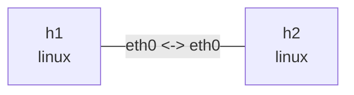

# CAKE 实验

这个实验在一条点到点链路两端安装 CAKE，以 20mbit 做总带宽整形，并使用逐流公平队列。
CAKE 把整形、公平队列和 AQM 合并在一个 qdisc 中。运行前需要内核提供 `sch_cake`，
吞吐实验还需要安装 `iperf3`。

## 拓扑图

```bash
nslab graph --format mermaid
```



## 运行

```console
$ sudo nslab deploy
deployed topology: cake

$ sudo nslab inspect
status: deployed

NAME  KIND   STATUS    NAMESPACE
----  -----  --------  -----------------------
h1    linux  matching  nslab-cake-h1-...
h2    linux  matching  nslab-cake-h2-...
```

如果部署时报内核不支持，可先检查模块：

```console
$ sudo modprobe sch_cake && echo sch_cake-ready
sch_cake-ready
```

发行版没有提供 `sch_cake` 时，需要换用包含该模块的内核；这不是 manifest 校验错误。

## 观察整形和公平队列

```console
$ sudo nslab exec --node h2 -- sh -c 'iperf3 -s -D && echo server-ready'
server-ready

$ sudo nslab exec --node h1 -- iperf3 -c 10.61.0.2 -P 2 -t 10
[  5]   0.00-10.01 sec  11.8 MBytes  9.90 Mbits/sec  receiver
[  7]   0.00-10.01 sec  11.8 MBytes  9.89 Mbits/sec  receiver
[SUM]   0.00-10.01 sec  23.6 MBytes  19.8 Mbits/sec  receiver

$ sudo nslab exec --node h1 -- tc -s -d qdisc show dev eth0
qdisc cake 1: root ... bandwidth 20Mbit besteffort flows nonat ... rtt 100ms ...
 Sent ... bytes ... pkt (dropped ..., overlimits ... requeues ...)
```

`flow_mode: flows` 按五元组区分 flow；`diffserv_mode: besteffort` 只使用一个 tin，适合先观察
纯粹的逐流公平；`rtt_ms` 为 AQM 提供网络 RTT 假设；`nat` 控制是否在 flow 隔离时识别 NAT
内侧地址。

## 清理

```console
$ sudo nslab destroy
destroyed topology: cake
```

[查看 nslab.yaml](https://github.com/calcky/nslab/blob/main/examples/cake/nslab.yaml) ·
[查看示例 README](https://github.com/calcky/nslab/blob/main/examples/cake/README.md)
