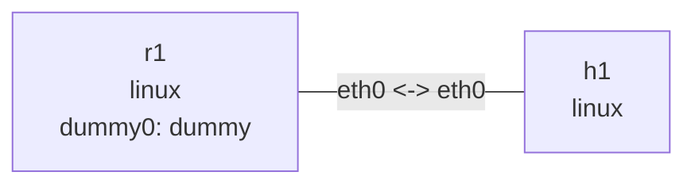

# Stateful DHCPv6

Run in this directory. On Ubuntu install `dnsmasq-base busybox tcpdump`. Check `busybox --list | grep -x udhcpc6` first; some distributions need a busybox-static build containing this applet. dnsmasq-base avoids an automatically started system service. IPv6 must be enabled. Outputs are illustrative; Prefix Delegation is outside this lab.

## Topology and deployment

```bash
nslab graph --format mermaid
```



```console
$ sudo nslab deploy
deployed topology: dhcpv6
$ sudo nslab inspect
status: deployed
...
```

## Start the server

Enable RA reception on h1. Run the foreground server in another terminal; a temporary directory holds leases and the PID file and is removed on exit. DNS service is disabled. RA advertises the M flag and an on-link prefix, without the SLAAC A flag.

```console
$ sudo nslab exec --node h1 -- sysctl -w net.ipv6.conf.eth0.accept_ra=1
net.ipv6.conf.eth0.accept_ra = 1
```

```bash
# Server terminal
(
run_dir=$(mktemp -d /tmp/nslab-dhcp6-server.XXXXXX)
trap 'rm -f "$run_dir/leases" "$run_dir/dnsmasq.pid"; rmdir "$run_dir"' EXIT
sudo nslab exec --node r1 -- dnsmasq --keep-in-foreground --user=root --log-facility=- --conf-file="$PWD/dnsmasq.conf" --pid-file="$run_dir/dnsmasq.pid" --dhcp-leasefile="$run_dir/leases"
)
```

```text
dnsmasq-dhcp: DHCPv6, IP range 2001:db8:60::100 -- 2001:db8:60::1ff, lease time 5m
```

## Capture and request a lease

Start a capture, then run BusyBox udhcpc6 in the foreground. The dedicated executable lease-script.sh only manages addresses from the lab prefix on eth0; it does not change the shared /etc/resolv.conf or install default routes. -n exits if initial acquisition fails; successful acquisition continues with foreground renewals. Client lease state stays in memory without system PID/lease files. The hook uses equal preferred/valid lifetimes, matching this dnsmasq configuration.

```console
$ sudo nslab exec --node h1 -- tcpdump -ni eth0 -vv 'icmp6 or udp port 546 or udp port 547'
...
IP6 ... > ff02::1:2.547: dhcp6 solicit ...
IP6 ...547 > ...546: dhcp6 advertise ...
IP6 ...546 > ...547: dhcp6 request ...
IP6 ...547 > ...546: dhcp6 reply ...
```

```bash
# Client terminal
sudo nslab exec --node h1 -- busybox udhcpc6 -f -n -i eth0 -s "$PWD/lease-script.sh"
```

```text
udhcpc6: started, v...
udhcpc6: sending ...
udhcpc6: IPv6 obtained, lease time 300
```

## Distinguish the address from the default route

Wait for acquisition and DAD. The global address comes from DHCPv6; the default route comes from RA and uses r1’s link-local address. M/O flags advise clients; the kernel does not launch a DHCPv6 client. Ping the router dummy0 address to exercise the default route. With a /128 lease, RA can still install an on-link /64 route.

```console
$ sudo nslab exec --node h1 -- ip -6 addr show dev eth0
...
    inet6 2001:db8:60::<lease>/128 scope global
       valid_lft ...sec preferred_lft ...sec
$ sudo nslab exec --node h1 -- ip -6 route show
default via fe80::<router> dev eth0 proto ra ...
2001:db8:60::/64 dev eth0 proto ra ...
$ sudo nslab exec --node h1 -- ping -6 -c 3 2001:db8:61::1
...
3 packets transmitted, 3 received, 0% packet loss
```

## Renewal and cleanup

Leave both processes running for several minutes to observe Renew/Reply and refreshed lifetimes. After the server stops, the client retries and the address is limited by its valid lifetime; the default route has a separate RA router lifetime. Stop all server, client, and capture terminals before destroy. Leases are not persisted between experiments, so DUID/address stability is not guaranteed.


```console
$ sudo nslab destroy
destroyed topology: dhcpv6
$ sudo nslab inspect
status: absent
...
```
