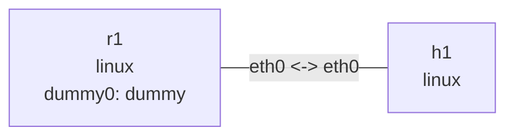

# DHCPv6 有状态地址分配

在此目录运行。Ubuntu 依赖：`sudo apt-get install dnsmasq-base busybox tcpdump`。先执行 `busybox --list | grep -x udhcpc6` 确认构建包含 DHCPv6 applet；部分发行版需提供该 applet 的 busybox-static 包。使用 dnsmasq-base 避免自动启动系统服务。IPv6 必须启用。以下输出为示意；此阶段不包含 Prefix Delegation。

## 拓扑与部署

```bash
nslab graph --format mermaid
```



```console
$ sudo nslab deploy
deployed topology: dhcpv6
$ sudo nslab inspect
status: deployed
...
```

## 启动服务

先启用 h1 接收 RA。另开终端以前台方式运行服务器；临时目录存放租约和 PID。Ctrl+C 停止后清理。dnsmasq 禁用 DNS 服务，只发送 RA 和分配 DHCPv6 地址。RA 发布 M 标志及 on-link 前缀，不发布 SLAAC 的 A 标志。

```console
$ sudo nslab exec --node h1 -- sysctl -w net.ipv6.conf.eth0.accept_ra=1
net.ipv6.conf.eth0.accept_ra = 1
```

```bash
# Server terminal
(
run_dir=$(mktemp -d /tmp/nslab-dhcp6-server.XXXXXX)
trap 'rm -f "$run_dir/leases" "$run_dir/dnsmasq.pid"; rmdir "$run_dir"' EXIT
sudo nslab exec --node r1 -- dnsmasq --keep-in-foreground --user=root --log-facility=- --conf-file="$PWD/dnsmasq.conf" --pid-file="$run_dir/dnsmasq.pid" --dhcp-leasefile="$run_dir/leases"
)
```

```text
dnsmasq-dhcp: DHCPv6, IP range 2001:db8:60::100 -- 2001:db8:60::1ff, lease time 5m
```

## 抓包与申请地址

再开终端抓包，然后启动前台 BusyBox udhcpc6。专用 lease-script.sh 只管理 eth0 上本实验前缀的租约地址，不写共享的 /etc/resolv.conf，也不设置默认路由。-n 在初次申请失败时退出，成功后继续前台续租。客户端租约保存在内存中，不使用系统客户端的 PID/租约文件。hook 的 preferred/valid lifetime 相同，与本例 dnsmasq 配置一致。

```console
$ sudo nslab exec --node h1 -- tcpdump -ni eth0 -vv 'icmp6 or udp port 546 or udp port 547'
...
IP6 ... > ff02::1:2.547: dhcp6 solicit ...
IP6 ...547 > ...546: dhcp6 advertise ...
IP6 ...546 > ...547: dhcp6 request ...
IP6 ...547 > ...546: dhcp6 reply ...
```

```bash
# Client terminal
sudo nslab exec --node h1 -- busybox udhcpc6 -f -n -i eth0 -s "$PWD/lease-script.sh"
```

```text
udhcpc6: started, v...
udhcpc6: sending ...
udhcpc6: IPv6 obtained, lease time 300
```

## 区分地址和默认路由

等待分配完成和 DAD 结束。全局地址来自 DHCPv6 租约；默认路由来自 RA，下一跳为 r1 的 link-local 地址。M/O 是对客户端的提示，Linux 内核本身不会启动 DHCPv6 客户端。用 r1 的 dummy0 地址测试默认路由，而不是只 ping 同网段。租约为 /128 时，同网段路由可来自 RA 的 on-link 前缀。

```console
$ sudo nslab exec --node h1 -- ip -6 addr show dev eth0
...
    inet6 2001:db8:60::<lease>/128 scope global
       valid_lft ...sec preferred_lft ...sec
$ sudo nslab exec --node h1 -- ip -6 route show
default via fe80::<router> dev eth0 proto ra ...
2001:db8:60::/64 dev eth0 proto ra ...
$ sudo nslab exec --node h1 -- ping -6 -c 3 2001:db8:61::1
...
3 packets transmitted, 3 received, 0% packet loss
```

## 续租与清理

保持客户端和服务端运行数分钟，观察 Renew/Reply 和租约 lifetime 刷新。停止服务器后，客户端会重试，地址最终受有效期限制；默认路由则受独立的 RA router lifetime 限制。停止所有服务端、客户端和抓包终端后再 destroy。租约文件不跨实验保存，因此 DUID/地址不保证每次相同。


```console
$ sudo nslab destroy
destroyed topology: dhcpv6
$ sudo nslab inspect
status: absent
...
```
