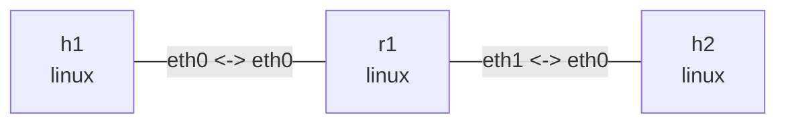

# Observation and drop diagnosis

Go beyond a failed ping to identify the packet, drop stage, and kernel reason. Configuration changes are restricted to lab namespaces; no nslab core features or host sysctls are changed.

Run in this directory with `nslab`, `python3`, `iproute2`, `iputils-ping`, `tcpdump`, and `bpftrace`. Ubuntu 24.04 or newer Linux is recommended. Tracing needs BTF, the `reason` field in `skb:kfree_skb` (upstream Linux 5.17+), and root/BPF permissions. Field availability, reason coverage, and symbol visibility depend on the running kernel. Tracefs must already be mounted; scripts do not mount it or install dependencies. Outputs below are illustrative.

## Topology and baseline

```bash
nslab graph --format mermaid
```



h1 is `10.73.1.1`, h2 is `10.73.2.2`, and r1 uses `.254` in both subnets. Fixed MACs and permanent neighbors exclude ARP resolution from these faults; see the neighbors example for neighbor-state experiments. Explicitly disable reverse-path filtering on r1 after deployment instead of relying on distribution defaults.

```console
$ sudo nslab deploy
deployed topology: drop-diagnosis
$ sudo nslab inspect
status: deployed
...
$ sudo nslab exec --node r1 -- sysctl -w net.ipv4.conf.all.rp_filter=0 net.ipv4.conf.default.rp_filter=0 net.ipv4.conf.eth0.rp_filter=0 net.ipv4.conf.eth1.rp_filter=0
net.ipv4.conf.all.rp_filter = 0
net.ipv4.conf.default.rp_filter = 0
net.ipv4.conf.eth0.rp_filter = 0
net.ipv4.conf.eth1.rp_filter = 0
$ sudo nslab exec --node h1 -- ping -n -c 3 -W 1 10.73.2.2
...
3 packets transmitted, 3 received, 0% packet loss
```

## Observe three evidence sources

Run the tracer in terminal A, the two captures in B/C, and inject faults/send probes in D. Restart observers for each experiment and wait for `ready` / `listening on`. A healthy baseline has no matching drop events; the drop line below illustrates a later fault. AF_PACKET capture precedes normal IP input and TC ingress, so all three faults can look like “visible at r1, absent at h2.”

```console
$ sudo python3 ./trace.py --name drop-diagnosis --node r1 --seconds 60
reason_names={"2": "NOT_SPECIFIED", ...}
ready netns=<inode>
...
drop ns=<inode> ifindex=<index> id=<id> seq=1 reason=<code> location=<kernel-function>
$ sudo nslab exec --node r1 -- env -u LD_LIBRARY_PATH tcpdump -nni eth0 'icmp and src host 10.73.1.1 and dst host 10.73.2.2'
... 10.73.1.1 > 10.73.2.2: ICMP echo request, id <id>, seq 1 ...
$ sudo nslab exec --node h2 -- env -u LD_LIBRARY_PATH tcpdump -nni eth0 'icmp and src host 10.73.1.1 and dst host 10.73.2.2'
... 10.73.1.1 > 10.73.2.2: ICMP echo request, id <id>, seq 1 ...
$ sudo nslab exec --node r1 -- nstat -aszj
{"kernel": {...}}
```

`nstat -aszj` reads absolute namespace counters without updating history files. Take snapshots before/after and subtract them; cumulative values are not per-experiment drops. `env -u LD_LIBRARY_PATH` prevents bundled nslab libraries from interfering with system tcpdump.

**Run the tracer on the host, not inside nslab exec.** Kernel tracepoints are not namespace-isolated. Entering a namespace does not scope events and may hide the host tracefs mount. The script resolves the target namespace inode using inspect, checks `skb->dev->nd_net.net->ns.inum` in BPF, then filters the fixed IPv4 endpoints and ICMP Echo Requests. It does not filter by current PID: receive processing can occur in softirq/ksoftirqd.

Events retain ICMP `id/seq`, `ifindex`, numeric `reason`, and release `location`. Interpret numbers using the initial `reason_names` table, read from the running kernel's trace format rather than hardcoded across versions. The automated checker also adds a human-readable `reason_name` field.

## Fault 1: missing destination route

Remove r1's route to h2's subnet. Requests should appear at r1 but not h2, with `IP_INNOROUTES` or the version's corresponding `IP_OUTNOROUTES`. Correlate with `IpExtInNoRoutes` / `IpOutNoRoutes` deltas. ICMP errors may be rate limited; do not require one error reply per request. This `ip route get` is a local routing lookup, not a complete forwarding-path simulation.

```console
$ sudo nslab exec --node r1 -- ip route del 10.73.2.0/24 dev eth1
(no output)
$ sudo nslab exec --node r1 -- ip route get 10.73.2.2
RTNETLINK answers: Network is unreachable
$ sudo nslab exec --node h1 -- ping -n -c 3 -W 1 10.73.2.2
From 10.73.1.254 icmp_seq=1 Destination Net Unreachable
...
3 packets transmitted, 0 received, ... 100% packet loss
$ sudo nslab exec --node r1 -- ip route add 10.73.2.0/24 dev eth1
(no output)
$ sudo nslab exec --node h1 -- ping -n -c 3 -W 1 10.73.2.2
...
3 packets transmitted, 3 received, 0% packet loss
```

## Fault 2: strict reverse-path filtering

Enable strict `rp_filter=1` on r1:eth0 and install a more-specific wrong reverse route. Requests arrive on eth0, but the best route to their source points to eth1. Require `IP_RPFILTER` events and correlate `TcpExtIPReversePathFilter` deltas, not merely missing replies.

```console
$ sudo nslab exec --node r1 -- sysctl -w net.ipv4.conf.eth0.rp_filter=1
net.ipv4.conf.eth0.rp_filter = 1
$ sudo nslab exec --node r1 -- ip route add 10.73.1.1/32 via 10.73.2.2 dev eth1
(no output)
$ sudo nslab exec --node r1 -- ip route get 10.73.1.1
10.73.1.1 via 10.73.2.2 dev eth1 src 10.73.2.254 ...
$ sudo nslab exec --node h1 -- ping -n -c 3 -W 1 10.73.2.2
...
3 packets transmitted, 0 received, 100% packet loss
$ sudo nslab exec --node r1 -- sysctl -w net.ipv4.conf.eth0.rp_filter=0
net.ipv4.conf.eth0.rp_filter = 0
$ sudo nslab exec --node r1 -- ip route del 10.73.1.1/32 via 10.73.2.2 dev eth1
(no output)
$ sudo nslab exec --node h1 -- ping -n -c 3 -W 1 10.73.2.2
...
3 packets transmitted, 3 received, 0% packet loss
```

Effective rp_filter is the maximum of `conf.all` and the ingress interface value; the baseline sets all to 0. Recovery must also remove the wrong route; disabling filtering alone leaves replies misrouted. Permanent neighbors prevent ARP from failing before this IPv4 experiment.

## Fault 3: TC ingress drop

A flower filter matches the lab flow and gact drops it before IP routing input. r1 capture still sees requests, while IP counters need not increase. Correlate TC action drop deltas with `TC_INGRESS`. Older kernels may report only `NOT_SPECIFIED`, which must not be reinterpreted as an exact cause.

```console
$ sudo nslab exec --node r1 -- tc qdisc add dev eth0 clsact
(no output)
$ sudo nslab exec --node r1 -- tc filter add dev eth0 ingress protocol ip pref 10 flower src_ip 10.73.1.1 dst_ip 10.73.2.2 ip_proto icmp action drop
(no output)
$ sudo nslab exec --node h1 -- ping -n -c 3 -W 1 10.73.2.2
...
3 packets transmitted, 0 received, 100% packet loss
$ sudo nslab exec --node r1 -- tc -s filter show dev eth0 ingress
filter ... flower ...
action order 1: gact action drop
... Sent ... bytes 3 pkt (dropped 3, overlimits 0 requeues 0)
$ sudo nslab exec --node r1 -- tc qdisc del dev eth0 clsact
(no output)
$ sudo nslab exec --node h1 -- ping -n -c 3 -W 1 10.73.2.2
...
3 packets transmitted, 3 received, 0% packet loss
```

| Scenario | Requests at r1 eth0 | Requests at h2 | Key evidence |
| --- | --- | --- | --- |
| Baseline | 3 | 3 | Ping succeeds, no matching drop |
| no-route | 3 | 0 | `IP_INNOROUTES` / `IP_OUTNOROUTES`, route lookup fails |
| rp-filter | 3 | 0 | `IP_RPFILTER`, wrong reverse-path interface |
| tc-ingress | 3 | 0 | `TC_INGRESS`, TC action drops increase |

## Automated check and results

`check.py` creates a randomly named temporary deployment without reusing the manual one. It verifies connectivity, collects traces, r1/h2 pcaps, nstat, routes, and TC state for each fault, restores the fault and pings again, then destroys the deployment and checks absent. It downloads no tools and adds no privileged CI tests.

```console
$ sudo python3 ./check.py
results: /tmp/nslab-drop-results-<random>
baseline: observed
no-route: observed
rp-filter: observed
tc-ingress: observed
$ sudo python3 ./check.py --scenario rp-filter --output /tmp/drop-rpf-run1
results: /tmp/drop-rpf-run1
rp-filter: observed
$ sudo python3 -m json.tool /tmp/drop-rpf-run1/rp-filter/result.json
{
    "scenario": "rp-filter",
    ...
    "events": [
        {
            ...
            "reason_name": "IP_RPFILTER",
            "location": "<kernel-function>"
        }
    ],
    ...
}
```

`--output` must name a new directory. For programs outside sudo's PATH, use `sudo env NSLAB_BIN=/absolute/path/nslab BPFTRACE_BIN=/absolute/path/bpftrace python3 ./check.py`.

The checker also runs a simultaneous h2-namespace control tracer. It must not report the same flow's drops occurring in r1, checking that other namespaces are excluded. Its log is `other-netns.log`. Cases not reached after an earlier command failure are marked `not-run` in the summary.

Results remain in the printed directory. `summary.json` contains environment/version, source SHA256, full commands/exit codes/outputs, and final cleanup checks. Each scenario has `result.json`, `drops.log`, `r1.pcap`, `h2.pcap`, and decoded packets. Raw `drops.log` retains the kernel reason table.

`observed` requires probe results, capture positions, namespace/id/reason evidence for all three ICMP sequence numbers, and successful recovery. The baseline requires delivery with no matching drops. Insufficient evidence or nonspecific kernel reasons produce `inconclusive`; missing tracing prerequisites produce `skipped` (standalone trace.py exits 77). Command failures produce `error` and stop subsequent cases to avoid stacking an unreverted fault. Incomplete checks exit 1, never a false success.

Ctrl+C/SIGTERM stops children, detaches tracing, and destroys the temporary deployment. Interrupts during deploy are deferred until the state transaction completes, then cleanup runs. SIGKILL/power loss cannot guarantee cleanup; use the deployment recorded in summary.json to destroy manually. The tracer pins no BPF objects, changes no global tracefs enable/filter settings, and clears nobody else's trace buffer.

## Observation limits

- `kfree_skb` reports discarded skb release, not every packet's path. No events do not imply no drops. Skbs with NULL devices, unreadable/nonlinear headers, or a different packet format are outside this filter.
- Only linear, unfragmented IPv4 Echo Requests without IP options are inspected. This is intentionally not a general TCP/UDP/IPv6 tracer, so evidence stays tied to controlled packets.
- XDP, drivers, hardware, and other paths may bypass this event or lack useful reasons. Use XDP program counters for XDP_DROP instead of relying on this tracer.
- `location` identifies the release caller, not necessarily the origin of the fault. Inlining, symbols/offsets, and reason numbers vary by kernel; never use a fixed function name as the sole criterion.
- Tracing has overhead and may lose events. This is a low-rate learning experiment, not production full-traffic monitoring. For cross-hook skb correlation, explore [retis](https://github.com/retis-org/retis), still filtering by namespace and packet.

## Cleanup

Stop manual tracing/captures before destroy. trace.py exits after --seconds or Ctrl+C; its BPF links are released with the process. The automated checker already cleans up its own temporary deployment.

```console
$ sudo nslab destroy
destroyed topology: drop-diagnosis
$ sudo nslab inspect
status: absent
...
```
