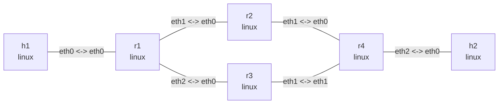

# ECMP multipath routing

This lab builds two equal-cost paths between edge routers `r1` and `r4`. Both routers install one
static multipath route with two next hops, so traffic between `h1` and `h2` can traverse either
`r2` or `r3`.

## Graph

```bash
nslab graph --format mermaid
```



The outputs below are representative. Namespace suffixes and ICMP timings vary.

## Run

```console
$ sudo nslab deploy
deployed topology: ecmp

$ sudo nslab inspect
status: deployed

NAME  KIND   STATUS    NAMESPACE
----  -----  --------  -------------------
h1    linux  matching  nslab-ecmp-h1-...
r1    linux  matching  nslab-ecmp-r1-...
r2    linux  matching  nslab-ecmp-r2-...
r3    linux  matching  nslab-ecmp-r3-...
r4    linux  matching  nslab-ecmp-r4-...
h2    linux  matching  nslab-ecmp-h2-...
```

## Inspect both multipath routes

```console
$ sudo nslab exec -N r1 -- ip -4 route show 192.0.2.0/24
192.0.2.0/24 proto static
        nexthop via 10.0.12.2 dev eth1 weight 1
        nexthop via 10.0.13.2 dev eth2 weight 1

$ sudo nslab exec -N r4 -- ip -4 route show 192.0.1.0/24
192.0.1.0/24 proto static
        nexthop via 10.0.24.1 dev eth0 weight 1
        nexthop via 10.0.34.1 dev eth1 weight 1
```

The route is one FIB entry containing two next hops, rather than two independently managed static
routes. Linux normally hashes each flow onto one next hop to avoid packet reordering. A single
`ping` flow therefore does not alternate packet by packet.

## Verify end-to-end forwarding

```console
$ sudo nslab exec -N h1 -- ping -c 3 -W 2 192.0.2.2
PING 192.0.2.2 (192.0.2.2) 56(84) bytes of data.
64 bytes from 192.0.2.2: icmp_seq=1 ttl=61 time=<time> ms
64 bytes from 192.0.2.2: icmp_seq=2 ttl=61 time=<time> ms
64 bytes from 192.0.2.2: icmp_seq=3 ttl=61 time=<time> ms

--- 192.0.2.2 ping statistics ---
3 packets transmitted, 3 received, 0% packet loss
```

Set different next-hop `weight` values to study weighted multipath routing. Distribution is
statistical across multiple flows; a `2:1` ratio does not split every three packets exactly.

## Clean up

```console
$ sudo nslab destroy
destroyed topology: ecmp
```

[View nslab.yaml](https://github.com/calcky/nslab/blob/main/examples/ecmp/nslab.yaml) ·
[View example README](https://github.com/calcky/nslab/blob/main/examples/ecmp/README.md)
