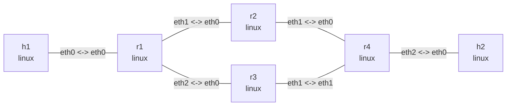

# ECMP 等价多路径路由

这个实验在边缘路由器 `r1` 与 `r4` 之间建立两条等价路径。两端各安装一条包含两个
下一跳的静态 multipath route，因此 `h1` 与 `h2` 之间的流量可以经过 `r2` 或 `r3`。

## 拓扑图

```bash
nslab graph --format mermaid
```



以下是典型输出；namespace 后缀和 ICMP 时延会随运行变化。

## 部署

```console
$ sudo nslab deploy
deployed topology: ecmp

$ sudo nslab inspect
status: deployed

NAME  KIND   STATUS    NAMESPACE
----  -----  --------  -------------------
h1    linux  matching  nslab-ecmp-h1-...
r1    linux  matching  nslab-ecmp-r1-...
r2    linux  matching  nslab-ecmp-r2-...
r3    linux  matching  nslab-ecmp-r3-...
r4    linux  matching  nslab-ecmp-r4-...
h2    linux  matching  nslab-ecmp-h2-...
```

## 查看两端 multipath route

```console
$ sudo nslab exec -N r1 -- ip -4 route show 192.0.2.0/24
192.0.2.0/24 proto static
        nexthop via 10.0.12.2 dev eth1 weight 1
        nexthop via 10.0.13.2 dev eth2 weight 1

$ sudo nslab exec -N r4 -- ip -4 route show 192.0.1.0/24
192.0.1.0/24 proto static
        nexthop via 10.0.24.1 dev eth0 weight 1
        nexthop via 10.0.34.1 dev eth1 weight 1
```

这里是一条包含两个下一跳的 FIB 路由，不是两条独立管理的静态路由。Linux 通常按 flow
进行哈希，使同一个 flow 固定选择一个下一跳，从而避免报文乱序；单个 `ping` 不会逐包
在两条路径间轮询。

## 验证端到端转发

```console
$ sudo nslab exec -N h1 -- ping -c 3 -W 2 192.0.2.2
PING 192.0.2.2 (192.0.2.2) 56(84) bytes of data.
64 bytes from 192.0.2.2: icmp_seq=1 ttl=61 time=<time> ms
64 bytes from 192.0.2.2: icmp_seq=2 ttl=61 time=<time> ms
64 bytes from 192.0.2.2: icmp_seq=3 ttl=61 time=<time> ms

--- 192.0.2.2 ping statistics ---
3 packets transmitted, 3 received, 0% packet loss
```

修改各下一跳的 `weight` 可以继续观察加权多路径。分流结果按多个 flow 统计近似权重；
`2:1` 并不表示每三个报文严格分成两个和一个。

## 清理

```console
$ sudo nslab destroy
destroyed topology: ecmp
```

[查看 nslab.yaml](https://github.com/calcky/nslab/blob/main/examples/ecmp/nslab.yaml) ·
[查看示例 README](https://github.com/calcky/nslab/blob/main/examples/ecmp/README.md)
