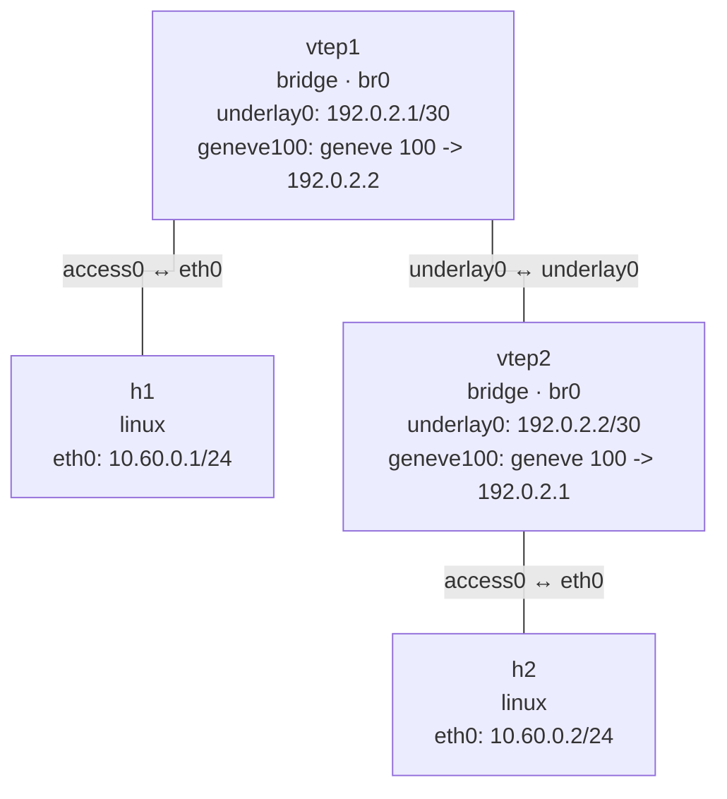

# Geneve

这个实验构建一个二层 Geneve overlay。`vtep1` 和 `vtep2` 使用直连 underlay 链路承载外层
UDP 流量，`geneve100` 则分别加入本地 bridge。

## 拓扑图

```bash
nslab graph --format mermaid
```



## 运行

```console
$ sudo nslab deploy
deployed topology: geneve

$ sudo nslab inspect
status: deployed

NAME   KIND    STATUS    NAMESPACE
-----  ------  --------  ----------------------
h1     linux   matching  nslab-geneve-h1-...
vtep1  bridge  matching  nslab-geneve-vtep1-...
vtep2  bridge  matching  nslab-geneve-vtep2-...
h2     linux   matching  nslab-geneve-h2-...

$ sudo nslab exec --node h1 -- /usr/bin/ping -c 1 10.60.0.2
PING 10.60.0.2 (10.60.0.2) 56(84) bytes of data.
64 bytes from 10.60.0.2: icmp_seq=1 ttl=64 time=<time> ms

--- 10.60.0.2 ping statistics ---
1 packets transmitted, 1 received, 0% packet loss

$ sudo nslab destroy
destroyed topology: geneve
```

underlay 为 1500 字节时，nslab 会为 IPv4 Geneve 自动推导 1450 字节 MTU。Geneve 的源地址
由 underlay 路由选择，配置中只需要声明单播 `remote` 端点。

[查看 nslab.yaml](https://github.com/calcky/nslab/blob/main/examples/geneve/nslab.yaml) ·
[查看示例 README](https://github.com/calcky/nslab/blob/main/examples/geneve/README.md)
