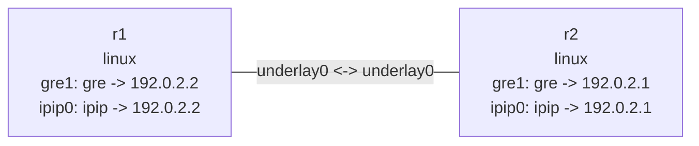

# GRE and IPIP tunnels

This lab creates two point-to-point tunnel devices over one IPv4 underlay. `gre1` is a keyed GRE
tunnel using inner network `10.10.0.0/30`; `ipip0` carries IPv4 over IPv4 on
`10.20.0.0/30`.

## Topology

```bash
nslab graph --format mermaid
```



## Run

```console
$ sudo nslab deploy
deployed topology: ip-tunnels

$ sudo nslab inspect
status: deployed

NAME  KIND   STATUS    NAMESPACE
----  -----  --------  -------------------------
r1    linux  matching  nslab-ip-tunnels-r1-...
r2    linux  matching  nslab-ip-tunnels-r2-...

$ sudo nslab exec --node r1 -- /usr/bin/ping -c 1 10.10.0.2
PING 10.10.0.2 (10.10.0.2) 56(84) bytes of data.
64 bytes from 10.10.0.2: icmp_seq=1 ttl=64 time=<time> ms

--- 10.10.0.2 ping statistics ---
1 packets transmitted, 1 received, 0% packet loss

$ sudo nslab exec --node r1 -- /usr/bin/ping -c 1 10.20.0.2
PING 10.20.0.2 (10.20.0.2) 56(84) bytes of data.
64 bytes from 10.20.0.2: icmp_seq=1 ttl=64 time=<time> ms

--- 10.20.0.2 ping statistics ---
1 packets transmitted, 1 received, 0% packet loss

$ sudo nslab destroy
destroyed topology: ip-tunnels
```

Both ends of a keyed GRE tunnel must use the same `key`. IPIP only carries IPv4, while GRE can
also carry IPv6. With a 1500-byte underlay, nslab derives MTU 1472 for keyed GRE and 1480 for
IPIP. The kernel-owned fallback names `gre0`, `gretap0`, `erspan0`, and `tunl0` are reserved; use
names such as `gre1` and `ipip0` for managed devices.

[View nslab.yaml](https://github.com/calcky/nslab/blob/main/examples/ip-tunnels/nslab.yaml) ·
[View example README](https://github.com/calcky/nslab/blob/main/examples/ip-tunnels/README.md)
