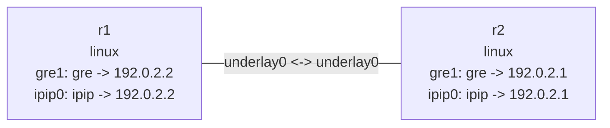

# GRE 与 IPIP 隧道

这个实验在一条 IPv4 underlay 上创建两组点到点 tunnel device。`gre1` 是带 key 的 GRE
隧道，使用内层网段 `10.10.0.0/30`；`ipip0` 在 `10.20.0.0/30` 上承载 IPv4 over IPv4。

## 拓扑图

```bash
nslab graph --format mermaid
```



## 运行

```console
$ sudo nslab deploy
deployed topology: ip-tunnels

$ sudo nslab inspect
status: deployed

NAME  KIND   STATUS    NAMESPACE
----  -----  --------  -------------------------
r1    linux  matching  nslab-ip-tunnels-r1-...
r2    linux  matching  nslab-ip-tunnels-r2-...

$ sudo nslab exec --node r1 -- /usr/bin/ping -c 1 10.10.0.2
PING 10.10.0.2 (10.10.0.2) 56(84) bytes of data.
64 bytes from 10.10.0.2: icmp_seq=1 ttl=64 time=<time> ms

--- 10.10.0.2 ping statistics ---
1 packets transmitted, 1 received, 0% packet loss

$ sudo nslab exec --node r1 -- /usr/bin/ping -c 1 10.20.0.2
PING 10.20.0.2 (10.20.0.2) 56(84) bytes of data.
64 bytes from 10.20.0.2: icmp_seq=1 ttl=64 time=<time> ms

--- 10.20.0.2 ping statistics ---
1 packets transmitted, 1 received, 0% packet loss

$ sudo nslab destroy
destroyed topology: ip-tunnels
```

带 key 的 GRE 隧道要求两端使用相同 `key`。IPIP 只能承载 IPv4，GRE 还可以承载 IPv6。
underlay MTU 为 1500 时，nslab 会为 keyed GRE 推导 MTU 1472，为 IPIP 推导 MTU 1480。
`gre0`、`gretap0`、`erspan0` 和 `tunl0` 是内核拥有的 fallback 名称；受管设备应使用
`gre1`、`ipip0` 等名称。

[查看 nslab.yaml](https://github.com/calcky/nslab/blob/main/examples/ip-tunnels/nslab.yaml) ·
[查看示例 README](https://github.com/calcky/nslab/blob/main/examples/ip-tunnels/README.md)
