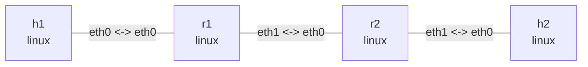

# IPsec / XFRM and IKEv2

One topology supports two experiments: static XFRM for policy matching and bidirectional ESP tunnels, then strongSwan IKEv2 for authentication, negotiation, and rekey. Both use AES-128-GCM for traffic. The static section does not require strongSwan. Ubuntu dependencies are `iproute2 openssl tcpdump iputils-ping`; the kernel must support XFRM, ESP, and RFC4106 AES-GCM. Run commands from this directory. Output is illustrative.

## Topology and deployment

```bash
nslab graph --format mermaid
```



```console
$ sudo nslab deploy
deployed topology: ipsec
$ sudo nslab inspect
status: deployed
...
```

## Verify routing first

Before installing IPsec, the LANs communicate in plaintext through ordinary routes. This checks addresses, forwarding, and return routes; it does not demonstrate encryption.

```console
$ sudo nslab exec --node h1 -- ping -c 2 -W 2 10.90.2.2
...
2 packets transmitted, 2 received, 0% packet loss
$ sudo nslab exec --node r1 -- ip route get 10.90.2.2
10.90.2.2 via 192.0.2.2 dev eth1 src 192.0.2.1 ...
```

## Configure both directions

Run setup.sh. It first requires empty XFRM state/policy on both gateways and refuses to overwrite existing configuration. Each direction gets an independent random 16-byte AES key plus a 4-byte salt, with a 128-bit authentication tag. Secret batch files live in a private temporary directory and are removed on success or failure; keys are not passed as ip command-line arguments. Failure rolls back the lab SPIs and policies. NSLAB_BIN selects an absolute nslab path and NSLAB_NAME supports a custom deployment.

```console
$ sudo bash ./setup.sh
IPsec configured: r1 <-> r2 (ESP tunnel, AES-128-GCM)
$ sudo nslab exec --node r1 -- ip -s xfrm state list nokeys
src 192.0.2.1 dst 192.0.2.2
    proto esp spi 0x00000100 reqid 42 mode tunnel
    replay-window 32 ...
    aead rfc4106(gcm(aes)) ... 128
    lifetime current:
      ... bytes, ... packets
src 192.0.2.2 dst 192.0.2.1
    proto esp spi 0x00000200 reqid 42 mode tunnel
    ...
```

| Inner traffic | Outer tunnel | SPI | SA use |
| --- | --- | --- | --- |
| 10.90.1.0/24 → 10.90.2.0/24 | 192.0.2.1 → 192.0.2.2 | 0x100 | r1 encrypt / r2 decrypt |
| 10.90.2.0/24 → 10.90.1.0/24 | 192.0.2.2 → 192.0.2.1 | 0x200 | r2 encrypt / r1 decrypt |

## Policies versus states

SAs are unidirectional; each gateway has sending and receiving state. The SPI identifies a receiver SA, not a port. Policy src/dst select inner subnets, template src/dst specify outer gateways, and reqid=42 associates templates with SAs. out covers outbound traffic, fwd checks decrypted transit traffic, and in checks local delivery. level required requires IPsec. Only traffic between the LAN subnets is protected; pings between outer gateway addresses are outside these selectors.

```console
$ sudo nslab exec --node r1 -- ip xfrm policy list
src 10.90.1.0/24 dst 10.90.2.0/24
    dir out ...
    tmpl src 192.0.2.1 dst 192.0.2.2
        proto esp reqid 42 mode tunnel ... level required
src 10.90.2.0/24 dst 10.90.1.0/24
    dir in ...
    tmpl src 192.0.2.2 dst 192.0.2.1 ...
src 10.90.2.0/24 dst 10.90.1.0/24
    dir fwd ...
    tmpl src 192.0.2.2 dst 192.0.2.1 ...
```

## Confirm encryption with capture

Capture r1’s outward underlay traffic and h2’s LAN interface in separate terminals, then ping. r1 egress should carry IP protocol 50 ESP; h2 sees decrypted ICMP. There is no NAT-T, so this is not UDP 4500. A successful ping alone cannot distinguish plaintext from encryption; check both captures and SA counters. -Q out isolates transmission from receive-side decapsulation observations.

```console
$ sudo nslab exec --node r1 -- tcpdump -ni eth1 -Q out 'esp or icmp'
... 192.0.2.1 > 192.0.2.2: ESP(spi=0x00000100,seq=0x1), length ...
$ sudo nslab exec --node h2 -- tcpdump -ni eth0 icmp
... 10.90.1.2 > 10.90.2.2: ICMP echo request ...
... 10.90.2.2 > 10.90.1.2: ICMP echo reply ...
$ sudo nslab exec --node h1 -- ping -c 3 -W 2 10.90.2.2
...
3 packets transmitted, 3 received, 0% packet loss
$ sudo nslab exec --node h2 -- ping -c 3 -W 2 10.90.1.2
...
3 packets transmitted, 3 received, 0% packet loss
$ sudo nslab exec --node r2 -- ip -s xfrm state list nokeys
...
    lifetime current:
      <increased> bytes, <increased> packets
    ... replay ... seq ...
```

## Remove a receiving SA

Read r2’s XfrmInNoStates baseline, then remove only its receive SA with SPI 0x100. r1 still transmits ESP, but r2 cannot find the SA; ping fails and XfrmInNoStates increases. Unknown ESP is not delivered as plaintext. A nonzero ping exit is expected. To recover, stop captures, redeploy, and rerun setup.sh with fresh keys rather than reusing old SA sequence numbers.

```console
$ sudo nslab exec --node r2 -- nstat -az XfrmInNoStates
#kernel
XfrmInNoStates <before> 0.0
$ sudo nslab exec --node r2 -- ip xfrm state delete src 192.0.2.1 dst 192.0.2.2 proto esp spi 0x100
(no output)
$ sudo nslab exec --node h1 -- ping -c 2 -W 1 10.90.2.2
...
2 packets transmitted, 0 received, 100% packet loss
$ sudo nslab exec --node r2 -- nstat -az XfrmInNoStates
#kernel
XfrmInNoStates <before+2> 0.0
```

## Automatic negotiation with IKEv2

Static XFRM and IKEv2 are alternative modes of the same topology, not concurrent configurations. Stop previous captures and redeploy to remove static SAs. IKEv2 additionally needs Python 3.9+, util-linux (unshare/mount), and strongSwan charon/swanctl with openssl, kernel-netlink, socket-default, and vici plugins. On Ubuntu use the packages `strongswan-charon strongswan-swanctl libstrongswan-standard-plugins`. The script neither installs software nor starts the host IPsec service.

```console
$ sudo nslab redeploy
redeployed topology: ipsec
$ sudo python3 ./ikev2.py
loaded connection 'site'
...
IKEv2 ready: r1 <-> r2 (PSK, ESP AES-128-GCM)
R1_URI=unix:///tmp/nslab-ikev2-<random>/r1/run/charon.vici
Keep this terminal open. Ctrl+C stops both daemons.
```

The foreground script manages two charon processes with separate network and private mount namespaces. Each mounts its temporary runtime directory onto /run, isolating PID files and VICI sockets without changing the host /run. Configuration and a fresh random PSK live in a permission-restricted /tmp/nslab-ikev2-* directory, removed on normal exit or startup failure. Isolated STRONGSWAN_CONF and SWANCTL_DIR prevent loading host strongSwan configuration or credentials. NSLAB_BIN and NSLAB_NAME are supported; CHARON_BIN and SWANCTL_BIN select nonstandard binary paths.

Keep that terminal running. In another terminal, set R1_URI to the actual value printed by the script (replace <random> below). Never omit --uri: otherwise swanctl connects to the host's default socket.

```bash
R1_URI=unix:///tmp/nslab-ikev2-<random>/r1/run/charon.vici
```

```console
$ sudo swanctl --list-sas --uri "$R1_URI"
site: #1, ESTABLISHED, IKEv2, ...
  local  'r1' @ 192.0.2.1[500]
  remote 'r2' @ 192.0.2.2[500]
  ...
  lan: #1, reqid 1, INSTALLED, TUNNEL, ESP:AES_GCM_16-128
    ...
    local  10.90.1.0/24
    remote 10.90.2.0/24
$ sudo nslab exec --node r1 -- ip xfrm state list nokeys
src 192.0.2.2 dst 192.0.2.1
    proto esp spi <negotiated> reqid 1 mode tunnel
    ...
$ sudo nslab exec --node h1 -- ping -c 3 -W 2 10.90.2.2
...
3 packets transmitted, 3 received, 0% packet loss
$ sudo swanctl --rekey --child lan --uri "$R1_URI"
...
rekey completed successfully
$ sudo swanctl --list-sas --uri "$R1_URI"
site: #1, ESTABLISHED, IKEv2, ...
  lan: #2, reqid 1, INSTALLED, TUNNEL, ESP:AES_GCM_16-128
    <new inbound/outbound SPIs> ...
$ sudo nslab exec --node h1 -- ping -c 3 -W 2 10.90.2.2
...
3 packets transmitted, 3 received, 0% packet loss
```

- **IKE SA**: the authenticated IKEv2 control channel, with mutual PSK authentication and aes128-sha256-modp2048 in this lab.
- **CHILD SA**: a pair of ESP SAs using aes128gcm16 to protect 10.90.1.0/24 and 10.90.2.0/24. Traffic keys and SPIs are negotiated.
- **Rekey**: CHILD SAs rekey at approximately 5 minutes (with randomized advance), with a 6-minute hard lifetime. The command above requests an immediate rekey. New and old SAs may briefly overlap before the old ones disappear. IKE SAs rekey at approximately one hour.
- **Routing and security scope**: install_routes=no retains nslab's routes. This remains policy-based IPsec without xfrm0. No permanent blocking policy is installed; plaintext routing can resume before startup and after shutdown. This is not a production VPN configuration. PSK is a lab authentication choice; certificates, NAT-T and remote access are out of scope.

To capture the initial IKE_SA_INIT / IKE_AUTH exchange, start this capture before ikev2.py, then ping after negotiation:

```console
$ sudo nslab exec --node r1 -- tcpdump -ni eth1 -Q out 'udp port 500 or udp port 4500 or esp or icmp'
... 192.0.2.1.500 > 192.0.2.2.500: isakmp: parent_sa ikev2_init[I]
... 192.0.2.1.500 > 192.0.2.2.500: isakmp: child_sa ikev2_auth[I]
... 192.0.2.1 > 192.0.2.2: ESP(spi=<negotiated>,seq=0x1), length ...
```

There is no NAT and MOBIKE is disabled, so expect IKE over UDP 500 and native ESP. UDP 4500 commonly carries NAT-T traffic. IKE control packets are not the protected LAN payload. Do not reuse the static lab's fixed-SPI deletion command.

If tcpdump reports a libcrypto loading error with a standalone nslab build, replace `-- tcpdump` with `-- env -u LD_LIBRARY_PATH tcpdump` to avoid inheriting bundled library paths. The IKEv2 script also clears this path before starting charon. For non-system libraries, point CHARON_BIN at a wrapper that sets its own library path.

## IKEv2 checks and shutdown

Press Ctrl+C in the foreground script terminal and wait for both charon processes to exit, then stop captures and destroy. Daemon shutdown removes negotiated SAs/policies but leaves the topology deployed. Do not redeploy/destroy while the script is running: external processes can retain an old namespace. SIGKILL or power loss cannot run cleanup; check leftover processes and the printed temporary directory in that case.

For a one-shot check, use a deployed topology without static SAs or another ikev2.py process. This tests bidirectional ping, requests CHILD_SA rekey, checks for a new SPI, pings again, and exits.

```console
$ sudo python3 ./ikev2.py --check
...
IKEv2 check passed: bidirectional ping and CHILD_SA rekey
$ sudo nslab exec --node r1 -- ip xfrm state list nokeys
(no output)
$ sudo nslab exec --node r1 -- ip xfrm policy list
(no output)
```

## MTU, scope, and cleanup

ESP tunnel adds an outer IP header, ESP header, IV, padding, and an authentication tag, reducing the usable inner MTU. A small successful ping does not validate large packets; continue with the existing pmtu lab for DF and Fragmentation Needed. This is policy-based IPsec without an xfrm0 interface; Linux routes still use outer Ethernet interfaces. nslab inspect checks declared topology resources, not manual or IKEv2-installed XFRM state; use ip xfrm / swanctl to observe it. Stop the IKEv2 script and captures before destroy; removing namespaces releases remaining SAs, policies, and kernel keys.


```console
$ sudo nslab destroy
destroyed topology: ipsec
$ sudo nslab inspect
status: absent
...
```
