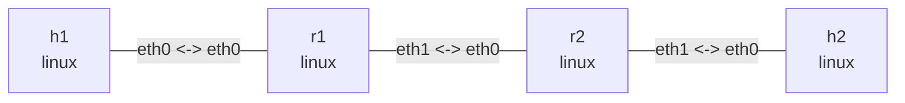

# IPsec / XFRM 与 IKEv2

同一拓扑包含两种实验：先用静态 XFRM 学习策略匹配与双向 ESP tunnel，再用 strongSwan IKEv2 学习认证、自动协商与 rekey。两者均使用 AES-128-GCM 加密业务。静态部分不需要 strongSwan，Ubuntu 依赖 `iproute2 openssl tcpdump iputils-ping`；内核必须支持 XFRM、ESP 和 RFC4106 AES-GCM。所有命令在本目录运行，输出为示意。

## 拓扑与部署

```bash
nslab graph --format mermaid
```



```console
$ sudo nslab deploy
deployed topology: ipsec
$ sudo nslab inspect
status: deployed
...
```

## 先验证路由

配置 IPsec 前，两个内网通过普通路由以明文互通。这个阶段验证地址、转发和回程路由；不要把它当作加密成功。

```console
$ sudo nslab exec --node h1 -- ping -c 2 -W 2 10.90.2.2
...
2 packets transmitted, 2 received, 0% packet loss
$ sudo nslab exec --node r1 -- ip route get 10.90.2.2
10.90.2.2 via 192.0.2.2 dev eth1 src 192.0.2.1 ...
```

## 配置双向 SA

运行 setup.sh，脚本先检查两个网关的 XFRM state/policy 为空，拒绝覆盖已有配置。为两个方向分别生成随机密钥，每个是 16 字节 AES key 加 4 字节 salt，认证 tag 为 128 bit。含密钥的 batch 文件保存在私有临时目录，执行成功或失败后均删除；密钥不作为 ip 的命令行参数传递。失败时回滚本例创建的 SPI 和策略。NSLAB_BIN 可指定 nslab 绝对路径，NSLAB_NAME 支持自定义部署名。

```console
$ sudo bash ./setup.sh
IPsec configured: r1 <-> r2 (ESP tunnel, AES-128-GCM)
$ sudo nslab exec --node r1 -- ip -s xfrm state list nokeys
src 192.0.2.1 dst 192.0.2.2
    proto esp spi 0x00000100 reqid 42 mode tunnel
    replay-window 32 ...
    aead rfc4106(gcm(aes)) ... 128
    lifetime current:
      ... bytes, ... packets
src 192.0.2.2 dst 192.0.2.1
    proto esp spi 0x00000200 reqid 42 mode tunnel
    ...
```

| Inner traffic | Outer tunnel | SPI | SA use |
| --- | --- | --- | --- |
| 10.90.1.0/24 → 10.90.2.0/24 | 192.0.2.1 → 192.0.2.2 | 0x100 | r1 encrypt / r2 decrypt |
| 10.90.2.0/24 → 10.90.1.0/24 | 192.0.2.2 → 192.0.2.1 | 0x200 | r2 encrypt / r1 decrypt |

## 策略与状态的分工

SA 是单向的；每台网关都有发送和接收状态。SPI 标识接收方要使用的 SA，不是端口。policy 的 src/dst 匹配内层网段，tmpl src/dst 指定外层网关，reqid=42 关联模板和 SA。out 用于发出方向，fwd 检查解密后转发的流量，in 检查本机接收流量。level required 要求使用 IPsec。这里只保护两段内网之间的流量，外层网关之间的 ping 不在选择器中。

```console
$ sudo nslab exec --node r1 -- ip xfrm policy list
src 10.90.1.0/24 dst 10.90.2.0/24
    dir out ...
    tmpl src 192.0.2.1 dst 192.0.2.2
        proto esp reqid 42 mode tunnel ... level required
src 10.90.2.0/24 dst 10.90.1.0/24
    dir in ...
    tmpl src 192.0.2.2 dst 192.0.2.1 ...
src 10.90.2.0/24 dst 10.90.1.0/24
    dir fwd ...
    tmpl src 192.0.2.2 dst 192.0.2.1 ...
```

## 抓包确认加密

分别开终端抓 r1 外层接口的出方向和 h2 内网接口，再发送 ping。r1 出方向应看到协议号 50 的 ESP，而 h2 可见解密后的 ICMP。这里没有 NAT-T，因此不是 UDP 4500。只看 ping 成功无法区分明文和加密；应同时看外层抓包与 SA 计数。用 -Q out 避免把接收解封装后的本机抓包现象混入发送方向。

```console
$ sudo nslab exec --node r1 -- tcpdump -ni eth1 -Q out 'esp or icmp'
... 192.0.2.1 > 192.0.2.2: ESP(spi=0x00000100,seq=0x1), length ...
$ sudo nslab exec --node h2 -- tcpdump -ni eth0 icmp
... 10.90.1.2 > 10.90.2.2: ICMP echo request ...
... 10.90.2.2 > 10.90.1.2: ICMP echo reply ...
$ sudo nslab exec --node h1 -- ping -c 3 -W 2 10.90.2.2
...
3 packets transmitted, 3 received, 0% packet loss
$ sudo nslab exec --node h2 -- ping -c 3 -W 2 10.90.1.2
...
3 packets transmitted, 3 received, 0% packet loss
$ sudo nslab exec --node r2 -- ip -s xfrm state list nokeys
...
    lifetime current:
      <increased> bytes, <increased> packets
    ... replay ... seq ...
```

## 删除接收 SA

先看 r2 的 XfrmInNoStates 基线，再仅删除 SPI=0x100 的接收 SA。r1 仍发送 ESP，但 r2 找不到对应 SA，ping 失败，XfrmInNoStates 增加。不会因为找不到接收 SA 就把 ESP 当作明文交付。此处 ping 非零是预期结果。要恢复，停止抓包后 redeploy，再重新运行 setup.sh；每次生成新密钥，不复用旧 SA 的序列号。

```console
$ sudo nslab exec --node r2 -- nstat -az XfrmInNoStates
#kernel
XfrmInNoStates <before> 0.0
$ sudo nslab exec --node r2 -- ip xfrm state delete src 192.0.2.1 dst 192.0.2.2 proto esp spi 0x100
(no output)
$ sudo nslab exec --node h1 -- ping -c 2 -W 1 10.90.2.2
...
2 packets transmitted, 0 received, 100% packet loss
$ sudo nslab exec --node r2 -- nstat -az XfrmInNoStates
#kernel
XfrmInNoStates <before+2> 0.0
```

## IKEv2 自动协商

静态实验和 IKEv2 是同一拓扑的两种模式，不要同时运行。停止此前的抓包并 redeploy，清除静态 SA。IKEv2 额外需要 Python 3.9+、util-linux（unshare/mount）和 strongSwan 的 charon、swanctl、openssl、kernel-netlink、socket-default、vici 插件。Ubuntu 可使用 `strongswan-charon strongswan-swanctl libstrongswan-standard-plugins` 软件包；脚本不安装软件，也不启动宿主机的 IPsec 服务。

```console
$ sudo nslab redeploy
redeployed topology: ipsec
$ sudo python3 ./ikev2.py
loaded connection 'site'
...
IKEv2 ready: r1 <-> r2 (PSK, ESP AES-128-GCM)
R1_URI=unix:///tmp/nslab-ikev2-<random>/r1/run/charon.vici
Keep this terminal open. Ctrl+C stops both daemons.
```

脚本在前台管理两个 charon：每端独立 network namespace 和私有 mount namespace，将各自的临时运行目录绑定到 /run，隔离 PID 文件和 VICI socket；退出后绑定随进程消失，不修改宿主机 /run。配置与随机 PSK 保存在权限受限的 /tmp/nslab-ikev2-* 中，正常退出或启动失败都会删除。使用独立 STRONGSWAN_CONF 和 SWANCTL_DIR，不加载宿主机 strongSwan 配置或证书。支持 NSLAB_BIN、NSLAB_NAME；非标准安装路径可设置 CHARON_BIN、SWANCTL_BIN。

保持该终端运行，在另一个终端设置脚本实际打印的 R1_URI（替换下面的 <random>），观察协商与 rekey。不要省略 --uri，否则 swanctl 会连接宿主机的默认 socket。

```bash
R1_URI=unix:///tmp/nslab-ikev2-<random>/r1/run/charon.vici
```

```console
$ sudo swanctl --list-sas --uri "$R1_URI"
site: #1, ESTABLISHED, IKEv2, ...
  local  'r1' @ 192.0.2.1[500]
  remote 'r2' @ 192.0.2.2[500]
  ...
  lan: #1, reqid 1, INSTALLED, TUNNEL, ESP:AES_GCM_16-128
    ...
    local  10.90.1.0/24
    remote 10.90.2.0/24
$ sudo nslab exec --node r1 -- ip xfrm state list nokeys
src 192.0.2.2 dst 192.0.2.1
    proto esp spi <negotiated> reqid 1 mode tunnel
    ...
$ sudo nslab exec --node h1 -- ping -c 3 -W 2 10.90.2.2
...
3 packets transmitted, 3 received, 0% packet loss
$ sudo swanctl --rekey --child lan --uri "$R1_URI"
...
rekey completed successfully
$ sudo swanctl --list-sas --uri "$R1_URI"
site: #1, ESTABLISHED, IKEv2, ...
  lan: #2, reqid 1, INSTALLED, TUNNEL, ESP:AES_GCM_16-128
    <new inbound/outbound SPIs> ...
$ sudo nslab exec --node h1 -- ping -c 3 -W 2 10.90.2.2
...
3 packets transmitted, 3 received, 0% packet loss
```

- **IKE SA**：IKEv2 控制通道，使用 PSK 双向认证；本例 proposal 为 aes128-sha256-modp2048。
- **CHILD SA**：一对承载业务的 ESP SA，使用 aes128gcm16，保护 10.90.1.0/24 与 10.90.2.0/24；SPI 和业务密钥由协商产生。
- **rekey**：CHILD SA 默认约 5 分钟更新（带随机提前量），6 分钟硬过期；上面的命令立即触发更新。短时间内新旧 SA 可重叠，稍后旧 SA 删除。IKE SA 默认约 1 小时更新。
- **路由与安全边界**：install_routes=no，保留 nslab 已配置的路由；仍是 policy-based IPsec，不创建 xfrm0。未设置永久阻断策略，启动前及停止后可能恢复明文路由，不可用作生产 VPN。PSK 只是实验认证方式，本例不覆盖证书、NAT-T 或远程接入。

若要抓到初次 IKE_SA_INIT / IKE_AUTH，在启动 ikev2.py 前打开以下抓包，协商成功后另开终端 ping：

```console
$ sudo nslab exec --node r1 -- tcpdump -ni eth1 -Q out 'udp port 500 or udp port 4500 or esp or icmp'
... 192.0.2.1.500 > 192.0.2.2.500: isakmp: parent_sa ikev2_init[I]
... 192.0.2.1.500 > 192.0.2.2.500: isakmp: child_sa ikev2_auth[I]
... 192.0.2.1 > 192.0.2.2: ESP(spi=<negotiated>,seq=0x1), length ...
```

本例没有 NAT，且关闭 MOBIKE，因此通常是 UDP 500 上的 IKE 和直接 ESP；UDP 4500 是 NAT-T 的常见承载端口，不能把 IKE 控制报文误认为内网业务数据。也不要沿用静态实验中的固定 SPI 删除命令。

如果使用独立打包的 nslab 时 tcpdump 报 libcrypto 加载错误，可将命令中的 `-- tcpdump` 改为 `-- env -u LD_LIBRARY_PATH tcpdump`，避免继承打包程序的动态库路径。IKEv2 脚本启动 charon 前也会清除此路径；非系统库安装请通过 CHARON_BIN 指向自行设置库路径的包装脚本。

## IKEv2 检查与停止

在前台脚本终端按 Ctrl+C，等待两个 charon 退出，再停止抓包并 destroy。停止守护进程会删除协商的 SA/policy，但不会销毁拓扑。不要在脚本仍运行时 redeploy/destroy：外部进程可能继续持有旧 namespace。SIGKILL 或掉电无法执行清理，应检查遗留进程和脚本打印的临时目录。

也可以在无静态 SA、无其他 ikev2.py 的已部署拓扑中运行一次性自检：双向 ping、触发 CHILD_SA rekey、确认出现新 SPI，再次 ping 后退出。

```console
$ sudo python3 ./ikev2.py --check
...
IKEv2 check passed: bidirectional ping and CHILD_SA rekey
$ sudo nslab exec --node r1 -- ip xfrm state list nokeys
(no output)
$ sudo nslab exec --node r1 -- ip xfrm policy list
(no output)
```

## MTU、边界与清理

ESP tunnel 添加外层 IP、ESP header、IV、padding 和认证 tag，有效内层 MTU 会减小；小 ping 成功不代表大包一定正常。可结合已有 pmtu 示例继续观察 DF 与 Fragmentation Needed。本例为基于策略的 IPsec，不创建 xfrm0；Linux 路由仍指向外层 eth 接口。nslab inspect 检查声明的拓扑资源，不检查手工配置或 IKEv2 安装的 XFRM 状态，应使用上面的 ip xfrm / swanctl 命令观察。停止 IKEv2 脚本和抓包后 destroy，namespace 删除会释放剩余 SA、策略和内核密钥。


```console
$ sudo nslab destroy
destroyed topology: ipsec
$ sudo nslab inspect
status: absent
...
```
