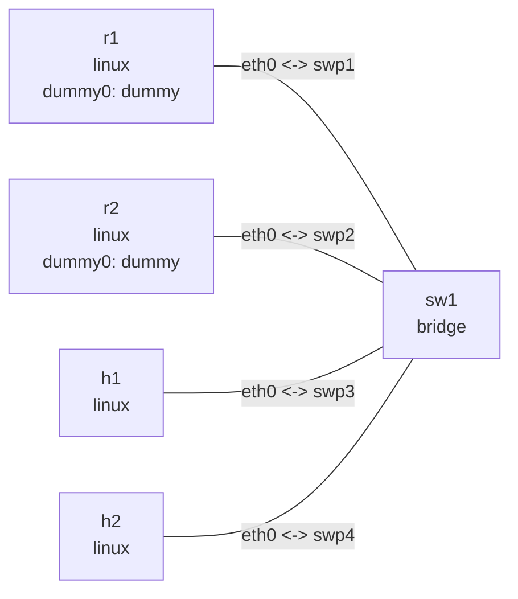

# IPv6 autoconfiguration lab

## Setup

Run from this example directory. On Ubuntu install `radvd`, `tcpdump`, and `iputils-ping`. Output below is illustrative; addresses, timing, and route metrics depend on the host. The identical /128 on each router dummy0 is a test destination in separate namespaces, reached through a default route. This does not test Internet access.

```bash
nslab graph --format mermaid
```



```console
$ sudo nslab deploy
deployed topology: ipv6-autoconf
$ sudo nslab inspect
status: deployed
...
```

## Enable host autoconfiguration

Set host parameters before starting RA. addr_gen_mode=0 selects EUI-64; fixed MACs make the SLAAC addresses below predictable. Temporary addresses are disabled. IPv6 must be enabled on the host. nslab inspect may report learned addresses/routes as differences from the manifest; these are expected dynamic state in this lab.

```console
$ sudo nslab exec --node h1 -- sysctl -w net.ipv6.conf.eth0.accept_ra=1 net.ipv6.conf.eth0.autoconf=1 net.ipv6.conf.eth0.accept_dad=1 net.ipv6.conf.eth0.addr_gen_mode=0 net.ipv6.conf.eth0.use_tempaddr=0
net.ipv6.conf.eth0.accept_ra = 1
net.ipv6.conf.eth0.autoconf = 1
net.ipv6.conf.eth0.accept_dad = 1
net.ipv6.conf.eth0.addr_gen_mode = 0
net.ipv6.conf.eth0.use_tempaddr = 0
$ sudo nslab exec --node h2 -- sysctl -w net.ipv6.conf.eth0.accept_ra=1 net.ipv6.conf.eth0.autoconf=1 net.ipv6.conf.eth0.accept_dad=1 net.ipv6.conf.eth0.addr_gen_mode=0 net.ipv6.conf.eth0.use_tempaddr=0
net.ipv6.conf.eth0.accept_ra = 1
net.ipv6.conf.eth0.autoconf = 1
net.ipv6.conf.eth0.accept_dad = 1
net.ipv6.conf.eth0.addr_gen_mode = 0
net.ipv6.conf.eth0.use_tempaddr = 0
```

## Start router advertisements

Open two more terminals in this directory. Keep each command in the foreground. A temporary directory isolates the PID file and is removed on exit. nslab exec shares the filesystem, so use absolute configuration paths. These terminals manage radvd; it is not an nslab-managed FRR daemon.

```bash
# Terminal 1
(
ra_dir=$(mktemp -d /tmp/nslab-ra-r1.XXXXXX)
trap 'rmdir "$ra_dir"' EXIT
sudo nslab exec --node r1 -- radvd -n -m stderr -C "$PWD/r1.conf" -p "$ra_dir/radvd.pid"
)
```

```bash
# Terminal 2
(
ra_dir=$(mktemp -d /tmp/nslab-ra-r2.XXXXXX)
trap 'rmdir "$ra_dir"' EXIT
sudo nslab exec --node r2 -- radvd -n -m stderr -C "$PWD/r2.conf" -p "$ra_dir/radvd.pid"
)
```

```text
radvd: version ... started
```

## SLAAC and default routes

Wait a few seconds for RA reception and DAD. The prefix option supplies the SLAAC prefix; the RA source link-local address supplies the default next hop. r1 advertises high preference and r2 low preference. Prefix L/A flags mean on-link/autonomous respectively.

```console
$ sudo nslab exec --node h1 -- ip -6 addr show dev eth0
...
    inet6 2001:db8:10::ff:fe00:11/64 scope global dynamic
       valid_lft ...sec preferred_lft ...sec
$ sudo nslab exec --node h2 -- ip -6 addr show dev eth0
...
    inet6 2001:db8:10::ff:fe00:22/64 scope global dynamic
$ sudo nslab exec --node h1 -- ip -6 route show default
default via fe80::1 dev eth0 proto ra ... pref high
default via fe80::2 dev eth0 proto ra ... pref low
$ sudo nslab exec --node h1 -- ping -6 -c 3 2001:db8:10::ff:fe00:22
...
3 packets transmitted, 3 received, 0% packet loss
$ sudo nslab exec --node h1 -- ip -6 route get 2001:db8:100::1
2001:db8:100::1 via fe80::1 dev eth0 ...
$ sudo nslab exec --node h1 -- ping -6 -c 3 2001:db8:100::1
...
3 packets transmitted, 3 received, 0% packet loss
```

## Capture and duplicate address detection

Capture ICMPv6 in another terminal: RS(133), RA(134), NS(135), NA(136). Add the address already owned by h1 to h2, wait about two seconds for dadfailed, then remove it. DAD NS packets use source ::. A successful address-add command does not mean DAD succeeded.

```console
$ sudo nslab exec --node h1 -- tcpdump -ni eth0 icmp6
tcpdump: verbose output suppressed, use -v[v]... for full protocol decode
...
$ sudo nslab exec --node h2 -- ip -6 addr add 2001:db8:10::ff:fe00:11/64 dev eth0
(no output on success)
```

```bash
sleep 2
```

```console
$ sudo nslab exec --node h2 -- ip -6 addr show dev eth0
...
    inet6 2001:db8:10::ff:fe00:11/64 scope global tentative dadfailed
$ sudo nslab exec --node h2 -- ip -6 addr del 2001:db8:10::ff:fe00:11/64 dev eth0
(no output on success)
```

## NDP state transitions

Optionally run `nslab exec --node h1 -- ip -6 monitor neigh` in another terminal. Flush then ping to trigger INCOMPLETE/REACHABLE; idle until STALE, then send traffic to observe DELAY/PROBE where applicable. Positive confirmation can bypass states, so not every run shows every state. Bring h2 down and ping repeatedly to observe failure, then restore it.

```console
$ sudo nslab exec --node h1 -- ip -6 neigh flush dev eth0
(no output on success)
$ sudo nslab exec --node h1 -- ping -6 -c 3 2001:db8:10::ff:fe00:22
...
3 packets transmitted, 3 received, 0% packet loss
$ sudo nslab exec --node h1 -- ip -6 neigh show dev eth0
2001:db8:10::ff:fe00:22 lladdr 02:00:00:00:00:22 REACHABLE
...
$ sudo nslab exec --node h2 -- ip link set eth0 down
(no output on success)
$ sudo nslab exec --node h1 -- ip -6 neigh flush dev eth0
(no output on success)
$ sudo nslab exec --node h1 -- ping -6 -c 5 -W 2 2001:db8:10::ff:fe00:22
...
5 packets transmitted, 0 received, ...
$ sudo nslab exec --node h1 -- ip -6 neigh show dev eth0
2001:db8:10::ff:fe00:22 FAILED
...
$ sudo nslab exec --node h2 -- ip link set eth0 up
(no output on success)
```

```bash
sleep 6
```

```console
$ sudo nslab exec --node h1 -- ping -6 -c 3 2001:db8:10::ff:fe00:22
...
3 packets transmitted, 3 received, 0% packet loss
```

## Default-router failover

Taking the interface down removes link-local addresses. Restore fe80::1 before bringing it up again. AdvRASrcAddress in the radvd configuration explicitly selects this source instead of another kernel-generated link-local address.

Bring r1 down to simulate failure rather than a graceful withdrawal. The advertised router lifetime is 12 seconds; wait 15 seconds and verify r2 becomes the next hop. Neighbor reachability can also affect selection earlier. Restore r1 and wait for new RA messages. Both routers own the test destination, so ping remains possible.

```console
$ sudo nslab exec --node r1 -- ip link set eth0 down
(no output on success)
```

```bash
sleep 15
```

```console
$ sudo nslab exec --node h1 -- ip -6 route get 2001:db8:100::1
2001:db8:100::1 via fe80::2 dev eth0 ...
$ sudo nslab exec --node h1 -- ping -6 -c 3 2001:db8:100::1
...
3 packets transmitted, 3 received, 0% packet loss
$ sudo nslab exec --node r1 -- ip -6 addr replace fe80::1/64 dev eth0
(no output on success)
$ sudo nslab exec --node r1 -- ip link set eth0 up
(no output on success)
```

## Forwarding and accept_ra

With forwarding enabled on h1, accept_ra=1 stops accepting RA; value 2 allows RA even on a forwarding node. Existing routes do not disappear immediately: wait for lifetime expiry or explicitly delete them before observing. Restore the host settings afterwards.

```console
$ sudo nslab exec --node h1 -- sysctl -w net.ipv6.conf.all.forwarding=1 net.ipv6.conf.eth0.accept_ra=1
net.ipv6.conf.all.forwarding = 1
net.ipv6.conf.eth0.accept_ra = 1
```

```bash
sleep 15
```

```console
$ sudo nslab exec --node h1 -- ip -6 route show default
(no output after RA routes expire)
$ sudo nslab exec --node h1 -- sysctl -w net.ipv6.conf.eth0.accept_ra=2
net.ipv6.conf.eth0.accept_ra = 2
```

```bash
sleep 6
```

```console
$ sudo nslab exec --node h1 -- ip -6 route show default
default via fe80::1 dev eth0 proto ra ... pref high
default via fe80::2 dev eth0 proto ra ... pref low
$ sudo nslab exec --node h1 -- sysctl -w net.ipv6.conf.all.forwarding=0 net.ipv6.conf.eth0.accept_ra=1
net.ipv6.conf.all.forwarding = 0
net.ipv6.conf.eth0.accept_ra = 1
```

## Address lifetimes and cleanup

RA refreshes preferred/valid prefix lifetimes (120/300 seconds) every 3–4 seconds. Stop both radvd processes to observe address deprecation and expiry; a remaining router would keep refreshing them. radvd may send final withdrawal advertisements on graceful shutdown, so default routes can disappear immediately. Stop all RA, capture, and monitor terminals with Ctrl+C before destroying the topology. For another run, redeploy and repeat host initialization. Do not run concurrent deployments with the same name.

```console
$ sudo nslab destroy
destroyed topology: ipv6-autoconf
$ sudo nslab inspect
status: absent
...
```
