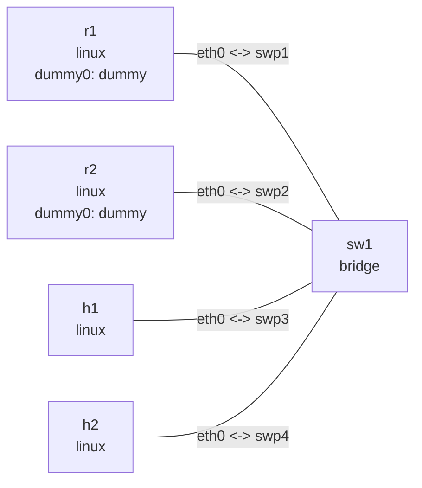

# IPv6 自动配置实验

## 准备

在本目录执行。Ubuntu 安装依赖：`sudo apt-get install radvd tcpdump iputils-ping`。下文输出为示意，地址、时间和路由 metric 以实机为准。两台路由器 dummy0 上的相同 /128 地址是测试目标，各自在独立 namespace 中；主机通过默认路由访问它。不是公网连通性测试。

```bash
nslab graph --format mermaid
```



```console
$ sudo nslab deploy
deployed topology: ipv6-autoconf
$ sudo nslab inspect
status: deployed
...
```

## 启用主机自动配置

先设置主机参数，再启动 RA。addr_gen_mode=0 使用 EUI-64，固定 MAC 使下面的 SLAAC 地址可预测；不启用临时地址。宿主机必须启用 IPv6。nslab 的 inspect 可能将 RA 自动生成的地址/路由报告为与 manifest 不同，这是本实验预期的动态状态。

```console
$ sudo nslab exec --node h1 -- sysctl -w net.ipv6.conf.eth0.accept_ra=1 net.ipv6.conf.eth0.autoconf=1 net.ipv6.conf.eth0.accept_dad=1 net.ipv6.conf.eth0.addr_gen_mode=0 net.ipv6.conf.eth0.use_tempaddr=0
net.ipv6.conf.eth0.accept_ra = 1
net.ipv6.conf.eth0.autoconf = 1
net.ipv6.conf.eth0.accept_dad = 1
net.ipv6.conf.eth0.addr_gen_mode = 0
net.ipv6.conf.eth0.use_tempaddr = 0
$ sudo nslab exec --node h2 -- sysctl -w net.ipv6.conf.eth0.accept_ra=1 net.ipv6.conf.eth0.autoconf=1 net.ipv6.conf.eth0.accept_dad=1 net.ipv6.conf.eth0.addr_gen_mode=0 net.ipv6.conf.eth0.use_tempaddr=0
net.ipv6.conf.eth0.accept_ra = 1
net.ipv6.conf.eth0.autoconf = 1
net.ipv6.conf.eth0.accept_dad = 1
net.ipv6.conf.eth0.addr_gen_mode = 0
net.ipv6.conf.eth0.use_tempaddr = 0
```

## 发送 RA

另开两个终端，都进入此目录。每个命令保持前台运行。临时目录隔离 PID 文件，Ctrl+C 后删除目录。nslab exec 共享文件系统，因此配置必须使用绝对路径。radvd 由这些终端管理，不属于 nslab 的 FRR 守护进程。

```bash
# Terminal 1
(
ra_dir=$(mktemp -d /tmp/nslab-ra-r1.XXXXXX)
trap 'rmdir "$ra_dir"' EXIT
sudo nslab exec --node r1 -- radvd -n -m stderr -C "$PWD/r1.conf" -p "$ra_dir/radvd.pid"
)
```

```bash
# Terminal 2
(
ra_dir=$(mktemp -d /tmp/nslab-ra-r2.XXXXXX)
trap 'rmdir "$ra_dir"' EXIT
sudo nslab exec --node r2 -- radvd -n -m stderr -C "$PWD/r2.conf" -p "$ra_dir/radvd.pid"
)
```

```text
radvd: version ... started
```

## SLAAC 与默认路由

等待数秒完成 RA 接收和 DAD。RA 的 prefix 提供 SLAAC 前缀；默认路由下一跳来自 RA 发送方的 link-local 地址。r1 preference=high，r2=low；不是用全局地址作为默认网关。prefix 的 L/A 标志分别表示 on-link 和 autonomous。

```console
$ sudo nslab exec --node h1 -- ip -6 addr show dev eth0
...
    inet6 2001:db8:10::ff:fe00:11/64 scope global dynamic
       valid_lft ...sec preferred_lft ...sec
$ sudo nslab exec --node h2 -- ip -6 addr show dev eth0
...
    inet6 2001:db8:10::ff:fe00:22/64 scope global dynamic
$ sudo nslab exec --node h1 -- ip -6 route show default
default via fe80::1 dev eth0 proto ra ... pref high
default via fe80::2 dev eth0 proto ra ... pref low
$ sudo nslab exec --node h1 -- ping -6 -c 3 2001:db8:10::ff:fe00:22
...
3 packets transmitted, 3 received, 0% packet loss
$ sudo nslab exec --node h1 -- ip -6 route get 2001:db8:100::1
2001:db8:100::1 via fe80::1 dev eth0 ...
$ sudo nslab exec --node h1 -- ping -6 -c 3 2001:db8:100::1
...
3 packets transmitted, 3 received, 0% packet loss
```

## 抓包与重复地址检测

在另一个终端抓取 ICMPv6，可见 RS(133)、RA(134)、NS(135)、NA(136)。给 h2 添加 h1 已使用的地址，等待约 2 秒查看 dadfailed，然后删除冲突地址。DAD 的 NS 源地址为 ::；添加地址命令成功不代表 DAD 成功。

```console
$ sudo nslab exec --node h1 -- tcpdump -ni eth0 icmp6
tcpdump: verbose output suppressed, use -v[v]... for full protocol decode
...
$ sudo nslab exec --node h2 -- ip -6 addr add 2001:db8:10::ff:fe00:11/64 dev eth0
(no output on success)
```

```bash
sleep 2
```

```console
$ sudo nslab exec --node h2 -- ip -6 addr show dev eth0
...
    inet6 2001:db8:10::ff:fe00:11/64 scope global tentative dadfailed
$ sudo nslab exec --node h2 -- ip -6 addr del 2001:db8:10::ff:fe00:11/64 dev eth0
(no output on success)
```

## NDP 状态机

可另开终端运行 `nslab exec --node h1 -- ip -6 monitor neigh`。flush 后 ping 触发 INCOMPLETE、REACHABLE；静置等待变为 STALE，再发包可能经过 DELAY、PROBE。正向确认可能跳过某些状态，不能保证每次都看到全部。关闭 h2 链路，持续 ping 后可见探测失败。恢复链路后重新 ping 验证恢复。

```console
$ sudo nslab exec --node h1 -- ip -6 neigh flush dev eth0
(no output on success)
$ sudo nslab exec --node h1 -- ping -6 -c 3 2001:db8:10::ff:fe00:22
...
3 packets transmitted, 3 received, 0% packet loss
$ sudo nslab exec --node h1 -- ip -6 neigh show dev eth0
2001:db8:10::ff:fe00:22 lladdr 02:00:00:00:00:22 REACHABLE
...
$ sudo nslab exec --node h2 -- ip link set eth0 down
(no output on success)
$ sudo nslab exec --node h1 -- ip -6 neigh flush dev eth0
(no output on success)
$ sudo nslab exec --node h1 -- ping -6 -c 5 -W 2 2001:db8:10::ff:fe00:22
...
5 packets transmitted, 0 received, ...
$ sudo nslab exec --node h1 -- ip -6 neigh show dev eth0
2001:db8:10::ff:fe00:22 FAILED
...
$ sudo nslab exec --node h2 -- ip link set eth0 up
(no output on success)
```

```bash
sleep 6
```

```console
$ sudo nslab exec --node h1 -- ping -6 -c 3 2001:db8:10::ff:fe00:22
...
3 packets transmitted, 3 received, 0% packet loss
```

## 默认路由故障切换

接口 down 会删除 link-local 地址，所以下面的恢复步骤先补回 fe80::1，再将接口置为 up。radvd 配置中的 AdvRASrcAddress 明确指定源地址，避免选中内核自动生成的另一个 link-local 地址。

关闭 r1 链路模拟故障，不是优雅撤销。RA router lifetime 为 12 秒，等待 15 秒后验证下一跳是 r2。邻居可达性检测也可能提前影响选路。恢复后等待新的 RA，再检查 high preference 路由。两台路由器使用相同测试目标，故 ping 仍然成功。

```console
$ sudo nslab exec --node r1 -- ip link set eth0 down
(no output on success)
```

```bash
sleep 15
```

```console
$ sudo nslab exec --node h1 -- ip -6 route get 2001:db8:100::1
2001:db8:100::1 via fe80::2 dev eth0 ...
$ sudo nslab exec --node h1 -- ping -6 -c 3 2001:db8:100::1
...
3 packets transmitted, 3 received, 0% packet loss
$ sudo nslab exec --node r1 -- ip -6 addr replace fe80::1/64 dev eth0
(no output on success)
$ sudo nslab exec --node r1 -- ip link set eth0 up
(no output on success)
```

## forwarding 与 accept_ra

在 h1 开启 forwarding 后，accept_ra=1 不再接受 RA；设置为 2 则允许转发节点接受 RA。已有路由不会因此立即消失，需等 lifetime 到期或显式删除再观察。完成后恢复 host 参数。

```console
$ sudo nslab exec --node h1 -- sysctl -w net.ipv6.conf.all.forwarding=1 net.ipv6.conf.eth0.accept_ra=1
net.ipv6.conf.all.forwarding = 1
net.ipv6.conf.eth0.accept_ra = 1
```

```bash
sleep 15
```

```console
$ sudo nslab exec --node h1 -- ip -6 route show default
(no output after RA routes expire)
$ sudo nslab exec --node h1 -- sysctl -w net.ipv6.conf.eth0.accept_ra=2
net.ipv6.conf.eth0.accept_ra = 2
```

```bash
sleep 6
```

```console
$ sudo nslab exec --node h1 -- ip -6 route show default
default via fe80::1 dev eth0 proto ra ... pref high
default via fe80::2 dev eth0 proto ra ... pref low
$ sudo nslab exec --node h1 -- sysctl -w net.ipv6.conf.all.forwarding=0 net.ipv6.conf.eth0.accept_ra=1
net.ipv6.conf.all.forwarding = 0
net.ipv6.conf.eth0.accept_ra = 1
```

## 地址生命周期与清理

RA 每 3–4 秒刷新 prefix 的 preferred/valid lifetime（120/300 秒）。要观察 deprecated 和地址删除，可先停止两个 radvd，再看地址计时；不要只停一个，另一个会继续刷新。停止时 radvd 可能发送最终撤销 RA，故默认路由可能立即删除，不能将其当作崩溃超时。最后在 RA、抓包和 monitor 的所有终端 Ctrl+C，再销毁拓扑。再次实验先 redeploy 并重新设置主机参数。不要并发运行同名实验。

```console
$ sudo nslab destroy
destroyed topology: ipv6-autoconf
$ sudo nslab inspect
status: absent
...
```
