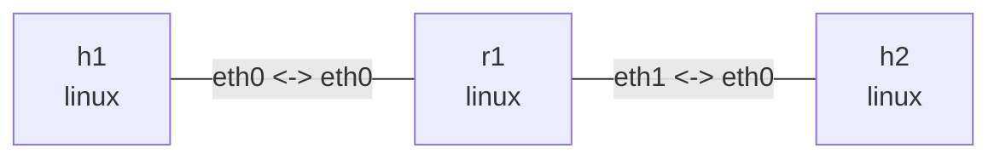

# Linux IPv6 forwarding

## Goal

`r1` connects two `/64` networks with `net.ipv6.conf.all.forwarding=1`. Both hosts use explicit
IPv6 default routes to reach the remote network.

## Graph

```bash
nslab graph --format mermaid
```



The outputs below are representative. Link-local addresses, interface indexes, counters, and
ICMP timings vary per run.

## Run

```bash
cd examples/ipv6-forward
```

```console
$ sudo nslab deploy
deployed topology: ipv6-forward
```

Wait for duplicate address detection (DAD), then inspect the topology:

```bash
sleep 2
```

```console
$ sudo nslab inspect
status: deployed

NAME  KIND   STATUS    NAMESPACE
----  -----  --------  -------------------------------
h1    linux  matching  nslab-ipv6-forward-h1-...
r1    linux  matching  nslab-ipv6-forward-r1-...
h2    linux  matching  nslab-ipv6-forward-h2-...
```

## Observe routes and forwarding

```console
$ sudo nslab exec --node r1 -- cat /proc/sys/net/ipv6/conf/all/forwarding
1

$ sudo nslab exec --node r1 -- ip -6 address show
... eth0 ...
    inet6 2001:db8:1::1/64 scope global
    inet6 fe80::.../64 scope link
... eth1 ...
    inet6 2001:db8:2::1/64 scope global
    inet6 fe80::.../64 scope link

$ sudo nslab exec --node h1 -- ip -6 route show
2001:db8:1::/64 dev eth0 proto kernel metric 256 pref medium
default via 2001:db8:1::1 dev eth0 metric 1024 pref medium

$ sudo nslab exec --node h1 -- ip -6 route get 2001:db8:2::2
2001:db8:2::2 via 2001:db8:1::1 dev eth0 src 2001:db8:1::2 metric 1024 pref medium

$ sudo nslab exec --node h2 -- ip -6 route show
2001:db8:2::/64 dev eth0 proto kernel metric 256 pref medium
default via 2001:db8:2::1 dev eth0 metric 1024 pref medium
```

## Verify connectivity

```console
$ sudo nslab exec --node h1 -- ping -6 -c 3 2001:db8:2::2
64 bytes from 2001:db8:2::2: icmp_seq=1 ttl=63 time=<time> ms
...
3 packets transmitted, 3 received, 0% packet loss

$ sudo nslab exec --node h2 -- ping -6 -c 3 2001:db8:1::2
64 bytes from 2001:db8:1::2: icmp_seq=1 ttl=63 time=<time> ms
...
3 packets transmitted, 3 received, 0% packet loss

$ sudo nslab exec --node r1 -- ip -s link show eth0
... eth0 ... state UP ...
    RX: ... packets ...
    TX: ... packets ...

$ sudo nslab exec --node r1 -- ip -s link show eth1
... eth1 ... state UP ...
    RX: ... packets ...
    TX: ... packets ...
```

## Clean up

```console
$ sudo nslab destroy
destroyed topology: ipv6-forward
```

[View nslab.yaml](https://github.com/calcky/nslab/blob/main/examples/ipv6-forward/nslab.yaml) ·
[View example README](https://github.com/calcky/nslab/blob/main/examples/ipv6-forward/README.md)
