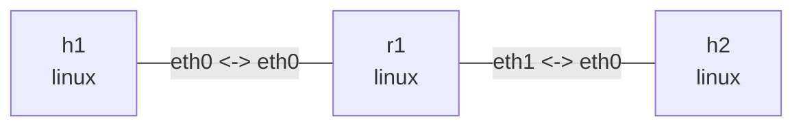

# Kernel Data Path Observation

Deploy, run bt, send packets, inspect output, and clean up manually. No Python automation. Requires `nslab bpftrace jq iproute2 iputils-ping`, optionally `tcpdump`, plus root, kernel BTF, tracefs and the selected tracepoints/kprobes. Drop tracing also needs kfree_skb's reason field (upstream Linux 5.17+). Outputs are illustrative; Ubuntu 24.04 or newer Linux is recommended.

## 1. Deploy

Run in this directory. Fixed MACs and permanent neighbors exclude ARP interference.

```bash
nslab graph --format mermaid
```



```console
$ sudo nslab deploy
deployed topology: kernel-path
$ sudo nslab inspect
status: deployed
...
$ sudo nslab exec --node r1 -- sysctl -w net.ipv4.conf.all.rp_filter=0 net.ipv4.conf.eth0.rp_filter=0 net.ipv4.conf.eth1.rp_filter=0
net.ipv4.conf.all.rp_filter = 0
net.ipv4.conf.eth0.rp_filter = 0
net.ipv4.conf.eth1.rp_filter = 0
```

```bash
lab_ns=$(sudo nslab inspect --format json | jq -er '.nodes[] | select(.name == "r1") | .namespace')
lab_inode=$(sudo stat -Lc '%i' "/run/netns/$lab_ns")
```

Set these variables in the tracer terminal; resolve the inode again after redeploy. **Run bpftrace on the host**, not under nslab exec. The bt code filters the skb namespace, not the current PID. Clean up old deployments with `nslab destroy --name drop-diagnosis`.

## 2. Normal Paths

Start tracing in terminal A, wait for ready, then run the three pings in terminal B. Set the second argument to `1` for kernel stacks, or `0` for concise output. Ctrl+C stops tracing; append `| tee /tmp/kernel-path.log` to retain logs.

```console
$ sudo bpftrace paths.bt "$lab_inode" 0
...
ready netns=<inode> stacks=0
ts=... cpu=... ns=... dev=eth0(...) skb=0x... 10.73.1.1 -> 10.73.2.2 type=8 id=... seq=1 kprobe:ip_forward
...
```

```console
$ sudo nslab exec --node h1 -- ping -n -c 3 -W 1 10.73.2.2
...
3 packets transmitted, 3 received, 0% packet loss
$ sudo nslab exec --node h1 -- ping -n -c 3 -W 1 10.73.1.254
...
3 packets transmitted, 3 received, 0% packet loss
$ sudo nslab exec --node r1 -- ping -n -c 3 -W 1 10.73.2.2
...
3 packets transmitted, 3 received, 0% packet loss
```

| Traffic | Observe on r1 |
| --- | --- |
| h1 → h2 | ip_rcv → ip_forward → ip_output → net_dev_queue |
| h1 → r1 | Request reaches ip_local_deliver; reply uses __ip_local_out and ip_output |
| r1 → h2 | Request uses __ip_local_out and ip_output; reply reaches ip_local_deliver |

Correlate source/destination, type (8 request, 0 reply), id/seq and timestamps. skb addresses are auxiliary. These are observation points, not a complete call chain. dev is the current skb device, not necessarily final egress. Local output can show `-(0)`; those probes use the function's net argument instead. Inlining/batching may bypass probes: not observed does not mean not traversed. Timings include tracing overhead, not benchmark latency.

## 3. Drop Diagnosis

Stop paths.bt and start drops.bt. Inject, probe, and revert each fault in another terminal. Do not stack faults or use set -e: failed ping is expected.

```console
$ sudo bpftrace drops.bt "$lab_inode"
...
ready netns=<inode>
drop ns=... ifindex=... id=... seq=1 reason=<number> location=<function>
```

```bash
sudo cat /sys/kernel/tracing/events/skb/kfree_skb/format
```

Decode numeric reasons using the running kernel's format table, not hardcoded version-independent numbers. Expected reasons are `IP_INNOROUTES/IP_OUTNOROUTES`, `IP_RPFILTER`, and `TC_INGRESS`; old kernels may report only `NOT_SPECIFIED`. Commands below test missing routes, strict reverse-path filtering, then TC ingress drop:

```console
$ sudo nslab exec --node r1 -- ip route del 10.73.2.0/24 dev eth1
(no output)
$ sudo nslab exec --node h1 -- ping -n -c 3 -W 1 10.73.2.2
From 10.73.1.254 icmp_seq=1 Destination Net Unreachable
...
$ sudo nslab exec --node r1 -- ip route add 10.73.2.0/24 dev eth1
(no output)
$ sudo nslab exec --node r1 -- sysctl -w net.ipv4.conf.eth0.rp_filter=1
net.ipv4.conf.eth0.rp_filter = 1
$ sudo nslab exec --node r1 -- ip route add 10.73.1.1/32 via 10.73.2.2 dev eth1
(no output)
$ sudo nslab exec --node h1 -- ping -n -c 3 -W 1 10.73.2.2
...
3 packets transmitted, 0 received, 100% packet loss
$ sudo nslab exec --node r1 -- sysctl -w net.ipv4.conf.eth0.rp_filter=0
net.ipv4.conf.eth0.rp_filter = 0
$ sudo nslab exec --node r1 -- ip route del 10.73.1.1/32 via 10.73.2.2 dev eth1
(no output)
$ sudo nslab exec --node r1 -- tc qdisc add dev eth0 clsact
(no output)
$ sudo nslab exec --node r1 -- tc filter add dev eth0 ingress protocol ip pref 10 flower src_ip 10.73.1.1 dst_ip 10.73.2.2 ip_proto icmp action drop
(no output)
$ sudo nslab exec --node h1 -- ping -n -c 3 -W 1 10.73.2.2
...
3 packets transmitted, 0 received, 100% packet loss
$ sudo nslab exec --node r1 -- tc -s filter show dev eth0 ingress
... gact action drop ... dropped 3 ...
$ sudo nslab exec --node r1 -- tc qdisc del dev eth0 clsact
(no output)
$ sudo nslab exec --node h1 -- ping -n -c 3 -W 1 10.73.2.2
...
3 packets transmitted, 3 received, 0% packet loss
```

Optionally capture with `tcpdump -nni eth0 icmp` on r1 eth0 and h2 eth0, and compare before/after `nstat -aszj`. All three faults typically show requests at r1 but not h2; distinguish them using reasons, routes and TC counters. Restoring rp_filter also requires removing the wrong reverse route.

## 4. Receive Processing and CPU Scheduling

`context` is a concise classification: `NET_RX`, `NET_TX`, `ksoftirqd`, or `task/unknown`. `comm` and `softirq` remain separate, so `context=ksoftirqd softirq=NET_RX` retains both meanings. `task/unknown` only means neither tracked network softirq nor ksoftirqd was identified; it does not prove process context. Other softirq vectors, hard IRQ, threaded NAPI, and attachment during an already-running softirq are not classified by this lightweight tracer.

`receive.bt` counts lab ICMP packets at `netif_receive_skb` and `ip_rcv` on r1 by CPU and records `pid/comm`. Its `NET_RX` softirq and `ksoftirqd` scheduling counts are host-wide background signals.

```console
$ sudo bpftrace receive.bt "$lab_inode"
ready netns=<inode>
rx ts=... cpu=2 pid=... comm=ping context=task/unknown softirq=none dev=eth0 skb=0x... type=8 id=... seq=1
ip ts=... cpu=2 pid=... comm=ping context=task/unknown softirq=none dev=eth0 skb=0x... type=8 id=... seq=1
```

Capture a baseline and send traffic from another terminal. Press Ctrl+C afterward to inspect per-CPU and execution-context summaries:

```bash
sudo ip netns exec "$lab_ns" cat /sys/class/net/eth0/queues/rx-0/rps_cpus
sudo cat /proc/softirqs
sudo cat /proc/net/softnet_stat
sudo nslab exec --node h1 -- ping -n -f -c 10000 10.73.2.2
sudo cat /proc/softirqs
sudo cat /proc/net/softnet_stat
```

Receive processing may run in the process transmitting to a veth peer (`softirq=none`), in `NET_RX`, or as `ksoftirqd/N + NET_RX`. A veth commonly invokes peer receive directly on the sender CPU without a physical NIC interrupt. A softirq may borrow a normal task or `swapper/N`; only comm `ksoftirqd/N` means work was deferred to that kernel thread. PID does not identify the application that owns the packet.

Choose an online CPU (CPU 2, hexadecimal mask `4`, below), enable RPS, repeat tracing and traffic, then restore it:

```bash
grep '^processor' /proc/cpuinfo
sudo ip netns exec "$lab_ns" sh -c 'echo 4 > /sys/class/net/eth0/queues/rx-0/rps_cpus'
sudo nslab exec --node h1 -- ping -n -f -c 10000 10.73.2.2
sudo ip netns exec "$lab_ns" sh -c 'echo 0 > /sys/class/net/eth0/queues/rx-0/rps_cpus'
```

Mask `4` selects CPU 2; `3` selects CPUs 0 and 1. One flow may stay on one CPU, so use concurrent flows to inspect distribution. The `/proc/softirqs` `NET_RX` row and `/proc/net/softnet_stat` are cumulative host counters: subtract before and after. Each softnet row is one CPU; its first three fields are processed, dropped, and time_squeeze. A veth/RPS experiment says nothing about physical NIC IRQ affinity, RSS queues, or hardware steering.

## 5. Transmit Processing and CPU Scheduling

`transmit.bt` observes `ip_output`, `net_dev_queue`, and `net_dev_start_xmit` on r1: IPv4 output, entry into the device transmit path, and the boundary before the driver transmit call. Start tracing in terminal A and send traffic from h1 in terminal B:

```console
$ sudo bpftrace transmit.bt "$lab_inode"
ready netns=<inode>
ipout ts=... cpu=2 pid=... comm=ping context=task/unknown softirq=none dev=eth0 skb=0x... type=8 id=... seq=1
queue ts=... cpu=2 pid=... comm=ping context=task/unknown softirq=none dev=eth1 skb=0x... len=98 type=8 id=... seq=1
xmit ts=... cpu=2 pid=... comm=ping context=task/unknown softirq=none dev=eth1 skb=0x... q=0 len=98 gso=0/0 type=8 id=... seq=1
```

```bash
sudo nslab exec --node h1 -- ping -n -c 3 -W 1 10.73.2.2
sudo nslab exec --node r1 -- tc -s -d qdisc show dev eth1
```

Transmit processing may run in a send syscall's process context (`none`), in the forwarding `NET_RX`, in deferred `NET_TX`, or in the matching `ksoftirqd/N`. Correlate type/id/seq and skb, then compare timestamp, CPU, comm, and softirq. For a forwarded packet, dev at `ip_output` may still be ingress; the device queue shows egress. `q` is the TX queue mapping, and small ICMP packets normally show `gso=0/0`.

`net_dev_start_xmit` is the boundary before calling the virtual driver, not proof of transmission on a physical wire. The script does not dereference skb at the post-driver `net_dev_xmit` tracepoint because a successful driver may already have freed it. Use interface counters, `tc -s`, and drop tracing to inspect results and errors.

## 6. Cleanup and Limits

Stop all bpftrace/capture processes with Ctrl+C, then destroy. The bt files pin no objects and change no global tracefs configuration; process exit releases probes. **Faults and topology are not automatically cleaned up**, including after interruption.

```console
$ sudo nslab destroy
destroyed topology: kernel-path
$ sudo nslab inspect
status: absent
...
```

Unavailable probes cause bpftrace errors. Check `sudo bpftrace -l 'kprobe:ip_*'` and `sudo bpftrace -l 'tracepoint:net:*'`; remove unsupported attachment points for your kernel, rather than ignoring errors and interpreting empty logs.

Only linear, unfragmented IPv4 ICMP without IP options in the lab subnets is inspected; drops.bt filters h1 → h2 requests only. NULL devices, unreadable headers and lost events can cause omissions. XDP/driver/hardware drops need not reach kfree_skb. location is the release site, and a stack is current execution context, not the packet's complete history. For richer cross-hook correlation, explore [retis](https://github.com/retis-org/retis).
