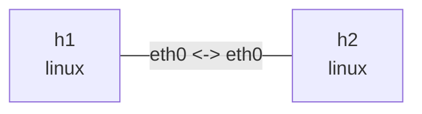

# MTU and offload

Run in this directory with `ethtool`, `iperf3`, `tcpdump`, and `iputils-ping`. This is a veth software-path experiment; large captured packets do not prove that oversized frames traversed a physical link. Output is illustrative and capabilities depend on the kernel.

## Topology and deployment

```bash
nslab graph --format mermaid
```



```console
$ sudo nslab deploy
deployed topology: mtu-offload
$ sudo nslab inspect
status: deployed
...
```

## MTU boundary

Without IPv4 options, a 1500-byte MTU minus 20 bytes of IPv4 and 8 bytes of ICMP leaves a 1472-byte ping payload. -M do forbids fragmentation; 1473 should fail. This MTU boundary is distinct from large TCP skbs observed by packet capture.

```console
$ sudo nslab exec --node h1 -- ip link show dev eth0
... eth0 ... mtu 1500 ...
$ sudo nslab exec --node h1 -- ping -c 2 -W 2 -M do -s 1472 10.71.0.2
...
2 packets transmitted, 2 received, 0% packet loss
$ sudo nslab exec --node h1 -- ping -c 1 -W 2 -M do -s 1473 10.71.0.2
ping: local error: message too long, mtu=1500
...
```

## Capture with offloads enabled

Inspect the actual flags before enabling TSO/GSO/GRO on both ends. Fixed features cannot be changed; if the kernel rejects a setting, do not treat the run as a complete on/off comparison. Use separate terminals for the server, capture, and traffic. TCP length in tcpdump is payload length, not the full Ethernet-frame size.

```console
$ sudo nslab exec --node h1 -- ethtool -k eth0
Features for eth0:
...
tcp-segmentation-offload: on
generic-segmentation-offload: on
generic-receive-offload: ...
$ sudo nslab exec --node h1 -- ethtool -K eth0 tso on gso on gro on
(no output on success)
$ sudo nslab exec --node h2 -- ethtool -K eth0 tso on gso on gro on
(no output on success)
$ sudo nslab exec --node h2 -- iperf3 -s
Server listening on 5201 ...
$ sudo nslab exec --node h1 -- tcpdump -ni eth0 -vv -c 100 'tcp port 5201'
...
... length 32768
...
$ sudo nslab exec --node h1 -- iperf3 -c 10.71.0.2 -t 10
...
... receiver
```

## Compare with offloads disabled

Disable these features at both ends, restart capture, and repeat the same traffic. Large skbs normally disappear. TCP payload is usually at most 1460 for MTU 1500, commonly 1448 with timestamps. GSO defers transmit segmentation and GRO coalesces receives; veth can carry GSO skbs and is not equivalent to a physical wire capture.

```console
$ sudo nslab exec --node h1 -- ethtool -K eth0 tso off gso off gro off
(no output on success)
$ sudo nslab exec --node h2 -- ethtool -K eth0 tso off gso off gro off
(no output on success)
$ sudo nslab exec --node h1 -- ethtool -k eth0
...
tcp-segmentation-offload: off
generic-segmentation-offload: off
generic-receive-offload: off
$ sudo nslab exec --node h1 -- tcpdump -ni eth0 -vv -c 100 'tcp port 5201'
...
... length 1448
...
$ sudo nslab exec --node h1 -- iperf3 -c 10.71.0.2 -t 10
...
... receiver
```

## Checksums and cleanup

Transmit captures may show incorrect checksums for CHECKSUM_PARTIAL packets before checksum completion. This alone does not mean the receiver got corrupted packets; consider the capture point, offloads, and connection results. tcpdump -K only disables checksum verification in the display. Stop services before destroy; deleting the veth removes these feature changes. Apply commands inside the lab, not to host physical interfaces.


```console
$ sudo nslab destroy
destroyed topology: mtu-offload
$ sudo nslab inspect
status: absent
...
```
