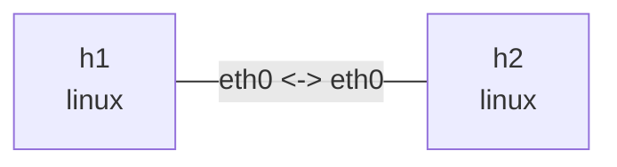

# MTU 与 offload

在此目录执行，依赖 `ethtool`、`iperf3`、`tcpdump`、`iputils-ping`。这是 veth 软件路径实验；看见大包不能推断物理链路发送了超 MTU 的帧。输出是示意，具体能力受内核影响。

## 拓扑与部署

```bash
nslab graph --format mermaid
```



```console
$ sudo nslab deploy
deployed topology: mtu-offload
$ sudo nslab inspect
status: deployed
...
```

## MTU 边界

无 IPv4 options 时，1500 字节 MTU 减去 20 字节 IPv4 头和 8 字节 ICMP 头，ping 最大 payload 为 1472。-M do 禁止 IPv4 分片；1473 应失败。这个边界与 TCP 抓包显示的大 skb 是不同层次。

```console
$ sudo nslab exec --node h1 -- ip link show dev eth0
... eth0 ... mtu 1500 ...
$ sudo nslab exec --node h1 -- ping -c 2 -W 2 -M do -s 1472 10.71.0.2
...
2 packets transmitted, 2 received, 0% packet loss
$ sudo nslab exec --node h1 -- ping -c 1 -W 2 -M do -s 1473 10.71.0.2
ping: local error: message too long, mtu=1500
...
```

## offload 开启时抓包

查看真实开关，再显式开启两端的 TSO/GSO/GRO。fixed 字段无法切换；如果内核拒绝某项，不应把该轮当作完整的 on/off 对比。终端 1 保持 iperf3 server，终端 2 抓包，终端 3 发流。tcpdump 的 TCP length 是 payload 长度，不是完整 Ethernet 帧长。

```console
$ sudo nslab exec --node h1 -- ethtool -k eth0
Features for eth0:
...
tcp-segmentation-offload: on
generic-segmentation-offload: on
generic-receive-offload: ...
$ sudo nslab exec --node h1 -- ethtool -K eth0 tso on gso on gro on
(no output on success)
$ sudo nslab exec --node h2 -- ethtool -K eth0 tso on gso on gro on
(no output on success)
$ sudo nslab exec --node h2 -- iperf3 -s
Server listening on 5201 ...
$ sudo nslab exec --node h1 -- tcpdump -ni eth0 -vv -c 100 'tcp port 5201'
...
... length 32768
...
$ sudo nslab exec --node h1 -- iperf3 -c 10.71.0.2 -t 10
...
... receiver
```

## 关闭后对比

在发送端和接收端都关闭，重新启动抓包后重复同一流量。大 skb 通常消失；MTU 1500 时 TCP payload 通常不超过 1460，有 timestamp option 时常见 1448。GSO 在发送侧延后分段，GRO 在接收侧合并；veth 支持传递 GSO skb，因此不能把虚拟端口等同于物理线上抓包点。

```console
$ sudo nslab exec --node h1 -- ethtool -K eth0 tso off gso off gro off
(no output on success)
$ sudo nslab exec --node h2 -- ethtool -K eth0 tso off gso off gro off
(no output on success)
$ sudo nslab exec --node h1 -- ethtool -k eth0
...
tcp-segmentation-offload: off
generic-segmentation-offload: off
generic-receive-offload: off
$ sudo nslab exec --node h1 -- tcpdump -ni eth0 -vv -c 100 'tcp port 5201'
...
... length 1448
...
$ sudo nslab exec --node h1 -- iperf3 -c 10.71.0.2 -t 10
...
... receiver
```

## 校验和与清理

发送侧抓包可能显示 incorrect checksum，因为抓到的是 CHECKSUM_PARTIAL 状态，校验和尚未最终计算。这不等于接收端真的收到坏包；需结合抓包位置、offload 开关和通信结果判断。-K 参数给 tcpdump 时只是关闭显示校验，不能修复数据。停止 iperf3 和抓包后 destroy，veth 删除会清除本实验的开关修改；不要把这些命令应用到宿主机物理接口。


```console
$ sudo nslab destroy
destroyed topology: mtu-offload
$ sudo nslab inspect
status: absent
...
```
