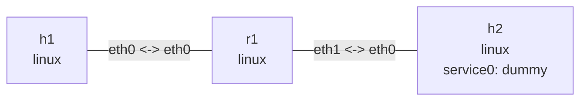

# Neighbor tables and proxying

## Goal

This lab combines fixed interface MAC addresses, static ARP/NDP entries, and Proxy ARP/NDP.
`h1` treats `192.0.2.200` and `2001:db8:1::200` as on-link destinations. `r1` answers address
resolution on their behalf and routes the packets to the `service0` dummy device on `h2`.

## Graph

```bash
nslab graph --format mermaid
```



The outputs below are representative. Namespace suffixes, interface indexes, neighbor states,
and ICMP timings vary.

## Run

```console
$ sudo nslab deploy
deployed topology: neighbors

$ sleep 2 && echo "IPv6 DAD complete"
IPv6 DAD complete

$ sudo nslab inspect
status: deployed

NAME  KIND   STATUS    NAMESPACE
----  -----  --------  ------------------------
h1    linux  matching  nslab-neighbors-h1-...
r1    linux  matching  nslab-neighbors-r1-...
h2    linux  matching  nslab-neighbors-h2-...
```

The two-second wait lets the kernel finish IPv6 duplicate address detection (DAD).

## Inspect fixed MAC addresses

```console
$ sudo nslab exec -N h1 -- ip -brief link show dev eth0
eth0@if...       UP             02:00:00:00:01:01 <BROADCAST,MULTICAST,UP,LOWER_UP>
```

The manifest assigns a stable unicast MAC to every veth endpoint, so static entries do not depend
on addresses randomly generated for each deployment.

## Inspect static ARP and NDP entries

```console
$ sudo nslab exec -N r1 -- ip -4 neigh show to 198.51.100.2 dev eth1 nud all
198.51.100.2 dev eth1 lladdr 02:00:00:00:02:02 PERMANENT

$ sudo nslab exec -N r1 -- ip -6 neigh show to 2001:db8:2::2 dev eth1 nud all
2001:db8:2::2 dev eth1 lladdr 02:00:00:00:02:02 REACHABLE

$ sudo nslab exec -N h2 -- ip -4 neigh show to 198.51.100.1 dev eth0 nud all
198.51.100.1 dev eth0 lladdr 02:00:00:00:02:01 STALE

$ sudo nslab exec -N h2 -- ip -6 neigh show to 2001:db8:2::1 dev eth0 nud all
2001:db8:2::1 dev eth0 lladdr 02:00:00:00:02:01 NOARP
```

`permanent` never ages; `reachable` is confirmed; `stale` retains the MAC but triggers confirmation
when next used; `noarp` suppresses neighbor probing. Traffic can legitimately move `reachable` or
`stale` through `delay`, `probe`, or each other. `nslab inspect` accepts those healthy NUD
transitions as matching state.

## Inspect Proxy ARP and Proxy NDP

```console
$ sudo nslab exec -N r1 -- ip -4 neigh show proxy dev eth0
192.0.2.200 dev eth0 proxy

$ sudo nslab exec -N r1 -- ip -6 neigh show proxy dev eth0
2001:db8:1::200 dev eth0 proxy

$ sudo nslab exec -N r1 -- cat /proc/sys/net/ipv4/conf/eth0/proxy_arp
1

$ sudo nslab exec -N r1 -- cat /proc/sys/net/ipv6/conf/eth0/proxy_ndp
1
```

Declaring `proxy: true` automatically enables `proxy_arp` or `proxy_ndp` on that interface. Proxy
entries are omitted from an ordinary `ip neigh show`; request the `proxy` table explicitly.

## Verify proxy forwarding

```console
$ sudo nslab exec -N h1 -- ping -4 -c 1 -W 2 192.0.2.200
PING 192.0.2.200 (192.0.2.200) 56(84) bytes of data.
64 bytes from 192.0.2.200: icmp_seq=1 ttl=63 time=<time> ms
1 packets transmitted, 1 received, 0% packet loss

$ sudo nslab exec -N h1 -- ping -6 -c 2 -W 2 2001:db8:1::200
64 bytes from 2001:db8:1::200: icmp_seq=1 ttl=63 time=<time> ms
64 bytes from 2001:db8:1::200: icmp_seq=2 ttl=63 time=<time> ms
2 packets transmitted, 2 received, 0% packet loss

$ sudo nslab inspect
status: deployed
```

`h1` has no explicit route through `r1`. It first resolves each service address on the local link;
`r1` answers and then performs Layer 3 forwarding. Healthy NUD transitions caused by the traffic
do not produce drift.

## Clean up

```console
$ sudo nslab destroy
destroyed topology: neighbors
```

[View nslab.yaml](https://github.com/calcky/nslab/blob/main/examples/neighbors/nslab.yaml) ·
[View example README](https://github.com/calcky/nslab/blob/main/examples/neighbors/README.md)
