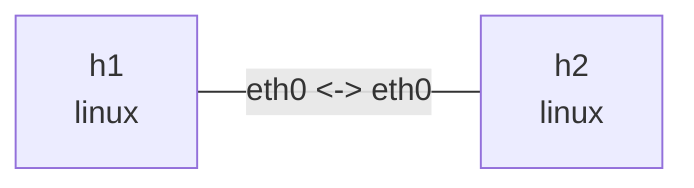

# Linux netem link conditions

## Goal

Install an egress netem qdisc at both ends of a veth to observe link delay, jitter, random loss,
and qdisc statistics independently. This lab does not use IP forwarding.

## Graph

```bash
nslab graph --format mermaid
```



Both directions use `100ms` delay, `10ms` jitter, and `5%` loss. Statistics below vary with
random loss and generated traffic.

## Run

```bash
cd examples/netem
```

```console
$ sudo nslab deploy
deployed topology: netem

$ sudo nslab inspect
status: deployed

NAME  KIND   STATUS    NAMESPACE
----  -----  --------  ------------------------
h1    linux  matching  nslab-netem-h1-...
h2    linux  matching  nslab-netem-h2-...
```

## Observe qdiscs

```console
$ sudo nslab exec --node h1 -- tc -s qdisc show dev eth0
qdisc netem ... root ... limit 1000 delay 100ms 10ms loss 5%
 Sent ... bytes ... pkt (dropped ..., overlimits ... requeues 0)

$ sudo nslab exec --node h2 -- tc -s qdisc show dev eth0
qdisc netem ... root ... limit 1000 delay 100ms 10ms loss 5%
 Sent ... bytes ... pkt (dropped ..., overlimits ... requeues 0)
```

## Generate traffic

```console
$ sudo nslab exec --node h1 -- ping -c 20 -i 0.2 10.30.0.2
64 bytes from 10.30.0.2: icmp_seq=1 ttl=64 time=<about-200> ms
...
20 packets transmitted, <received> received, <loss>% packet loss

$ sudo nslab exec --node h2 -- ping -c 20 -i 0.2 10.30.0.1
64 bytes from 10.30.0.1: icmp_seq=1 ttl=64 time=<about-200> ms
...
20 packets transmitted, <received> received, <loss>% packet loss
```

The echo request experiences egress delay at `h1` and the reply experiences it again at `h2`,
so RTT is centered around `200ms`.

## Change parameters

Change `delay_ms`, `jitter_ms`, or `loss_percent`, then rebuild the topology:

```console
$ sudo nslab redeploy
redeployed topology: netem

$ sudo nslab inspect
status: deployed
...

$ sudo nslab exec --node h1 -- ping -c 20 10.30.0.2
64 bytes from 10.30.0.2: icmp_seq=1 ttl=64 time=<new-delay> ms
...
20 packets transmitted, <received> received, <loss>% packet loss
```

## Clean up

```console
$ sudo nslab destroy
destroyed topology: netem
```

[View nslab.yaml](https://github.com/calcky/nslab/blob/main/examples/netem/nslab.yaml) ·
[View example README](https://github.com/calcky/nslab/blob/main/examples/netem/README.md)
