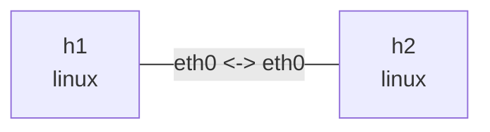

# Linux netem 链路条件

## 实验目标

在 veth 两端安装 netem egress qdisc，独立观察链路速率、延迟、抖动、随机丢包和 qdisc
统计。这个示例属于链路条件实验，不依赖 IP 转发。

## 拓扑图

```bash
nslab graph --format mermaid
```



该链路双向配置 `10mbit` rate、`100ms` delay、`10ms` jitter 和 `5%` loss。以下统计输出
会随随机丢包和流量变化。

## 运行

```bash
cd examples/netem
```

```console
$ sudo nslab deploy
deployed topology: netem

$ sudo nslab inspect
status: deployed

NAME  KIND   STATUS    NAMESPACE
----  -----  --------  ------------------------
h1    linux  matching  nslab-netem-h1-...
h2    linux  matching  nslab-netem-h2-...
```

## 观察 qdisc

```console
$ sudo nslab exec --node h1 -- tc -s qdisc show dev eth0
qdisc netem ... root ... limit 1000 delay 100ms 10ms loss 5% rate 10Mbit
 Sent ... bytes ... pkt (dropped ..., overlimits ... requeues 0)

$ sudo nslab exec --node h2 -- tc -s qdisc show dev eth0
qdisc netem ... root ... limit 1000 delay 100ms 10ms loss 5% rate 10Mbit
 Sent ... bytes ... pkt (dropped ..., overlimits ... requeues 0)
```

## 产生流量

```console
$ sudo nslab exec --node h1 -- ping -c 20 -i 0.2 10.30.0.2
64 bytes from 10.30.0.2: icmp_seq=1 ttl=64 time=<about-200> ms
...
20 packets transmitted, <received> received, <loss>% packet loss

$ sudo nslab exec --node h2 -- ping -c 20 -i 0.2 10.30.0.1
64 bytes from 10.30.0.1: icmp_seq=1 ttl=64 time=<about-200> ms
...
20 packets transmitted, <received> received, <loss>% packet loss
```

echo request 在 `h1` 经历一次 egress delay，reply 在 `h2` 再经历一次，因此 RTT
中心值约为 `200ms`。

## 修改参数

修改 `rate`、`delay_ms`、`jitter_ms` 或 `loss_percent` 后重建拓扑：

```console
$ sudo nslab redeploy
redeployed topology: netem

$ sudo nslab inspect
status: deployed
...

$ sudo nslab exec --node h1 -- ping -c 20 10.30.0.2
64 bytes from 10.30.0.2: icmp_seq=1 ttl=64 time=<new-delay> ms
...
20 packets transmitted, <received> received, <loss>% packet loss
```

## 其他根 qdisc

`netem` 与 `qdisc` 互斥；如果只想做令牌桶整形或 fq_codel，把链路上的 `netem` 替换为
下面其中一种配置：

```yaml
qdisc:
  kind: tbf
  rate: 10mbit
  burst: 32kb
  latency_ms: 400
```

```yaml
qdisc:
  kind: fq_codel
  target_ms: 5
  interval_ms: 100
  limit: 10240
  ecn: true
```

修改后运行 `sudo nslab redeploy`，再用 `sudo nslab exec --node h1 -- tc -s qdisc show dev eth0`
查看参数。三种配置的完整并行实验见 [qdisc 示例](qdisc.md)。

## 清理

```console
$ sudo nslab destroy
destroyed topology: netem
```

[查看 nslab.yaml](https://github.com/calcky/nslab/blob/main/examples/netem/nslab.yaml) ·
[查看示例 README](https://github.com/calcky/nslab/blob/main/examples/netem/README.md)
