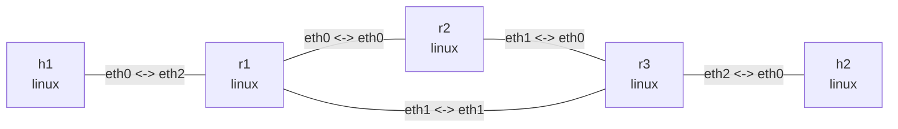

# OSPFv2 dynamic routing

## Goal

Three Linux routers run independent FRRouting `zebra` and `ospfd` processes in an OSPFv2
triangle for observing neighbors, learned routes, and failure convergence.

## Graph

```bash
nslab graph --format mermaid
```



The outputs below are representative. FRR timers, message counters, interface indexes, and
ICMP timings vary per run.

## Prepare and run

```bash
sudo apt install -y frr frr-pythontools
cd examples/ospf
```

```console
$ sudo nslab deploy
deployed topology: ospf

$ sudo nslab inspect
status: deployed

NAME  KIND   STATUS    NAMESPACE
----  -----  --------  ----------------------
h1    linux  matching  nslab-ospf-h1-...
r1    linux  matching  nslab-ospf-r1-...
r2    linux  matching  nslab-ospf-r2-...
r3    linux  matching  nslab-ospf-r3-...
h2    linux  matching  nslab-ospf-h2-...
```

`deploy` waits for daemon startup, not OSPF neighbor convergence.

## Inspect neighbors and routes

```console
$ sudo nslab exec --node r1 -- vtysh -N nslab-ospf-r1 -c "show ip ospf neighbor"
Neighbor ID  Pri  State         Dead Time  Address    Interface
2.2.2.2        1  Full/DROther  <time>     10.0.12.2  eth0:10.0.12.1
3.3.3.3        1  Full/DROther  <time>     10.0.13.2  eth1:10.0.13.1

$ sudo nslab exec --node r1 -- vtysh -N nslab-ospf-r1 -c "show ip route ospf"
...
O>* 192.0.3.0/24 [110/20] via 10.0.13.2, eth1, weight 1, <time>

$ sudo nslab exec --node r1 -- ip -4 route
10.0.12.0/30 dev eth0 proto kernel scope link src 10.0.12.1
10.0.13.0/30 dev eth1 proto kernel scope link src 10.0.13.1
192.0.1.0/24 dev eth2 proto kernel scope link src 192.0.1.1
192.0.3.0/24 via 10.0.13.2 dev eth1 proto ospf metric 20

$ sudo nslab exec --node h1 -- ping -c 3 192.0.3.2
64 bytes from 192.0.3.2: icmp_seq=1 ttl=62 time=<time> ms
...
3 packets transmitted, 3 received, 0% packet loss
```

## Observe failure convergence

Bring down the direct `r1`-to-`r3` path and wait for traffic to move through `r2`:

```bash
sudo nslab exec --node r1 -- ip link set eth1 down
sleep 10
```

```console
$ sudo nslab exec --node r1 -- vtysh -N nslab-ospf-r1 -c "show ip ospf neighbor"
Neighbor ID  Pri  State         Dead Time  Address    Interface
2.2.2.2        1  Full/DROther  <time>     10.0.12.2  eth0:10.0.12.1

$ sudo nslab exec --node r1 -- ip -4 route get 192.0.3.2
192.0.3.2 via 10.0.12.2 dev eth0 src 10.0.12.1
    cache

$ sudo nslab exec --node h1 -- ping -c 3 192.0.3.2
64 bytes from 192.0.3.2: icmp_seq=1 ttl=61 time=<time> ms
...
3 packets transmitted, 3 received, 0% packet loss
```

```bash
sudo nslab exec --node r1 -- ip link set eth1 up
```

## Clean up

```console
$ sudo nslab destroy
destroyed topology: ospf
```

[View nslab.yaml](https://github.com/calcky/nslab/blob/main/examples/ospf/nslab.yaml) ·
[View example README](https://github.com/calcky/nslab/blob/main/examples/ospf/README.md)
