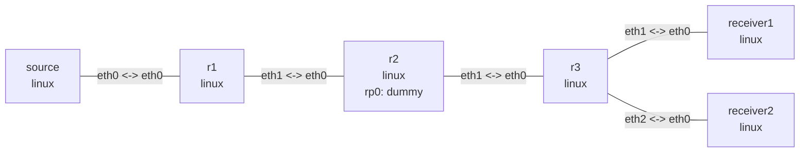

# IPv4 PIM-SM and IGMP multicast

## Goal

OSPF supplies unicast RPF routes while three routers run FRRouting `pimd` with
`10.255.0.2` as a static RP. Two receivers join `239.1.1.1` through IGMP so r3 must copy one
UDP stream from source onto both downstream interfaces.

## Graph

```bash
nslab graph --format mermaid
```



The output below is representative; neighbor uptimes, timers, and UDP source ports vary.

## Deploy

```bash
sudo apt install -y frr frr-pythontools
cd examples/pim
```

```console
$ sudo nslab deploy
deployed topology: pim

$ sudo nslab inspect
status: deployed

NAME       KIND   STATUS    NAMESPACE
---------  -----  --------  ---------------------
source     linux  matching  nslab-pim-source-...
r1         linux  matching  nslab-pim-r1-...
r2         linux  matching  nslab-pim-r2-...
r3         linux  matching  nslab-pim-r3-...
receiver1  linux  matching  nslab-pim-receiver1-...
receiver2  linux  matching  nslab-pim-receiver2-...
```

`deploy` waits for FRR daemon startup, but OSPF and PIM neighbors can take a few more seconds
to converge.

## Inspect PIM neighbors and the RP

```console
$ sudo nslab exec -N r2 -- vtysh -N nslab-pim-r2 -c "show ip pim neighbor"
Interface  Neighbor   Uptime    Holdtime  DR Pri
eth0       10.0.12.1  <time>    <time>    1
eth1       10.0.23.2  <time>    <time>    1

$ sudo nslab exec -N r2 -- vtysh -N nslab-pim-r2 -c "show ip pim rp-info"
RP address  group/prefix-list  OIF  I am RP  Source  Group-Type
10.255.0.2  224.0.0.0/4        rp0  yes      Static  ASM
```

The r2 dummy interface `rp0` owns the RP `/32`. OSPF advertises it to r1 and r3 for PIM RPF
lookups.

## Join the group and send UDP

Start the receivers in two separate terminals. Each command remains active until it receives
three packets:

```console
$ sudo nslab exec -N receiver1 -- python3 multicast_receive.py 192.0.31.2
joined 239.1.1.1:5000 on 192.0.31.2
pim-2 from 192.0.1.2:<port>
pim-3 from 192.0.1.2:<port>
pim-4 from 192.0.1.2:<port>
```

```console
$ sudo nslab exec -N receiver2 -- python3 multicast_receive.py 192.0.32.2
joined 239.1.1.1:5000 on 192.0.32.2
pim-2 from 192.0.1.2:<port>
pim-3 from 192.0.1.2:<port>
pim-4 from 192.0.1.2:<port>
```

While those commands are still running, r3 sees one membership on each receiver-facing
interface:

```console
$ sudo nslab exec -N r3 -- vtysh -N nslab-pim-r3 -c "show ip igmp groups"
Total IGMP groups: 2
Interface  Group      Mode  Timer   Srcs  V  Uptime
eth1       239.1.1.1  EXCL  <time>  1     3  <time>
eth2       239.1.1.1  EXCL  <time>  1     3  <time>
```

Send ten packets from a third terminal. The sender waits five seconds for the `(*,G)` join to
reach the RP. The first packet can also build `(S,G)` state, so the receivers do not require
sequence number 1.

```console
$ sudo nslab exec -N source -- python3 multicast_send.py 192.0.1.2
sent 10 packets to 239.1.1.1:5000
```

r3 now shows one `(S,G)` entry entering through `eth0` and being copied to `eth1` and `eth2`:

```console
$ sudo nslab exec -N r3 -- vtysh -N nslab-pim-r3 -c "show ip mroute"
IP Multicast Routing Table
Source     Group      Flags  Proto  Input  Output  TTL  Uptime
*          239.1.1.1  SC     IGMP   eth0   pimreg  1    <time>
                              IGMP          eth1    1
                              IGMP          eth2    1
192.0.1.2  239.1.1.1  ST     STAR   eth0   eth1    1    <time>
                              STAR          eth2    1
```

## Clean up

```console
$ sudo nslab destroy
destroyed topology: pim
```

[View nslab.yaml](https://github.com/calcky/nslab/blob/main/examples/pim/nslab.yaml) ·
[View example README](https://github.com/calcky/nslab/blob/main/examples/pim/README.md)
