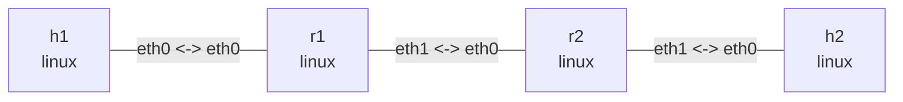

# MTU, PMTU, and IP fragmentation

This dual-stack lab places two Linux routers between `h1` and `h2`. The edge links use MTU 1500,
while the bottleneck between `r1:eth1` and `r2:eth0` uses 1280, the minimum IPv6 link MTU. It
compares three behaviors:

- IPv4 router fragmentation and destination reassembly when DF is clear;
- ICMP Fragmentation Needed and source PMTU learning when IPv4 DF is set;
- ICMPv6 Packet Too Big, because IPv6 routers never fragment forwarded packets.

The observation commands also require `tcpdump` and `tracepath`:

```bash
sudo apt install -y tcpdump iputils-tracepath
```

## Graph

```bash
nslab graph --format mermaid
```



The middle `r1:eth1 <-> r2:eth0` link uses MTU 1280; the other two links use MTU 1500. Interface
indexes, MAC addresses, counters, PMTU expiration times, and timings vary between runs.

## Deploy and check the links

Run from `examples/pmtu`:

```console
$ sudo nslab deploy
deployed topology: pmtu

$ sudo nslab inspect
status: deployed

NAME  KIND   STATUS    NAMESPACE
----  -----  --------  -----------------------
h1    linux  matching  nslab-pmtu-h1-...
h2    linux  matching  nslab-pmtu-h2-...
r1    linux  matching  nslab-pmtu-r1-...
r2    linux  matching  nslab-pmtu-r2-...

$ sudo nslab exec --node r1 -- ip -o link show dev eth1
<index>: eth1@...: <BROADCAST,MULTICAST,UP,LOWER_UP> mtu 1280 ...
```

Small packets cross both routers. The reply TTL and Hop Limit decrease from 64 to 62:

```console
$ sudo nslab exec --node h1 -- ping -4 -c 1 -W 2 198.51.100.2
64 bytes from 198.51.100.2: icmp_seq=1 ttl=62 time=<time> ms
1 packets transmitted, 1 received, 0% packet loss

$ sudo nslab exec --node h1 -- ping -6 -c 1 -W 2 2001:db8:3::2
64 bytes from 2001:db8:3::2: icmp_seq=1 ttl=62 time=<time> ms
1 packets transmitted, 1 received, 0% packet loss
```

## IPv4 router fragmentation

In terminal one, capture the two IPv4 fragments leaving the bottleneck interface on `r1`:

```console
$ sudo nslab exec --node r1 -- tcpdump -nn -v -i eth1 -c 2 'ip[6:2] & 0x3fff != 0'
tcpdump: listening on eth1, link-type EN10MB (Ethernet), snapshot length 262144 bytes
IP (... id <id>, offset 0, flags [+], proto ICMP (1), length 1276)
    192.0.2.2 > 198.51.100.2: ICMP echo request, ... length 1256
IP (... id <id>, offset 1256, flags [none], proto ICMP (1), length 172)
    192.0.2.2 > 198.51.100.2: ip-proto-1
2 packets captured
```

In terminal two, send a 1400-byte ICMP payload and clear DF with `-M dont`:

```console
$ sudo nslab exec --node h1 -- ping -4 -c 1 -W 2 -M dont -s 1400 198.51.100.2
PING 198.51.100.2 (198.51.100.2) 1400(1428) bytes of data.
1408 bytes from 198.51.100.2: icmp_seq=1 ttl=62 time=<time> ms
1 packets transmitted, 1 received, 0% packet loss
```

The IPv4 length is `1400 + 8 + 20 = 1428`, which exceeds 1280. `r1` splits the request into two
fragments. Every fragment payload except the last must be a multiple of eight bytes, so the first
fragment has a total length of 1276. The counters show fragmentation at the router and reassembly
at the destination:

```console
$ sudo nslab exec --node r1 -- nstat -az IpFragOKs IpFragCreates
#kernel
IpFragOKs                       1                  0.0
IpFragCreates                   2                  0.0

$ sudo nslab exec --node h2 -- nstat -az IpReasmReqds IpReasmOKs
#kernel
IpReasmReqds                    2                  0.0
IpReasmOKs                      1                  0.0
```

## IPv4 DF and PMTU

Redeploy to clear the counters and route exceptions. In terminal one, capture ICMP Type 3 / Code
4 on the interface from `r1` toward the source:

```console
$ sudo nslab redeploy
redeployed topology: pmtu

$ sudo nslab exec --node r1 -- tcpdump -nn -l -i eth0 -c 1 'icmp[0] == 3 and icmp[1] == 4'
tcpdump: listening on eth0, link-type EN10MB (Ethernet), snapshot length 262144 bytes
IP 192.0.2.1 > 192.0.2.2: ICMP 198.51.100.2 unreachable - need to frag (mtu 1280), length 556
1 packet captured
```

In terminal two, send the same size with DF set by `-M do`. This failure is expected:

```console
$ sudo nslab exec --node h1 -- ping -4 -c 1 -W 2 -M do -s 1400 198.51.100.2 || true
PING 198.51.100.2 (198.51.100.2) 1400(1428) bytes of data.
From 192.0.2.1 icmp_seq=1 Frag needed and DF set (mtu = 1280)
1 packets transmitted, 0 received, +1 errors, 100% packet loss

$ sudo nslab exec --node h1 -- ip -4 route get 198.51.100.2
198.51.100.2 via 192.0.2.1 dev eth0 src 192.0.2.2
    cache expires <seconds> mtu 1280
```

The ICMP response does not change the interface MTU. Instead, `h1` saves a destination-specific,
expiring PMTU exception. Later local sends with DF set are constrained by 1280.

## IPv6 Packet Too Big

IPv6 routers do not fragment forwarded packets. A 1400-byte payload plus the 40-byte IPv6 header
and 8-byte ICMPv6 header has a total length of 1448, so `r1` returns Packet Too Big:

```console
$ sudo nslab exec --node h1 -- ping -6 -c 1 -W 2 -s 1400 2001:db8:3::2 || true
PING 2001:db8:3::2 (2001:db8:3::2) 1400 data bytes
From 2001:db8:1::1 icmp_seq=1 Packet too big: mtu=1280
1 packets transmitted, 0 received, +1 errors, 100% packet loss

$ sudo nslab exec --node h1 -- ip -6 route get 2001:db8:3::2
2001:db8:3::2 from :: via 2001:db8:1::1 dev eth0 src 2001:db8:1::2 ...
    expires <seconds> mtu 1280 pref medium

$ sudo nslab exec --node h1 -- ping -6 -c 1 -W 2 -s 1232 2001:db8:3::2
PING 2001:db8:3::2 (2001:db8:3::2) 1232 data bytes
1240 bytes from 2001:db8:3::2: icmp_seq=1 ttl=62 time=<time> ms
1 packets transmitted, 1 received, 0% packet loss
```

`1280 - 40 - 8 = 1232`, so the final ICMPv6 Echo Request fits the learned PMTU exactly.

`tracepath` can also discover the path MTU for both address families:

```console
$ sudo nslab exec --node h1 -- tracepath -n -m 5 198.51.100.2
...
Resume: pmtu 1280 hops 3 back 3

$ sudo nslab exec --node h1 -- tracepath -6 -n -m 5 2001:db8:3::2
...
Resume: pmtu 1280 hops 3 back 3
```

## Clean up

```console
$ sudo nslab destroy
destroyed topology: pmtu
```

[View nslab.yaml](https://github.com/calcky/nslab/blob/main/examples/pmtu/nslab.yaml) ·
[View example README](https://github.com/calcky/nslab/blob/main/examples/pmtu/README.md)
