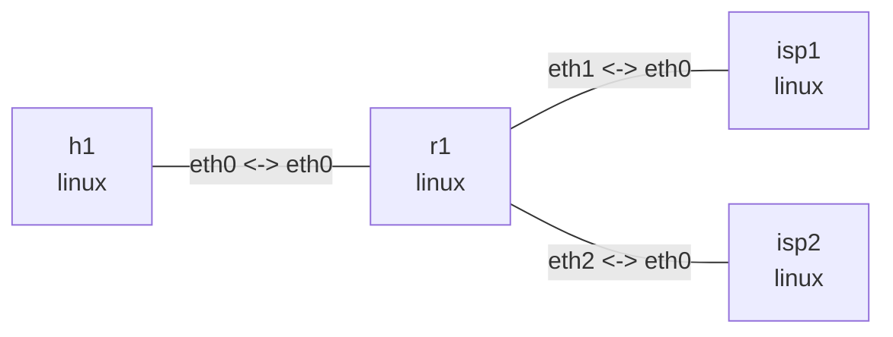

# Linux policy routing

## Goal

Use Linux RPDB rules on `r1` to select between two routing tables. Both ISP namespaces own
`203.0.113.1/32`. Ordinary traffic from `h1` matches a combined `from + to + iif` selector and
uses table 100; mark `2` takes precedence and selects table 200.

## Graph

```bash
nslab graph --format mermaid
```



The outputs below are representative. Namespace suffixes, interface indexes, and timings vary.

## Run

```console
$ cd examples/policy-routing

$ sudo nslab deploy
deployed topology: policy-routing

$ sudo nslab inspect
status: deployed

NAME  KIND   STATUS    NAMESPACE
----  -----  --------  -------------------------------
h1    linux  matching  nslab-policy-routing-h1-...
r1    linux  matching  nslab-policy-routing-r1-...
isp1  linux  matching  nslab-policy-routing-isp1-...
isp2  linux  matching  nslab-policy-routing-isp2-...
```

## Inspect rules and tables

```console
$ sudo nslab exec -N r1 -- ip -4 rule show
0:      from all lookup local
90:     from all fwmark 0x2/0xff lookup 200
100:    from 192.0.2.0/24 to 203.0.113.0/24 iif eth0 lookup 100
32766:  from all lookup main
32767:  from all lookup default

$ sudo nslab exec -N r1 -- ip -4 route show table 100
203.0.113.1 via 10.0.1.2 dev eth1 proto static

$ sudo nslab exec -N r1 -- ip -4 route show table 200
203.0.113.1 via 10.0.2.2 dev eth2 proto static
```

Priority 90 checks the packet mark first. If it does not match, priority 100 checks the source
prefix, destination prefix, and input interface together.

## Compare lookups

```console
$ sudo nslab exec -N r1 -- ip -4 route get 203.0.113.1 from 192.0.2.2 iif eth0
203.0.113.1 from 192.0.2.2 via 10.0.1.2 dev eth1 table 100
    cache iif eth0

$ sudo nslab exec -N r1 -- ip -4 route get 203.0.113.1 from 192.0.2.2 iif eth0 mark 2
203.0.113.1 from 192.0.2.2 via 10.0.2.2 dev eth2 table 200 mark 2
    cache iif eth0
```

Adding only mark `2` changes the selected table, next hop, and output interface.

## Verify forwarding

```console
$ sudo nslab exec -N h1 -- ping -c 1 -W 2 203.0.113.1
PING 203.0.113.1 (203.0.113.1) 56(84) bytes of data.
64 bytes from 203.0.113.1: icmp_seq=1 ttl=63 time=<time> ms
1 packets transmitted, 1 received, 0% packet loss
```

The unmarked packet from `h1` travels through `isp1` and returns successfully.

## Clean up

```console
$ sudo nslab destroy
destroyed topology: policy-routing
```

[View nslab.yaml](https://github.com/calcky/nslab/blob/main/examples/policy-routing/nslab.yaml) ·
[View example README](https://github.com/calcky/nslab/blob/main/examples/policy-routing/README.md)
