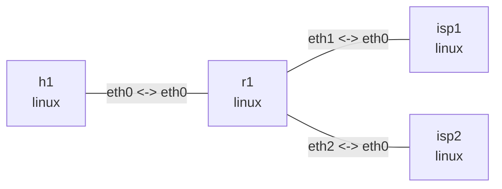

# Linux 策略路由

## 实验目标

在 `r1` 上使用 Linux RPDB rule 选择两张路由表。`isp1` 和 `isp2` 都拥有
`203.0.113.1/32`。来自 `h1` 的普通流量命中组合的 `from + to + iif` selector 并使用
table 100；mark `2` 拥有更高优先级，会改用 table 200。

## 拓扑图

```console
$ nslab graph --format mermaid
flowchart LR
    n0["h1\nlinux"]
    n1["r1\nlinux"]
    n2["isp1\nlinux"]
    n3["isp2\nlinux"]
    n0 -- "eth0 <-> eth0" --- n1
    n1 -- "eth1 <-> eth0" --- n2
    n1 -- "eth2 <-> eth0" --- n3
```



以下为典型输出；namespace 后缀、接口索引和时延会随运行变化。

## 运行

```console
$ cd examples/policy-routing

$ sudo nslab deploy
deployed topology: policy-routing

$ sudo nslab inspect
status: deployed

NAME  KIND   STATUS    NAMESPACE
----  -----  --------  -------------------------------
h1    linux  matching  nslab-policy-routing-h1-...
r1    linux  matching  nslab-policy-routing-r1-...
isp1  linux  matching  nslab-policy-routing-isp1-...
isp2  linux  matching  nslab-policy-routing-isp2-...
```

## 查看 rule 和路由表

```console
$ sudo nslab exec -N r1 -- ip -4 rule show
0:      from all lookup local
90:     from all fwmark 0x2/0xff lookup 200
100:    from 192.0.2.0/24 to 203.0.113.0/24 iif eth0 lookup 100
32766:  from all lookup main
32767:  from all lookup default

$ sudo nslab exec -N r1 -- ip -4 route show table 100
203.0.113.1 via 10.0.1.2 dev eth1 proto static

$ sudo nslab exec -N r1 -- ip -4 route show table 200
203.0.113.1 via 10.0.2.2 dev eth2 proto static
```

priority 90 先检查 packet mark；未命中时，priority 100 再同时检查源前缀、目的前缀和
入接口。

## 对比路由查询

```console
$ sudo nslab exec -N r1 -- ip -4 route get 203.0.113.1 from 192.0.2.2 iif eth0
203.0.113.1 from 192.0.2.2 via 10.0.1.2 dev eth1 table 100
    cache iif eth0

$ sudo nslab exec -N r1 -- ip -4 route get 203.0.113.1 from 192.0.2.2 iif eth0 mark 2
203.0.113.1 from 192.0.2.2 via 10.0.2.2 dev eth2 table 200 mark 2
    cache iif eth0
```

第二次只增加 mark `2`，选中的 table、下一跳和出接口便全部改变。

## 验证转发

```console
$ sudo nslab exec -N h1 -- ping -c 1 -W 2 203.0.113.1
PING 203.0.113.1 (203.0.113.1) 56(84) bytes of data.
64 bytes from 203.0.113.1: icmp_seq=1 ttl=63 time=<time> ms
1 packets transmitted, 1 received, 0% packet loss
```

`h1` 发出的普通包没有 mark，因此经由 `isp1` 往返。

## 清理

```console
$ sudo nslab destroy
destroyed topology: policy-routing
```

[查看 nslab.yaml](https://github.com/calcky/nslab/blob/main/examples/policy-routing/nslab.yaml) ·
[查看示例 README](https://github.com/calcky/nslab/blob/main/examples/policy-routing/README.md)
