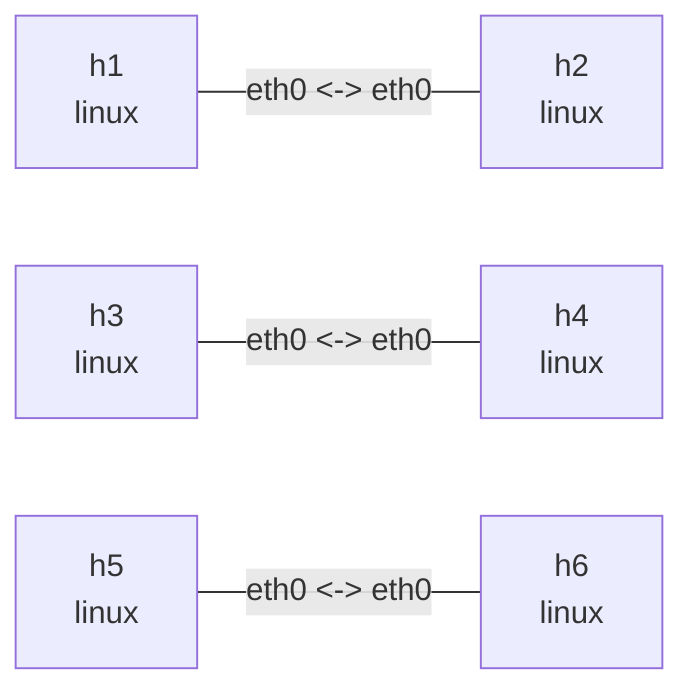

# Linux qdisc lab

This lab puts three traffic-control configurations on three independent point-to-point links:
netem with a rate, TBF, and fq_codel. Each qdisc is installed at egress on both ends of its link.

## Graph

```bash
nslab graph --format mermaid
```



## Run

```console
$ sudo nslab deploy
deployed topology: qdisc

$ sudo nslab inspect
status: deployed

NAME  KIND   STATUS    NAMESPACE
----  -----  --------  -------------------------
h1    linux  matching  nslab-qdisc-h1-...
h2    linux  matching  nslab-qdisc-h2-...
h3    linux  matching  nslab-qdisc-h3-...
h4    linux  matching  nslab-qdisc-h4-...
h5    linux  matching  nslab-qdisc-h5-...
h6    linux  matching  nslab-qdisc-h6-...
```

## Observe netem + rate

The `h1`/`h2` link has a 10mbit rate, 20ms delay, 5ms jitter, and 1% random loss:

```console
$ sudo nslab exec --node h1 -- tc -s qdisc show dev eth0
qdisc netem ... root ... delay 20ms 5ms loss 1% rate 10Mbit
 Sent ... bytes ... pkt (dropped ..., overlimits ...)

$ sudo nslab exec --node h1 -- ping -c 5 10.60.1.2
PING 10.60.1.2 (10.60.1.2) 56(84) bytes of data.
64 bytes from 10.60.1.2: icmp_seq=1 ttl=64 time=<about-40> ms
...
5 packets transmitted, <received> received, <loss>% packet loss
```

## Observe TBF

The `h3`/`h4` link uses token-bucket shaping: 5mbit, a 32kb burst, and a 400ms queueing
latency limit.

```console
$ sudo nslab exec --node h3 -- tc -s qdisc show dev eth0
qdisc tbf ... root ... rate 5Mbit burst 32Kb latency 400ms
 Sent ... bytes ... pkt (dropped ..., overlimits ...)

$ sudo nslab exec --node h3 -- ping -c 5 10.60.2.2
PING 10.60.2.2 (10.60.2.2) 56(84) bytes of data.
64 bytes from 10.60.2.2: icmp_seq=1 ttl=64 time=<time> ms
...
5 packets transmitted, <received> received, 0% packet loss
```

## Observe fq_codel

The `h5`/`h6` link uses fq_codel with a 5ms target, a 100ms interval, a 10240-packet limit,
and ECN enabled:

```console
$ sudo nslab exec --node h5 -- tc -s qdisc show dev eth0
qdisc fq_codel ... root ... limit 10240p ... target 5ms interval 100ms ... ecn
 Sent ... bytes ... pkt (dropped ..., overlimits ...)

$ sudo nslab exec --node h5 -- ping -c 5 10.60.3.2
PING 10.60.3.2 (10.60.3.2) 56(84) bytes of data.
64 bytes from 10.60.3.2: icmp_seq=1 ttl=64 time=<time> ms
...
5 packets transmitted, 5 received, 0% packet loss
```

Each link has the same qdisc at both ends; replace `h1`, `h3`, or `h5` with its peer to inspect
the reverse direction. `netem` and `qdisc` are mutually exclusive, so a link selects one or the
other.

## Clean up

```console
$ sudo nslab destroy
destroyed topology: qdisc
```

[View nslab.yaml](https://github.com/calcky/nslab/blob/main/examples/qdisc/nslab.yaml) ·
[View example README](https://github.com/calcky/nslab/blob/main/examples/qdisc/README.md)
