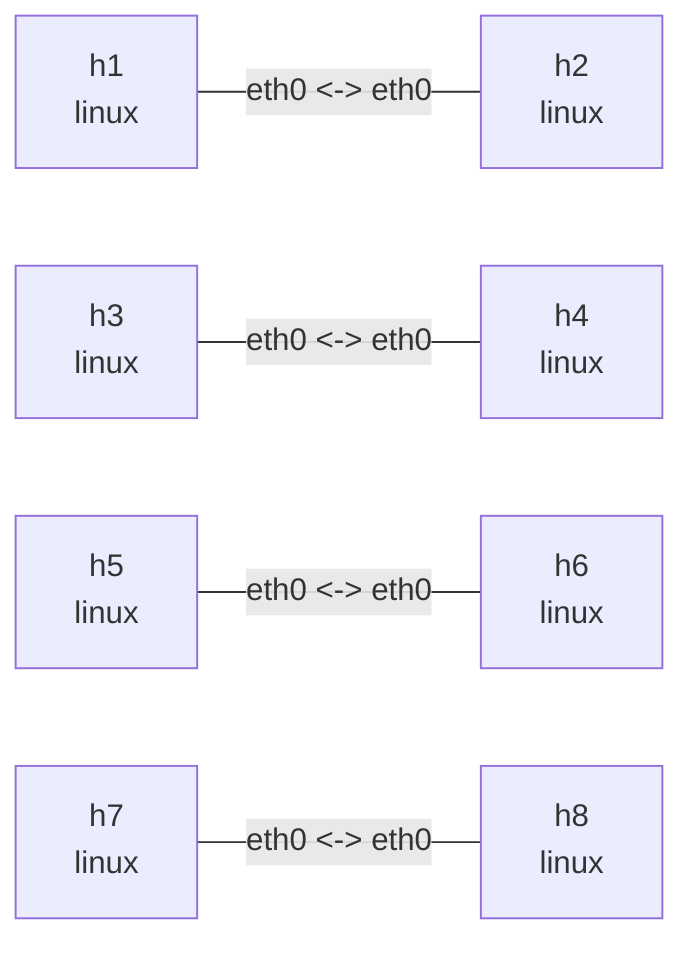

# Linux qdisc lab

This lab puts four traffic-control configurations on independent point-to-point links: netem
with a rate, TBF, fq_codel, and HTB with an fq_codel leaf. They compare link conditions, simple
shaping, standalone fair queueing, and multi-flow fairness under one aggregate rate. Each qdisc
is installed at egress on both ends of its link. The concurrent-flow exercise requires `iperf3`.

## Graph

```bash
nslab graph --format mermaid
```



## Run

```console
$ sudo nslab deploy
deployed topology: qdisc

$ sudo nslab inspect
status: deployed

NAME  KIND   STATUS    NAMESPACE
----  -----  --------  -------------------------
h1    linux  matching  nslab-qdisc-h1-...
h2    linux  matching  nslab-qdisc-h2-...
h3    linux  matching  nslab-qdisc-h3-...
h4    linux  matching  nslab-qdisc-h4-...
h5    linux  matching  nslab-qdisc-h5-...
h6    linux  matching  nslab-qdisc-h6-...
h7    linux  matching  nslab-qdisc-h7-...
h8    linux  matching  nslab-qdisc-h8-...
```

## Observe netem + rate

The `h1`/`h2` link has a 10mbit rate, 20ms delay, 5ms jitter, and 1% random loss:

```console
$ sudo nslab exec --node h1 -- tc -s qdisc show dev eth0
qdisc netem ... root ... delay 20ms 5ms loss 1% rate 10Mbit
 Sent ... bytes ... pkt (dropped ..., overlimits ...)

$ sudo nslab exec --node h1 -- ping -c 5 10.60.1.2
PING 10.60.1.2 (10.60.1.2) 56(84) bytes of data.
64 bytes from 10.60.1.2: icmp_seq=1 ttl=64 time=<about-40> ms
...
5 packets transmitted, <received> received, <loss>% packet loss
```

## Observe TBF

The `h3`/`h4` link uses token-bucket shaping: 5mbit, a 32kb burst, and a 400ms queueing
latency limit.

```console
$ sudo nslab exec --node h3 -- tc -s qdisc show dev eth0
qdisc tbf ... root ... rate 5Mbit burst 32Kb latency 400ms
 Sent ... bytes ... pkt (dropped ..., overlimits ...)

$ sudo nslab exec --node h3 -- ping -c 5 10.60.2.2
PING 10.60.2.2 (10.60.2.2) 56(84) bytes of data.
64 bytes from 10.60.2.2: icmp_seq=1 ttl=64 time=<time> ms
...
5 packets transmitted, <received> received, 0% packet loss
```

## Observe fq_codel

The `h5`/`h6` link uses fq_codel with a 5ms target, a 100ms interval, a 10240-packet limit,
and ECN enabled:

```console
$ sudo nslab exec --node h5 -- tc -s qdisc show dev eth0
qdisc fq_codel ... root ... limit 10240p ... target 5ms interval 100ms ... ecn
 Sent ... bytes ... pkt (dropped ..., overlimits ...)

$ sudo nslab exec --node h5 -- ping -c 5 10.60.3.2
PING 10.60.3.2 (10.60.3.2) 56(84) bytes of data.
64 bytes from 10.60.3.2: icmp_seq=1 ttl=64 time=<time> ms
...
5 packets transmitted, 5 received, 0% packet loss
```

## Observe HTB + fq_codel

The `h7`/`h8` link uses one 20mbit HTB class for aggregate shaping and attaches fq_codel below
that class. Start two TCP flows together; at roughly 20 Mbit/s aggregate throughput, each flow
normally receives about half of the available bandwidth:

```console
$ sudo nslab exec --node h8 -- sh -c 'iperf3 -s -D -p 5201 && iperf3 -s -D -p 5202 && echo servers-ready'
servers-ready

$ sudo nslab exec --node h7 -- sh -c 'iperf3 -c 10.60.4.2 -p 5201 -t 10 > /tmp/flow1 & iperf3 -c 10.60.4.2 -p 5202 -t 10 > /tmp/flow2 & wait; grep receiver /tmp/flow1 /tmp/flow2'
/tmp/flow1:[  5]   0.00-10.01 sec  11.5 MBytes  9.64 Mbits/sec  receiver
/tmp/flow2:[  5]   0.00-10.01 sec  11.2 MBytes  9.38 Mbits/sec  receiver

$ sudo nslab exec --node h7 -- tc -s -d qdisc show dev eth0
qdisc htb 1: root ... default 0x1 ...
 Sent ... bytes ... pkt (dropped ..., overlimits ...)
qdisc fq_codel 10: parent 1:1 limit 10240p flows 1024 quantum 1514 target 5ms interval 100ms ecn
 Sent ... bytes ... pkt (dropped ..., overlimits ...)
```

Each link has the same qdisc at both ends; replace `h1`, `h3`, `h5`, or `h7` with its peer to inspect
the reverse direction. `netem` and `qdisc` are mutually exclusive, so a link selects one or the
other.

## Clean up

```console
$ sudo nslab destroy
destroyed topology: qdisc
```

[View nslab.yaml](https://github.com/calcky/nslab/blob/main/examples/qdisc/nslab.yaml) ·
[View example README](https://github.com/calcky/nslab/blob/main/examples/qdisc/README.md)
