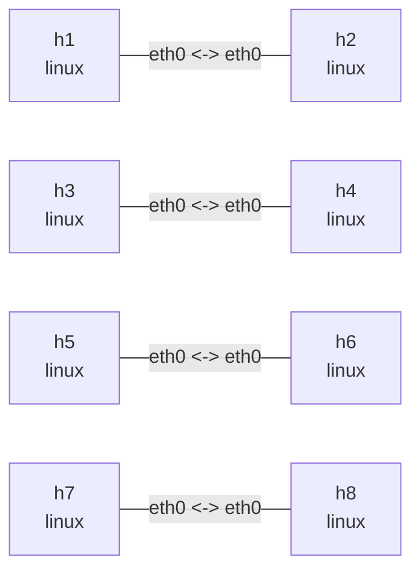

# Linux qdisc 实验

这个实验在四条独立的点到点链路上分别配置 netem（带速率）、TBF、fq_codel 和
HTB + fq_codel，用来比较链路条件、简单整形、独立公平队列以及“总带宽 + 多流公平”。
每种 qdisc 都会安装在对应链路两端的 egress。并发流实验需要安装 `iperf3`。

## 拓扑图

```bash
nslab graph --format mermaid
```



## 运行

```console
$ sudo nslab deploy
deployed topology: qdisc

$ sudo nslab inspect
status: deployed

NAME  KIND   STATUS    NAMESPACE
----  -----  --------  -------------------------
h1    linux  matching  nslab-qdisc-h1-...
h2    linux  matching  nslab-qdisc-h2-...
h3    linux  matching  nslab-qdisc-h3-...
h4    linux  matching  nslab-qdisc-h4-...
h5    linux  matching  nslab-qdisc-h5-...
h6    linux  matching  nslab-qdisc-h6-...
h7    linux  matching  nslab-qdisc-h7-...
h8    linux  matching  nslab-qdisc-h8-...
```

## 观察 netem + rate

`h1`/`h2` 链路同时配置 10mbit 速率、20ms 延迟、5ms 抖动和 1% 随机丢包：

```console
$ sudo nslab exec --node h1 -- tc -s qdisc show dev eth0
qdisc netem ... root ... delay 20ms 5ms loss 1% rate 10Mbit
 Sent ... bytes ... pkt (dropped ..., overlimits ...)

$ sudo nslab exec --node h1 -- ping -c 5 10.60.1.2
PING 10.60.1.2 (10.60.1.2) 56(84) bytes of data.
64 bytes from 10.60.1.2: icmp_seq=1 ttl=64 time=<about-40> ms
...
5 packets transmitted, <received> received, <loss>% packet loss
```

## 观察 TBF

`h3`/`h4` 链路使用令牌桶整形：速率 5mbit、burst 32kb，队列等待上限 400ms。

```console
$ sudo nslab exec --node h3 -- tc -s qdisc show dev eth0
qdisc tbf ... root ... rate 5Mbit burst 32Kb latency 400ms
 Sent ... bytes ... pkt (dropped ..., overlimits ...)

$ sudo nslab exec --node h3 -- ping -c 5 10.60.2.2
PING 10.60.2.2 (10.60.2.2) 56(84) bytes of data.
64 bytes from 10.60.2.2: icmp_seq=1 ttl=64 time=<time> ms
...
5 packets transmitted, <received> received, 0% packet loss
```

## 观察 fq_codel

`h5`/`h6` 链路使用 fq_codel：目标队列延迟 5ms、检测间隔 100ms、队列上限 10240 个报文，
并启用 ECN：

```console
$ sudo nslab exec --node h5 -- tc -s qdisc show dev eth0
qdisc fq_codel ... root ... limit 10240p ... target 5ms interval 100ms ... ecn
 Sent ... bytes ... pkt (dropped ..., overlimits ...)

$ sudo nslab exec --node h5 -- ping -c 5 10.60.3.2
PING 10.60.3.2 (10.60.3.2) 56(84) bytes of data.
64 bytes from 10.60.3.2: icmp_seq=1 ttl=64 time=<time> ms
...
5 packets transmitted, 5 received, 0% packet loss
```

## 观察 HTB + fq_codel

`h7`/`h8` 链路使用单个 20mbit HTB class 做总带宽整形，并把 fq_codel 挂在 class 下。
下面同时发起两个 TCP flow；总吞吐接近 20 Mbit/s 时，两个 flow 通常各获得约一半带宽：

```console
$ sudo nslab exec --node h8 -- sh -c 'iperf3 -s -D -p 5201 && iperf3 -s -D -p 5202 && echo servers-ready'
servers-ready

$ sudo nslab exec --node h7 -- sh -c 'iperf3 -c 10.60.4.2 -p 5201 -t 10 > /tmp/flow1 & iperf3 -c 10.60.4.2 -p 5202 -t 10 > /tmp/flow2 & wait; grep receiver /tmp/flow1 /tmp/flow2'
/tmp/flow1:[  5]   0.00-10.01 sec  11.5 MBytes  9.64 Mbits/sec  receiver
/tmp/flow2:[  5]   0.00-10.01 sec  11.2 MBytes  9.38 Mbits/sec  receiver

$ sudo nslab exec --node h7 -- tc -s -d qdisc show dev eth0
qdisc htb 1: root ... default 0x1 ...
 Sent ... bytes ... pkt (dropped ..., overlimits ...)
qdisc fq_codel 10: parent 1:1 limit 10240p flows 1024 quantum 1514 target 5ms interval 100ms ecn
 Sent ... bytes ... pkt (dropped ..., overlimits ...)
```

每条链路两端都安装相同的 qdisc；可将 `h1`、`h3`、`h5` 或 `h7` 换成对端节点观察反方向。`netem`
与 `qdisc` 互斥，同一条链路只能选择其中一种。

## 清理

```console
$ sudo nslab destroy
destroyed topology: qdisc
```

[查看 nslab.yaml](https://github.com/calcky/nslab/blob/main/examples/qdisc/nslab.yaml) ·
[查看示例 README](https://github.com/calcky/nslab/blob/main/examples/qdisc/README.md)
