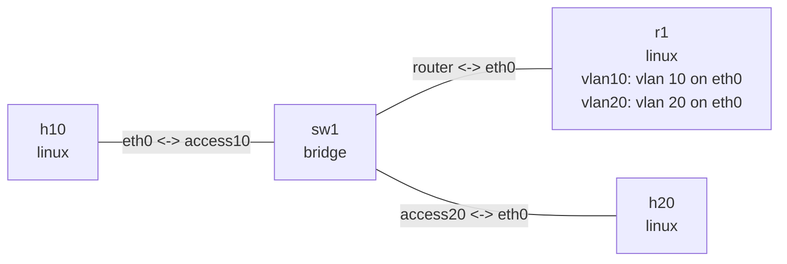

# Router on a stick

## Goal

Route between VLAN 10 and VLAN 20 through one physical trunk. `r1` owns the `vlan10` and
`vlan20` layer 3 subinterfaces on `eth0`; `sw1` presents untagged access ports to the hosts and
a tagged trunk to the router.

## Graph

```console
$ nslab graph --format mermaid
flowchart LR
    n0["h10\nlinux"]
    n1["sw1\nbridge"]
    n2["r1\nlinux\nvlan10: vlan 10 on eth0\nvlan20: vlan 20 on eth0"]
    n3["h20\nlinux"]
    n0 -- "eth0 <-> access10" --- n1
    n1 -- "router <-> eth0" --- n2
    n1 -- "access20 <-> eth0" --- n3
```



The outputs below are representative. Interface indexes, MAC addresses, and timings vary.

## Run

```console
$ cd examples/router-on-a-stick

$ sudo nslab deploy
deployed topology: router-on-a-stick

$ sudo nslab inspect
status: deployed

NAME  KIND    STATUS    NAMESPACE
----  ------  --------  -----------------------------------
h10   linux   matching  nslab-router-on-a-stick-h10-...
sw1   bridge  matching  nslab-router-on-a-stick-sw1-...
r1    linux   matching  nslab-router-on-a-stick-r1-...
h20   linux   matching  nslab-router-on-a-stick-h20-...
```

## Observe and verify

```console
$ sudo nslab exec --node sw1 -- bridge vlan show
port      vlan-id
access10  10 PVID Egress Untagged
router    10
          20
access20  20 PVID Egress Untagged

$ sudo nslab exec --node r1 -- ip -d link show type vlan
<index>: vlan10@eth0: <BROADCAST,MULTICAST,UP,LOWER_UP> ...
    vlan protocol 802.1Q id 10 <REORDER_HDR>
<index>: vlan20@eth0: <BROADCAST,MULTICAST,UP,LOWER_UP> ...
    vlan protocol 802.1Q id 20 <REORDER_HDR>

$ sudo nslab exec --node r1 -- ip -4 route show
192.168.10.0/24 dev vlan10 proto kernel scope link src 192.168.10.1
192.168.20.0/24 dev vlan20 proto kernel scope link src 192.168.20.1

$ sudo nslab exec --node r1 -- cat /proc/sys/net/ipv4/ip_forward
1

$ sudo nslab exec --node h10 -- ip -4 route show
default via 192.168.10.1 dev eth0
192.168.10.0/24 dev eth0 proto kernel scope link src 192.168.10.2

$ sudo nslab exec --node h10 -- ping -c 3 192.168.20.2
PING 192.168.20.2 (192.168.20.2) 56(84) bytes of data.
64 bytes from 192.168.20.2: icmp_seq=1 ttl=63 time=<time> ms
...
3 packets transmitted, 3 received, 0% packet loss
```

The access ports remove tags on egress. The router port retains VLAN 10 and VLAN 20 tags, which
the matching `r1` subinterface demultiplexes. TTL 63 confirms one IPv4 forwarding hop.

## Clean up

```console
$ sudo nslab destroy
destroyed topology: router-on-a-stick
```

[View nslab.yaml](https://github.com/calcky/nslab/blob/main/examples/router-on-a-stick/nslab.yaml) ·
[View example README](https://github.com/calcky/nslab/blob/main/examples/router-on-a-stick/README.md)
