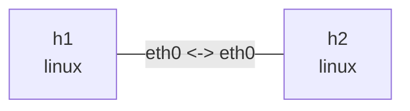

# TCP behavior

Run in this directory with `iperf3`, `tcpdump`, `iproute2`, and `python3`. Window sizes, rates, and retransmission counts below are illustrative, not benchmark results. Keep services in foreground terminals and stop them with Ctrl+C.

## Topology and deployment

```bash
nslab graph --format mermaid
```



```console
$ sudo nslab deploy
deployed topology: tcp-behavior
$ sudo nslab inspect
status: deployed
...
```

## Handshake and connection close

Use separate terminals for the server, capture, and client. Observe SYN, SYN-ACK, ACK, and FIN/ACK. iperf3 uses both control and data connections, so distinguish their four-tuples.

```console
$ sudo nslab exec --node h2 -- iperf3 -s
Server listening on 5201 ...
$ sudo nslab exec --node h1 -- tcpdump -ni eth0 -S 'tcp port 5201'
...
... Flags [S], ...
... Flags [S.], ...
... Flags [.], ...
$ sudo nslab exec --node h1 -- iperf3 -c 10.70.0.2 -t 10
...
[SUM/stream] ... sender
[SUM/stream] ... receiver
```

## Congestion window and retransmission

Check available congestion-control algorithms. Add 20ms delay and 1% random loss in the sending direction, then test Reno; compare with cubic when available. Existing tc commands create the conditions. In another terminal sample ss with watch to inspect cwnd, ssthresh, rtt, retrans, and bytes_retrans. Field availability varies and a short run may see no loss.

```console
$ sudo nslab exec --node h1 -- sysctl net.ipv4.tcp_available_congestion_control
net.ipv4.tcp_available_congestion_control = reno cubic ...
$ sudo nslab exec --node h1 -- tc qdisc replace dev eth0 root netem delay 20ms loss 1%
(no output)
$ sudo nslab exec --node h1 -- iperf3 -c 10.70.0.2 -C reno -t 20
...
... Retr ... Cwnd
... sender
... receiver
$ sudo nslab exec --node h1 -- ss -tin dst 10.70.0.2
ESTAB ...
 reno ... rtt:... cwnd:... ssthresh:... retrans:...
```

```bash
# Observe while iperf3 runs in another terminal.
sudo nslab exec --node h1 -- watch -n 0.2 'ss -tin dst 10.70.0.2'
```

```console
$ sudo nslab exec --node h1 -- tc qdisc del dev eth0 root
(no output)
```

## Zero window and flow control

Remove netem first. slow_receiver.py sets SO_RCVBUF to 4096 and pauses reads for 10 seconds after accept; send.py sends 8 MiB. Start capture, then receiver, then sender. Observe advertised win 0, the sender persist timer, and window updates when reads resume. Receiver flow control is distinct from congestion-window reduction.

```console
$ sudo nslab exec --node h1 -- tcpdump -ni eth0 -S 'tcp port 9000'
...
... Flags [.], ... win 0, length 0
$ sudo nslab exec --node h2 -- python3 "$PWD/slow_receiver.py"
listening on 10.70.0.2:9000
connected; pausing reads for 10s
received 8388608 bytes
$ sudo nslab exec --node h1 -- python3 "$PWD/send.py"
sent 8388608 bytes in <elapsed>s
$ sudo nslab exec --node h1 -- ss -tinop dst 10.70.0.2
ESTAB ... timer:(persist,...) ...
...
```

## Cleanup

Stop iperf3, watch, and capture processes before destroy. Both Python tools exit after completing; timeouts report errors and close sockets.


```console
$ sudo nslab destroy
destroyed topology: tcp-behavior
$ sudo nslab inspect
status: absent
...
```
