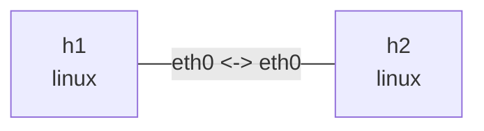

# TCP behavior

Run in this directory with `iperf3`, `tcpdump`, `iproute2`, and `python3`. Window sizes, rates, and retransmission counts below are illustrative, not benchmark results. Keep services in foreground terminals and stop them with Ctrl+C.

## Topology and deployment

```bash
nslab graph --format mermaid
```



```console
$ sudo nslab deploy
deployed topology: tcp-behavior
$ sudo nslab inspect
status: deployed
...
```

## Handshake and connection close

Use separate terminals for the server, capture, and client. Observe SYN, SYN-ACK, ACK, and FIN/ACK. iperf3 uses both control and data connections, so distinguish their four-tuples.

```console
$ sudo nslab exec --node h2 -- iperf3 -s
Server listening on 5201 ...
$ sudo nslab exec --node h1 -- tcpdump -ni eth0 -S 'tcp port 5201'
...
... Flags [S], ...
... Flags [S.], ...
... Flags [.], ...
$ sudo nslab exec --node h1 -- iperf3 -c 10.70.0.2 -t 10
...
[SUM/stream] ... sender
[SUM/stream] ... receiver
```

## Congestion window and retransmission

Check available congestion-control algorithms. Add 20ms delay and 1% random loss in the sending direction, then test Reno; compare with cubic when available. Existing tc commands create the conditions. In another terminal sample ss with watch to inspect cwnd, ssthresh, rtt, retrans, and bytes_retrans. Field availability varies and a short run may see no loss.

```console
$ sudo nslab exec --node h1 -- sysctl net.ipv4.tcp_available_congestion_control
net.ipv4.tcp_available_congestion_control = reno cubic ...
$ sudo nslab exec --node h1 -- tc qdisc replace dev eth0 root netem delay 20ms loss 1%
(no output)
$ sudo nslab exec --node h1 -- iperf3 -c 10.70.0.2 -C reno -t 20
...
... Retr ... Cwnd
... sender
... receiver
$ sudo nslab exec --node h1 -- ss -tin dst 10.70.0.2
ESTAB ...
 reno ... rtt:... cwnd:... ssthresh:... retrans:...
```

```bash
# Observe while iperf3 runs in another terminal.
sudo nslab exec --node h1 -- watch -n 0.2 'ss -tin dst 10.70.0.2'
```

```console
$ sudo nslab exec --node h1 -- tc qdisc del dev eth0 root
(no output)
```

## Zero window and flow control

Remove netem first. slow_receiver.py sets SO_RCVBUF to 4096 and pauses reads for 10 seconds after accept; send.py sends 8 MiB. Start capture, then receiver, then sender. Observe advertised win 0, the sender persist timer, and window updates when reads resume. Receiver flow control is distinct from congestion-window reduction.

```console
$ sudo nslab exec --node h1 -- tcpdump -ni eth0 -S 'tcp port 9000'
...
... Flags [.], ... win 0, length 0
$ sudo nslab exec --node h2 -- python3 "$PWD/slow_receiver.py"
listening on 10.70.0.2:9000
connected; pausing reads for 10s
received 8388608 bytes
$ sudo nslab exec --node h1 -- python3 "$PWD/send.py"
sent 8388608 bytes in <elapsed>s
$ sudo nslab exec --node h1 -- ss -tinop dst 10.70.0.2
ESTAB ... timer:(persist,...) ...
...
```

## Advanced experiments: SACK, DSACK, RACK, TLP, and ECN

`advanced.py` creates an independent temporary deployment per scenario from this same two-node manifest; it does not reuse the manually deployed `tcp-behavior`. It additionally requires `ethtool` and kernel support for `netem`, `clsact`, `u32`, `gact`, `pedit`, and `csum`. Run as root. It installs no packages and changes no host sysctls. These privileged experiments are manual, not CI jobs.

| Scenario | Injection | Main evidence |
| --- | --- | --- |
| `sack` / `no-sack` | Drop the first match for segments 3 and 5 of 8 | SACK blocks, `TCPSackRecovery`, `TCPRenoRecovery`, retransmissions and out-of-order queue |
| `dsack` / `no-dsack` | netem duplicate 100% in the h1 direction | `TCPDSACKOldSent`, `TCPDSACKRecv`; first SACK block below cumulative ACK |
| `rack` / `rack-zero` | Drop segment 2 of 3; disable TLP | `tcp_recovery=1/0` parameter control; retransmissions, `TCPTimeouts`, timeline |
| `tlp` / `no-tlp` | Drop both tail segments of 4; `tcp_early_retrans=3/0` | `TCPLossProbes` versus RTO; `TCPLossProbeRecovery` need not increase |
| `ecn` / `no-ecn` | Mark only ECT(0) data as CE; `tcp_ecn=1/0` | SYN ECE/CWR negotiation, CE, ECE ACK, subsequent CWR; `InCEPkts`, `TCPDeliveredCE` |

Each scenario uses Reno, MSS 512, timestamps disabled, segmentation/coalescing and checksum offloads disabled at both ends, and 20ms delay in each direction. The first four payload bytes contain a zero-based segment index. With 20-byte IPv4 and TCP data headers, `tc u32` matches at offset 40 from the IP header. These assumptions apply only to this controlled packet layout, not arbitrary TCP traffic.

Loss is injected at **h2 ingress** to avoid local TX-drop feedback masking network loss. `gact drop random determ pass 2` alternates drop/pass per target; it is not a permanent drop-once rule. The first retransmission normally passes; consult `filters` in `result.json` for actual hits. The receiver validates the entire payload SHA256 and returns its digest. The sender waits for that digest before sending FIN, so FIN cannot fill a tail-loss gap.

```console
$ sudo python3 ./advanced.py
results: /tmp/nslab-tcp-results-<random>
sack: observed
no-sack: observed
dsack: observed
no-dsack: observed
rack: observed
rack-zero: observed
tlp: observed
no-tlp: observed
ecn: observed
no-ecn: observed
$ sudo python3 ./advanced.py --scenario tlp
results: /tmp/nslab-tcp-results-<random>
tlp: observed
$ sudo python3 ./advanced.py --scenario ecn --output /tmp/tcp-ecn-run1
results: /tmp/tcp-ecn-run1
ecn: observed
```

This illustrates a successful run; kernels may produce different observations. `--output` must name a new directory. When nslab is outside sudo's PATH, use `sudo env NSLAB_BIN=/absolute/path/nslab python3 ./advanced.py`.

### Interpret the evidence

- **SACK** reports received noncontiguous byte ranges. **DSACK** reports duplicate bytes, not a different congestion-control algorithm. Here duplication is injected, so DSACK does not establish a spurious retransmission.
- **RACK** uses transmission time to infer loss; a retransmission alone does not prove it. `rack` checks non-RTO recovery without TLP under the enabled setting, not a function-level trace. Recent kernels ignore clearing bit 0 of `tcp_recovery`: `rack-zero` **does not mean RACK off**. Older kernels may fall back to RTO while newer kernels still recover without RTO. See the [kernel sysctl documentation](https://docs.kernel.org/networking/ip-sysctl.html#tcp-recovery-integer).
- **TLP** probes tail loss; not every tail retransmission is TLP. Require `TCPLossProbes` evidence. The disabled control requires `TCPTimeouts`. Dropping two tail segments lets a probe's ACK/SACK drive recovery.
- **ECN** negotiation alone does not prove congestion feedback. Artificial CE marking tests the feedback path, not AQM, throughput, or fairness. tcpdump uses `E` for ECE and `W` for CWR. A capture before h2 ingress modification may still show ECT(0); also check receiver `InCEPkts` and ECE ACKs received by h1.

The output retains `summary.json` plus per-scenario `result.json`, `h1.pcap`, `h2.pcap`, `h1-packets.txt`, `h2-packets.txt`, and process logs. JSON records kernel/architecture, nslab version, manifest and collector SHA256, commands/exit codes, before/after/delta `nstat -aszj` counters, tc filter statistics, and cleanup results. Missing kernel counters are `null`, not zero.

```console
$ sudo python3 -m json.tool /tmp/tcp-ecn-run1/ecn/result.json
{
    "scenario": "ecn",
    ...
}
$ sudo tcpdump -nn -tt -S -v -r /tmp/tcp-ecn-run1/ecn/h1.pcap
...
... Flags [SEW], ...
... Flags [S.E], ...
... Flags [.E], ...
... Flags [W.], ...
```

`observed` means payload validation and the scenario's counter conditions passed. Missing evidence becomes `inconclusive`; command or cleanup failures become `error`. Any non-observed scenario yields overall exit code 1 while subsequent scenarios still run. Ctrl+C or SIGTERM stops the experiment, terminates children, destroys temporary deployments, and retains collected results (exit 130). SIGKILL or power loss cannot guarantee cleanup; use the deployment in `result.json` with `nslab destroy --name <deployment>`.

## Cleanup

Stop iperf3, watch, and capture processes before destroy. Both Python tools exit after completing; timeouts report errors and close sockets.


```console
$ sudo nslab destroy
destroyed topology: tcp-behavior
$ sudo nslab inspect
status: absent
...
```
