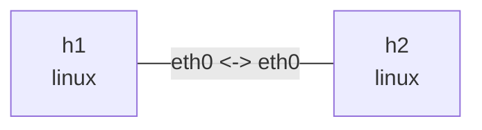

# TCP 行为

在此目录执行，依赖 `iperf3`、`tcpdump`、`iproute2`、`python3`。下面的窗口、速率和重传数都是示意，不能当作性能基准。使用终端前台进程，完成后 Ctrl+C。

## 拓扑与部署

```bash
nslab graph --format mermaid
```



```console
$ sudo nslab deploy
deployed topology: tcp-behavior
$ sudo nslab inspect
status: deployed
...
```

## 握手和连接关闭

终端 1 启动服务器，终端 2 抓包，终端 3 发起客户端。抓包中观察 SYN、SYN-ACK、ACK，以及 FIN/ACK；iperf3 有控制连接和数据连接，请按端口和四元组区分。

```console
$ sudo nslab exec --node h2 -- iperf3 -s
Server listening on 5201 ...
$ sudo nslab exec --node h1 -- tcpdump -ni eth0 -S 'tcp port 5201'
...
... Flags [S], ...
... Flags [S.], ...
... Flags [.], ...
$ sudo nslab exec --node h1 -- iperf3 -c 10.70.0.2 -t 10
...
[SUM/stream] ... sender
[SUM/stream] ... receiver
```

## 拥塞窗口与重传

先检查可用拥塞控制算法。给发送方向加入 20ms 延迟和 1% 随机丢包，再运行 Reno；可用时换成 cubic 对比。这里只用现有 tc 命令制造条件，不添加 nslab qdisc 功能。另一个终端用 watch 反复执行 ss，观察 cwnd、ssthresh、rtt、retrans、bytes_retrans。内核可能省略部分字段；短实验也可能恰好没有丢包。

```console
$ sudo nslab exec --node h1 -- sysctl net.ipv4.tcp_available_congestion_control
net.ipv4.tcp_available_congestion_control = reno cubic ...
$ sudo nslab exec --node h1 -- tc qdisc replace dev eth0 root netem delay 20ms loss 1%
(no output)
$ sudo nslab exec --node h1 -- iperf3 -c 10.70.0.2 -C reno -t 20
...
... Retr ... Cwnd
... sender
... receiver
$ sudo nslab exec --node h1 -- ss -tin dst 10.70.0.2
ESTAB ...
 reno ... rtt:... cwnd:... ssthresh:... retrans:...
```

```bash
# Observe while iperf3 runs in another terminal.
sudo nslab exec --node h1 -- watch -n 0.2 'ss -tin dst 10.70.0.2'
```

```console
$ sudo nslab exec --node h1 -- tc qdisc del dev eth0 root
(no output)
```

## 零窗口和流量控制

先清除上一步 netem。slow_receiver.py 将 SO_RCVBUF 设为 4096，accept 后 10 秒不读取；send.py 发送 8 MiB。先开抓包，再开接收端，最后发送。观察接收端通告 win 0、发送端 persist timer，以及恢复读取后的窗口更新。零窗口是接收端流量控制，不等同于拥塞窗口收缩。

```console
$ sudo nslab exec --node h1 -- tcpdump -ni eth0 -S 'tcp port 9000'
...
... Flags [.], ... win 0, length 0
$ sudo nslab exec --node h2 -- python3 "$PWD/slow_receiver.py"
listening on 10.70.0.2:9000
connected; pausing reads for 10s
received 8388608 bytes
$ sudo nslab exec --node h1 -- python3 "$PWD/send.py"
sent 8388608 bytes in <elapsed>s
$ sudo nslab exec --node h1 -- ss -tinop dst 10.70.0.2
ESTAB ... timer:(persist,...) ...
...
```

## 清理

停止 iperf3、watch 和抓包进程，再销毁。两个 Python 程序正常完成后会自行退出；超时会报错并关闭 socket。


```console
$ sudo nslab destroy
destroyed topology: tcp-behavior
$ sudo nslab inspect
status: absent
...
```
