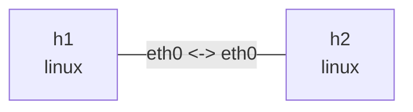

# TCP 行为

在此目录执行，依赖 `iperf3`、`tcpdump`、`iproute2`、`python3`。下面的窗口、速率和重传数都是示意，不能当作性能基准。使用终端前台进程，完成后 Ctrl+C。

## 拓扑与部署

```bash
nslab graph --format mermaid
```



```console
$ sudo nslab deploy
deployed topology: tcp-behavior
$ sudo nslab inspect
status: deployed
...
```

## 握手和连接关闭

终端 1 启动服务器，终端 2 抓包，终端 3 发起客户端。抓包中观察 SYN、SYN-ACK、ACK，以及 FIN/ACK；iperf3 有控制连接和数据连接，请按端口和四元组区分。

```console
$ sudo nslab exec --node h2 -- iperf3 -s
Server listening on 5201 ...
$ sudo nslab exec --node h1 -- tcpdump -ni eth0 -S 'tcp port 5201'
...
... Flags [S], ...
... Flags [S.], ...
... Flags [.], ...
$ sudo nslab exec --node h1 -- iperf3 -c 10.70.0.2 -t 10
...
[SUM/stream] ... sender
[SUM/stream] ... receiver
```

## 拥塞窗口与重传

先检查可用拥塞控制算法。给发送方向加入 20ms 延迟和 1% 随机丢包，再运行 Reno；可用时换成 cubic 对比。这里只用现有 tc 命令制造条件，不添加 nslab qdisc 功能。另一个终端用 watch 反复执行 ss，观察 cwnd、ssthresh、rtt、retrans、bytes_retrans。内核可能省略部分字段；短实验也可能恰好没有丢包。

```console
$ sudo nslab exec --node h1 -- sysctl net.ipv4.tcp_available_congestion_control
net.ipv4.tcp_available_congestion_control = reno cubic ...
$ sudo nslab exec --node h1 -- tc qdisc replace dev eth0 root netem delay 20ms loss 1%
(no output)
$ sudo nslab exec --node h1 -- iperf3 -c 10.70.0.2 -C reno -t 20
...
... Retr ... Cwnd
... sender
... receiver
$ sudo nslab exec --node h1 -- ss -tin dst 10.70.0.2
ESTAB ...
 reno ... rtt:... cwnd:... ssthresh:... retrans:...
```

```bash
# Observe while iperf3 runs in another terminal.
sudo nslab exec --node h1 -- watch -n 0.2 'ss -tin dst 10.70.0.2'
```

```console
$ sudo nslab exec --node h1 -- tc qdisc del dev eth0 root
(no output)
```

## 零窗口和流量控制

先清除上一步 netem。slow_receiver.py 将 SO_RCVBUF 设为 4096，accept 后 10 秒不读取；send.py 发送 8 MiB。先开抓包，再开接收端，最后发送。观察接收端通告 win 0、发送端 persist timer，以及恢复读取后的窗口更新。零窗口是接收端流量控制，不等同于拥塞窗口收缩。

```console
$ sudo nslab exec --node h1 -- tcpdump -ni eth0 -S 'tcp port 9000'
...
... Flags [.], ... win 0, length 0
$ sudo nslab exec --node h2 -- python3 "$PWD/slow_receiver.py"
listening on 10.70.0.2:9000
connected; pausing reads for 10s
received 8388608 bytes
$ sudo nslab exec --node h1 -- python3 "$PWD/send.py"
sent 8388608 bytes in <elapsed>s
$ sudo nslab exec --node h1 -- ss -tinop dst 10.70.0.2
ESTAB ... timer:(persist,...) ...
...
```

## 深入实验：SACK、DSACK、RACK、TLP 和 ECN

`advanced.py` 在同一份两节点 manifest 上为每个场景创建独立的临时拓扑，不使用上面手动部署的 `tcp-behavior`。额外依赖 `ethtool`，以及内核的 `netem`、`clsact`、`u32`、`gact`、`pedit`、`csum` 支持。以 root 运行；不安装软件、不修改宿主机 sysctl。特权实验只在本机手动执行，不加入 CI。

| 场景 | 注入条件 | 主要证据 |
| --- | --- | --- |
| `sack` / `no-sack` | 8 段中丢第 3、5 段的首次匹配 | SACK block、`TCPSackRecovery`、`TCPRenoRecovery`、重传与乱序队列 |
| `dsack` / `no-dsack` | h1 方向 netem duplicate 100% | `TCPDSACKOldSent`、`TCPDSACKRecv`；首个 SACK block 位于累计 ACK 之前 |
| `rack` / `rack-zero` | 3 段中丢第 2 段，禁用 TLP | `tcp_recovery=1/0` 对照；重传、`TCPTimeouts` 和时间线 |
| `tlp` / `no-tlp` | 4 段中丢尾部两段，`tcp_early_retrans=3/0` | `TCPLossProbes` 与 RTO 对照；不保证 `TCPLossProbeRecovery` 增长 |
| `ecn` / `no-ecn` | 只把 ECT(0) 数据包改成 CE；`tcp_ecn=1/0` | SYN 的 ECE/CWR 协商、CE、ECE ACK、后续 CWR；`InCEPkts`、`TCPDeliveredCE` |

每个场景使用 Reno、512 字节 MSS，关闭 timestamps 和两端分段/合并及校验和 offload，双向各延迟 20ms。payload 的前 4 字节是从 0 开始的段编号；IPv4/TCP 数据头各 20 字节，`tc u32` 按 IP 起点偏移 40 匹配。仅适用于这里受控的数据包布局，不能原样用于任意 TCP 流。

丢包在 **h2 ingress** 注入，避免发送端 egress 丢弃的本地反馈掩盖网络丢包。`gact drop random determ pass 2` 对每个目标交替丢弃/放行，并非永久“只丢一次”；正常运行的首次重传被放行，实际命中看 `result.json` 中 `filters`。接收端验证完整 payload 的 SHA256 后返回摘要，发送端收到摘要之前不发送 FIN，避免 FIN 改变尾部丢包恢复。

```console
$ sudo python3 ./advanced.py
results: /tmp/nslab-tcp-results-<random>
sack: observed
no-sack: observed
dsack: observed
no-dsack: observed
rack: observed
rack-zero: observed
tlp: observed
no-tlp: observed
ecn: observed
no-ecn: observed
$ sudo python3 ./advanced.py --scenario tlp
results: /tmp/nslab-tcp-results-<random>
tlp: observed
$ sudo python3 ./advanced.py --scenario ecn --output /tmp/tcp-ecn-run1
results: /tmp/tcp-ecn-run1
ecn: observed
```

输出为成功时的示意，不保证每种内核都观察到同样事件。`--output` 必须是不存在的新目录。nslab 不在 sudo 的 PATH 中时，用 `sudo env NSLAB_BIN=/absolute/path/nslab python3 ./advanced.py` 指定。

### 读懂证据，而不是只看 observed

- **SACK** 告诉发送端哪些非连续字节已到达；**DSACK** 报告重复到达的字节，不是另一种拥塞控制算法。此处 DSACK 使用人为复制，不能据此断定发生了伪重传。
- **RACK** 按发送时间判断丢失，不等同于“出现重传”。`rack` 只验证启用该参数时存在无 TLP、无 RTO 的恢复，不是函数级跟踪。新内核的 `tcp_recovery` bit 0 清零已无效，`rack-zero` **不表示 RACK off**；旧内核可能退回 RTO，新内核仍可能非 RTO 恢复。见 [内核 sysctl 文档](https://docs.kernel.org/networking/ip-sysctl.html#tcp-recovery-integer)。
- **TLP** 是尾部丢包探测，不是所有尾部重传。必须结合 `TCPLossProbes`；关闭 TLP 的对照要求观察到 `TCPTimeouts`。这里故意丢尾部两段，让探测后的 ACK/SACK 推动恢复。
- **ECN** 协商成功不等于发生了拥塞反馈。此处人为标记 CE 验证反馈路径，不是 AQM、吞吐或公平性测试。tcpdump 用 `E` 表示 ECE，`W` 表示 CWR；在 h2 ingress 修改前抓到的包仍可能显示 ECT(0)，需同时查看接收端 `InCEPkts` 和 h1 收到的 ECE ACK。

结果目录保留 `summary.json` 和每场景的 `result.json`、`h1.pcap`、`h2.pcap`、`h1-packets.txt`、`h2-packets.txt`、进程日志。JSON 包括内核/架构、nslab 版本、manifest 和采集器 SHA256、命令与退出码、两端 `nstat -aszj` 前后值/增量、tc filter 统计及清理结果。缺失的内核计数为 `null`，不是 0。

```console
$ sudo python3 -m json.tool /tmp/tcp-ecn-run1/ecn/result.json
{
    "scenario": "ecn",
    ...
}
$ sudo tcpdump -nn -tt -S -v -r /tmp/tcp-ecn-run1/ecn/h1.pcap
...
... Flags [SEW], ...
... Flags [S.E], ...
... Flags [.E], ...
... Flags [W.], ...
```

`observed` 表示传输校验和该场景的计数条件满足；证据不足标成 `inconclusive`，命令或清理失败标成 `error`。任一场景未观察到预期证据，整体退出码为 1，但继续后续场景。Ctrl+C 或 SIGTERM 会停止实验、终止子进程、销毁临时拓扑并保留已有结果（退出码 130）；SIGKILL 或主机掉电无法保证自动清理，可按 `result.json` 的 deployment 用 `nslab destroy --name <deployment>` 清理。

## 清理

停止 iperf3、watch 和抓包进程，再销毁。两个 Python 程序正常完成后会自行退出；超时会报错并关闭 socket。


```console
$ sudo nslab destroy
destroyed topology: tcp-behavior
$ sudo nslab inspect
status: absent
...
```
