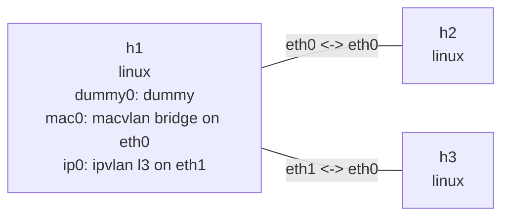

# 虚拟设备

这个实验在 `h1` 的 namespace 内创建三个接口：`dummy` 设备、`eth0` 的 `macvlan` 子接口和
`eth1` 的 `ipvlan` 子接口。两个 parent 链路分开配置，使两类设备不会共享同一个 parent。

## 拓扑图

```console
$ nslab graph --format mermaid
flowchart LR
    n0["h1\nlinux\ndummy0: dummy\nmac0: macvlan bridge on eth0\nip0: ipvlan l3 on eth1"]
    n1["h2\nlinux"]
    n2["h3\nlinux"]
    n0 -- "eth0 <-> eth0" --- n1
    n0 -- "eth1 <-> eth0" --- n2
```



## 运行

```console
$ sudo nslab deploy
deployed topology: virtual-devices

$ sudo nslab inspect
status: deployed

NAME  KIND   STATUS    NAMESPACE
----  -----  --------  -----------------------------
h1    linux  matching  nslab-virtual-devices-h1-...
h2    linux  matching  nslab-virtual-devices-h2-...
h3    linux  matching  nslab-virtual-devices-h3-...

$ sudo nslab exec --node h1 -- /usr/sbin/ip -d link show dummy0
dummy0: <BROADCAST,NOARP,UP,LOWER_UP> mtu 1400 qdisc noqueue state UNKNOWN mode DEFAULT

$ sudo nslab exec --node h1 -- /usr/sbin/ip -d link show mac0
mac0: <BROADCAST,UP,LOWER_UP> mtu 1500 ... macvlan mode bridge

$ sudo nslab exec --node h1 -- /usr/sbin/ip -d link show ip0
ip0: <BROADCAST,UP,LOWER_UP> mtu 1500 ... ipvlan mode l3

$ sudo nslab destroy
destroyed topology: virtual-devices
```

`dummy0` 可用于稳定的本地地址和路由目标。`mac0` 拥有独立 MAC 地址并使用 macvlan bridge
模式；`ip0` 与 parent 共享 MAC 地址并使用 ipvlan 三层模式。

[查看 nslab.yaml](https://github.com/calcky/nslab/blob/main/examples/virtual-devices/nslab.yaml) ·
[查看示例 README](https://github.com/calcky/nslab/blob/main/examples/virtual-devices/README.md)
